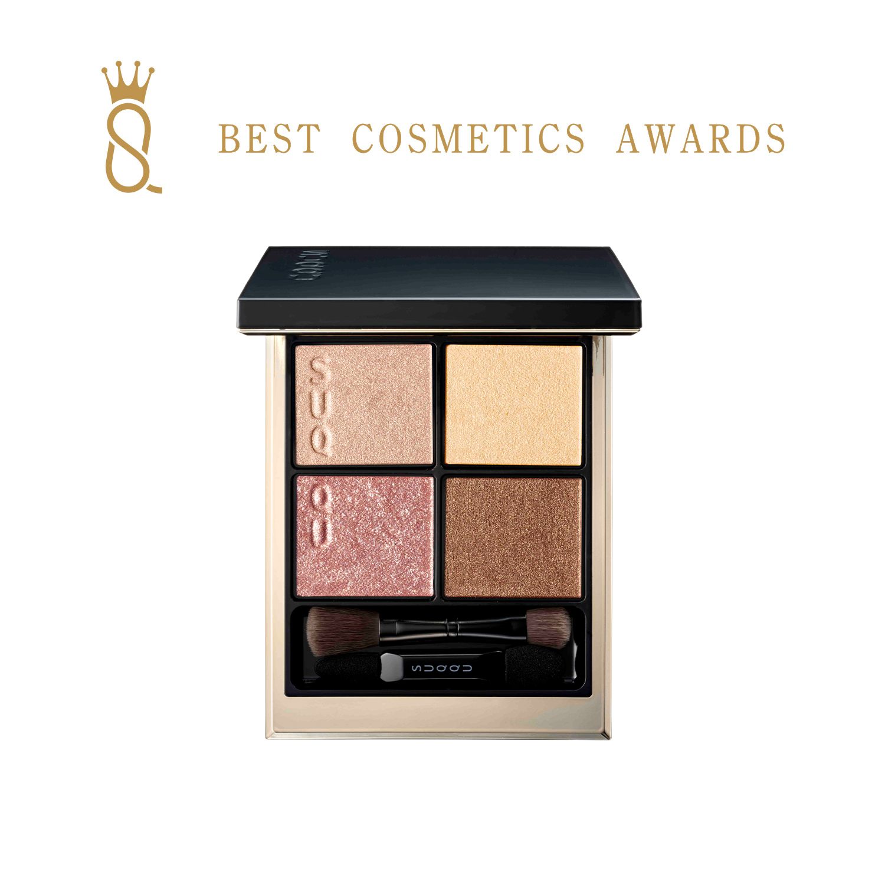
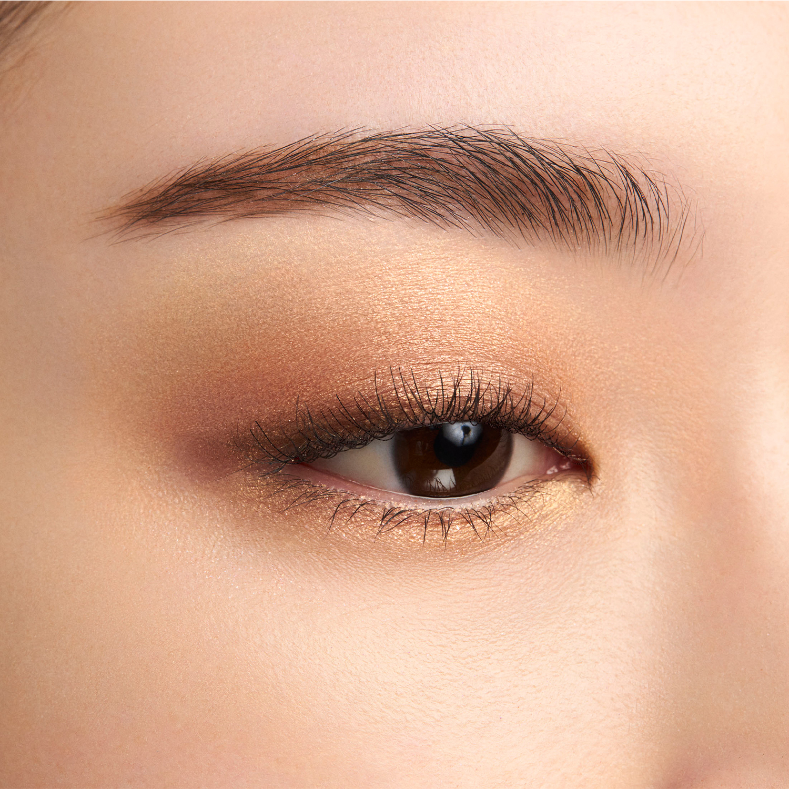
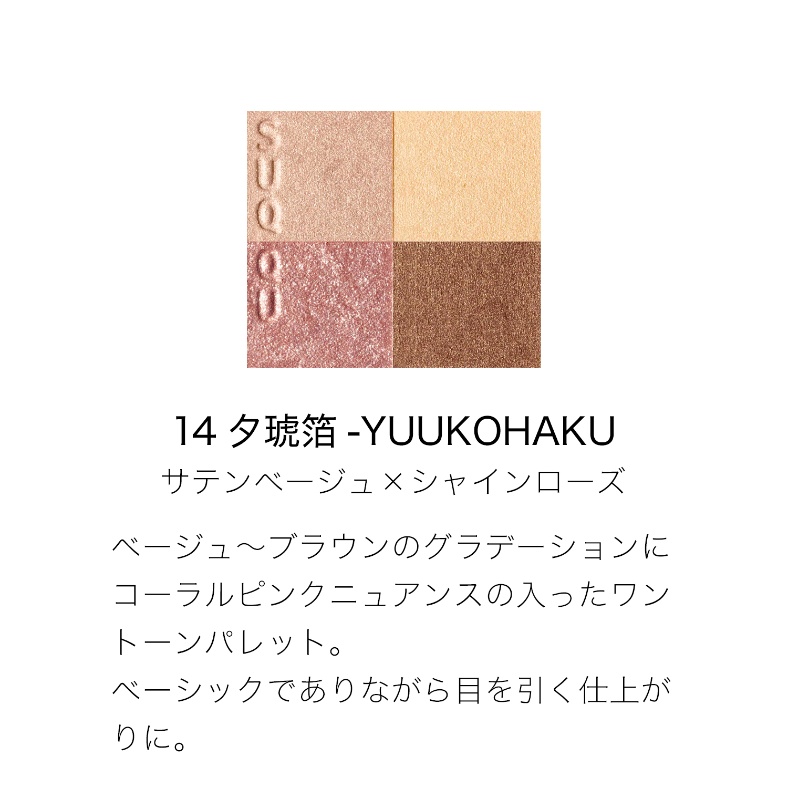
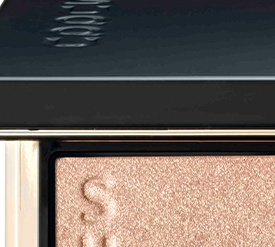
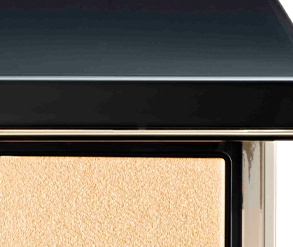
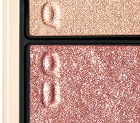
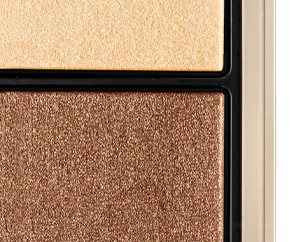

# SUQQU 4色 四色盘 夕琥箔 Signature Color Eyes 14 Yuukohaku
*发布：2022*

> 从米白到暖棕的渐变之中，融入珊瑚粉的柔和韵味，构成单一色调的和谐盘。基础而不普通，于简约中演绎引人注目的成熟光泽。

> *A beige-to-brown gradient softened by coral-pink nuance — a single-toned palette that is quietly extraordinary. Basic at its foundation, yet effortlessly eye-catching in the finished look.*

---

## 色号 A：覆光色 Coat Color — 玫冠金珠光

使用：点于眼头提亮，为整体贝色系眼妆注入流光感。

##### 色号 A：覆光色 (Coat Color) —— 玫调冠金珠光，温润细腻，是整体盘的亮点。
用途：点涂眼头，轻柔提亮内眼角；叠于其他色号上可增加金粉层次感，令妆效更高级。

---

## 色号 B：底色 Base Color — 淡黄香槟

使用：铺满眼窝，以淡香槟奠定明亮底色。

##### 色号 B：底色 (Base Color) —— 淡黄香槟珠光，通透明亮，令眼妆整体更显干净。
用途：铺满眼窝作为底色，为后续珊瑚粉及棕色提供明亮衬托；亦可单独晕开打造自然日妆。

---

## 色号 C：主色 Main Color — 玫粉珠光

使用：铺于眼窝作为主体色，演绎珊瑚粉韵味。

##### 色号 C：主色 (Main Color) —— 玫粉珠光，饱含珊瑚粉韵味，温暖而令人过目难忘。
用途：铺眼窝打造珊瑚粉主体色，与B色融合展现自然明亮渐变；亦可点涂下眼睑营造水光感。

---

## 色号 D：深色 Deep Color — 暖巧克力棕

使用：沿睫毛根部晕染，以暖巧克力棕为眼妆收尾定形。

##### 色号 D：深色 (Deep Color) —— 暖巧克力棕，浓郁温润，令贝色系眼妆更具立体层次。
用途：晕染睫毛线，赋予眼妆深度；与C色叠加营造暖粉→棕渐变，打造成熟日系妆感。
