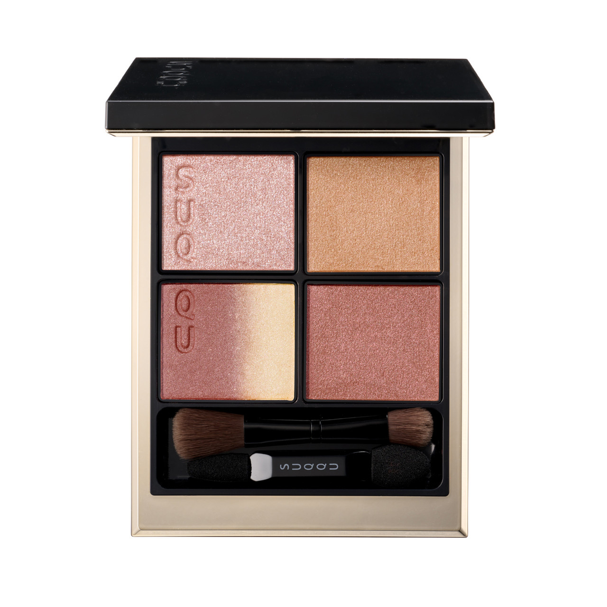
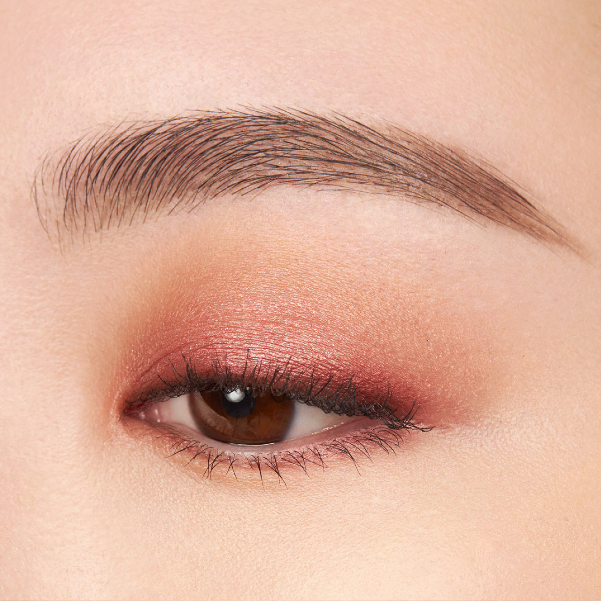
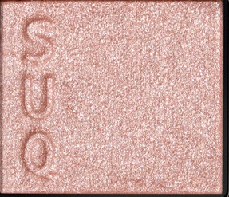
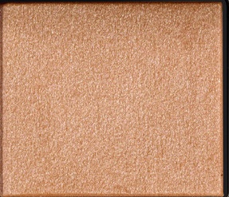
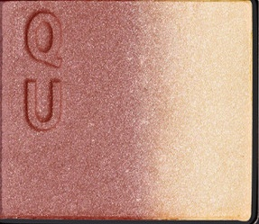
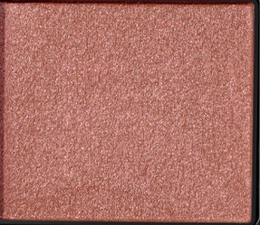

# SUQQU 4色 四色盘 雅空 Signature Color Eyes 140 Miyabizora
*发布：2024*

> 秋日的雅空，玫瑰色的云霞在暖金光中轻轻漂浮。细腻的玫瑰银光如云絮般柔软，温暖的玫瑰金橘珠光如阳光斜射云际，从玫瑰铜向香槟金渐变的双色主调如天边云层在光中流动变幻，最终以暖玫铜细闪收尾，将这份雅致的秋空之美留存于眼睑之上。

> *Miyabizora — the refined autumn sky, where rose-tinged clouds drift in warm golden light. Fine rosy silver shimmer soft as cloud wisps, warm rose-gold shimmer like sunlight striking the clouds from behind, a rose-copper to champagne-gold duochrome shifting like clouds in motion, and warm rose-bronze glitter settling it all into a luminous dusk. Autumn's most graceful sky, held in four shades.*

---

**方法一（D→B→A→C）：** ①D沿睫毛根部晕染，②B扫下眼睑，③A精准点涂眼头，④C铺满眼窝。

**方法二（B→D→C→A）：** ①B铺满眼窝打底，②D晕染睫毛线三分之二处，③C铺于眼窝并与D融合晕开，④A从眼头叠加提亮。

---

## 色号 A：覆光色 Coat Color — 玫瑰银细闪

使用：Press to the inner corner and lid centre to add a delicate rosy-silver shimmer that brightens and softens the whole look.

##### 色号 A：覆光色 (Coat Color) —— 柔和的玫瑰银调细闪，含密集银调微光粒子，冷暖之间，如秋空中玫瑰色云絮在阳光下漫射出的轻盈光泽。
用途：点涂眼头提亮，或叠于眼窝中央提升整体光感；与其他玫瑰调色号融为一体，强调秋日天空的明亮通透。

---

## 色号 B：底色 Base Color — 玫瑰金橘珠光

使用：Sweep across the eyelid for a warm, golden rose-terracotta shimmer that gives the eyes a glowing autumn warmth.

##### 色号 B：底色 (Base Color) —— 温暖的玫瑰金橘调珠光，色泽饱满而有温度，光感丰盈，如斜阳打在秋日云层上透出的橙金玫瑰光晕。
用途：均匀铺满眼窝作为基底，以温暖的玫瑰金调奠定整体秋意氛围；丰盈的珠光质感令眼妆即刻生辉。

---

## 色号 C：主色 Main Color — 玫瑰铜金渐变双色

使用：Blend across the lid for a stunning duochrome that shifts from warm rose-copper on the inner corner to champagne-gold at the outer edge.

##### 色号 C：主色 (Main Color) —— 从玫瑰铜调向香槟金渐变的双色主调，左侧偏玫瑰棕铜、右侧偏暖金香槟，随光线与角度变化呈现流动的色彩层次，是本盘最华丽的色号。
用途：铺满眼窝中央展现渐变双色之美；叠于B色之上可强化暖调玫瑰与金色的冷暖对比，演绎秋空流云的动态感。

---

## 色号 D：深色 Deep Color — 暖玫瑰铜细闪

使用：Apply along the lash line to add warm, dusty rose-bronze glitter that deepens and defines with a subtle metallic glow.

##### 色号 D：深色 (Deep Color) —— 温暖的玫瑰铜调细闪，含均匀分布的铜调细密闪粒，色调偏暖玫瑰棕，既有深度又不失温柔光泽感。
用途：沿睫毛线晕染加深轮廓，以玫瑰铜调的深色细闪为眼妆提供精致的金属感深度，令眼神在光线下流转生辉。
