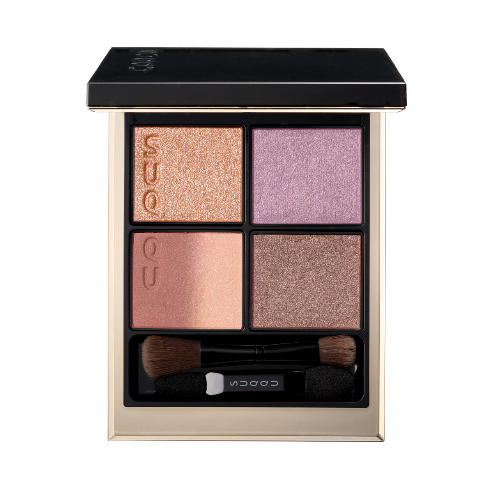
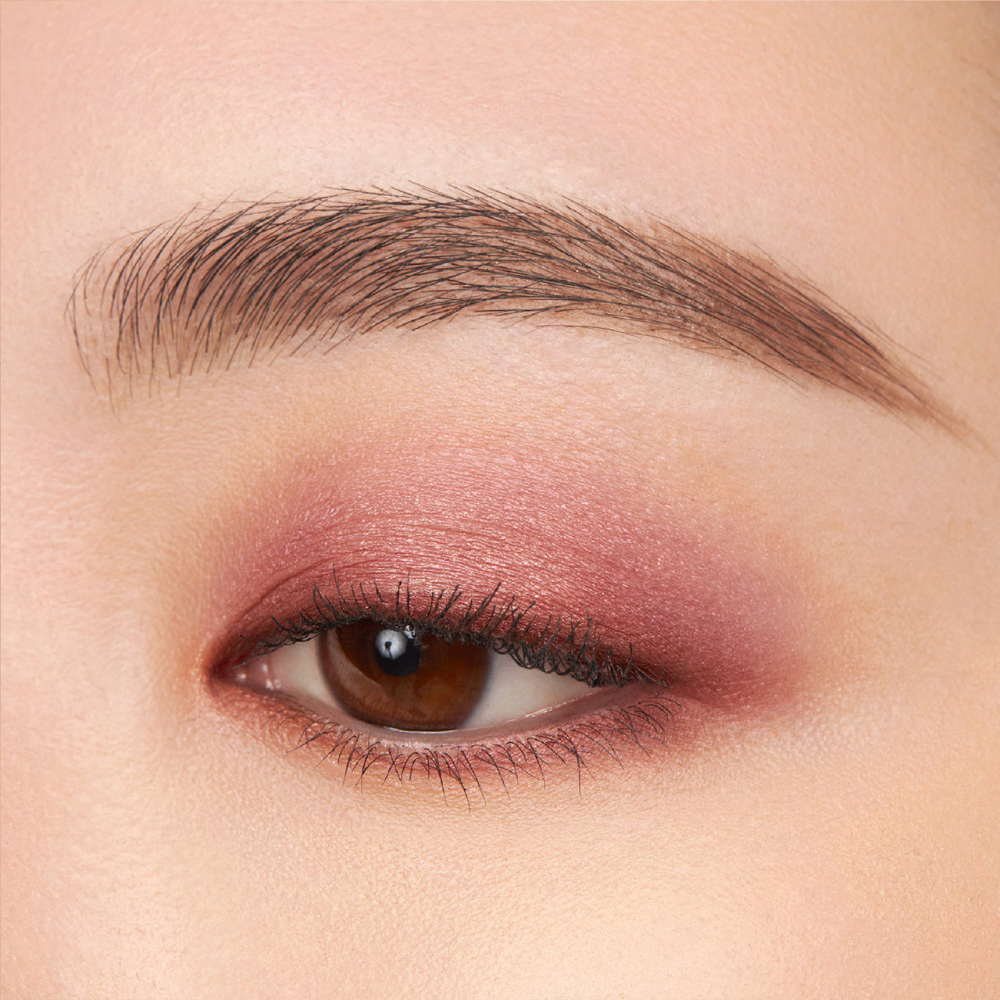
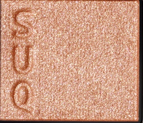
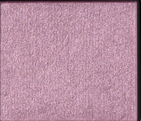
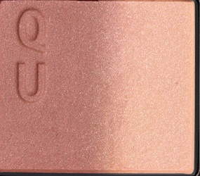
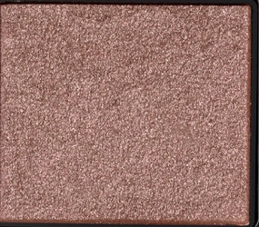

# SUQQU 4色 四色盘 狭間空 Signature Color Eyes 141 Hazamazora
*发布：2024*

> 秋日的狭间空，是叶隙之间那一线天色——香槟粉的细闪如晨光穿透叶间的第一道温柔，薰衣草的紫调珠光如叶隙中若隐若现的淡紫色天空，从玫瑰向香槟渐变的主色如天色在叶影流转间变幻的层次，暖玫瑰棕的细闪则如傍晚叶色透入的最后余晖——将一瞬的秋日天光，化为眼睑上永恒的诗意。

> *Hazamazora — the sky glimpsed through the gap between autumn leaves. Champagne-pink shimmer like morning light filtering between branches, lavender shimmer like the pale purple sky caught through rustling leaves, a rose-to-champagne duochrome shifting like the sky seen through moving foliage, and warm rose-mauve glitter like the last warm glow of dusk through the canopy. One fleeting autumn sky, made eternal.*

---

**方法一（D→B→A→C）：** ①D沿睫毛根部晕染，②B扫下眼睑，③A精准点涂眼头，④C铺满眼窝。

**方法二（B→D→C→A）：** ①B铺满眼窝打底，②D晕染睫毛线三分之二处，③C铺于眼窝并与D融合晕开，④A从眼头叠加提亮。

---

## 色号 A：覆光色 Coat Color — 香槟粉细闪

使用：Apply to the inner corner and centre lid to add a warm, champagne-pink shimmer that instantly brightens and warms the eye.

##### 色号 A：覆光色 (Coat Color) —— 温暖的香槟粉调细闪，含密集的玫瑰金微光粒子，色调介于粉与金之间，如清晨第一道穿过叶隙的暖光。
用途：点涂眼头提亮，或叠于眼窝中央强化温柔光感；与淡紫色B色搭配形成暖冷对比，演绎天光叶影的微妙层次。

---

## 色号 B：底色 Base Color — 薰衣草紫珠光

使用：Sweep across the lid for a soft lavender shimmer base that adds a dreamy, cool-toned depth to the eye.

##### 色号 B：底色 (Base Color) —— 柔和的薰衣草紫调珠光，含细腻冷调微光，色彩轻盈朦胧，如叶隙之间透出的那一线淡紫色晴空。
用途：均匀铺满眼窝作为基底，以淡雅的薰衣草珠光为整体妆感建立轻柔的冷调底色；单独使用亦可演绎清雅紫调眼妆。

---

## 色号 C：主色 Main Color — 玫瑰香槟渐变双色

使用：Blend across the lid for a beautiful rose-to-champagne duochrome that captures the shifting colours of autumn sky through leaves.

##### 色号 C：主色 (Main Color) —— 从玫瑰调向香槟金渐变的双色主调，偏温暖而柔美，随光线变化在玫瑰与香槟之间流转，如叶影中不断变换的天色。
用途：铺满眼窝展现由玫瑰到香槟的温柔渐变；叠于B色之上可与薰衣草底色形成冷暖对比，丰富眼妆的层次感。

---

## 色号 D：深色 Deep Color — 暖玫瑰棕细闪

使用：Apply along the lash line to add a warm, dusty rose-mauve glitter that defines the eye with a soft autumn depth.

##### 色号 D：深色 (Deep Color) —— 温暖的玫瑰棕调细闪，含均匀分布的微细闪粒，色调偏暖玫瑰棕，深邃而不失柔美，如傍晚最后一道暖光透过叶间的温柔余晖。
用途：沿睫毛线晕染为眼妆提供最终的深度与轮廓；以暖玫瑰棕的低调细闪平衡整体的薰衣草与香槟色调，令眼神秋意浓郁而不失温柔。
