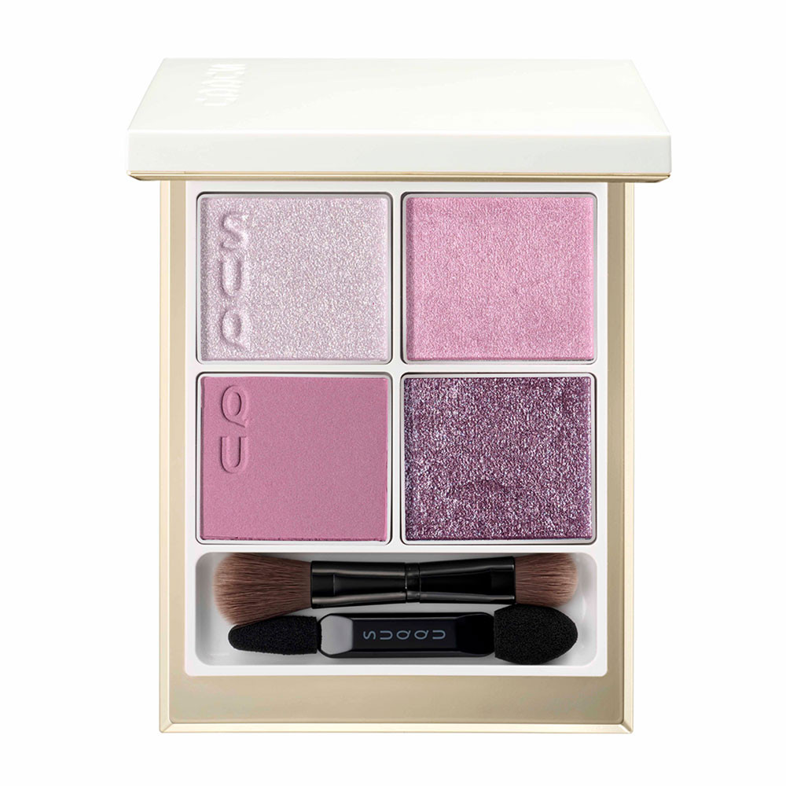
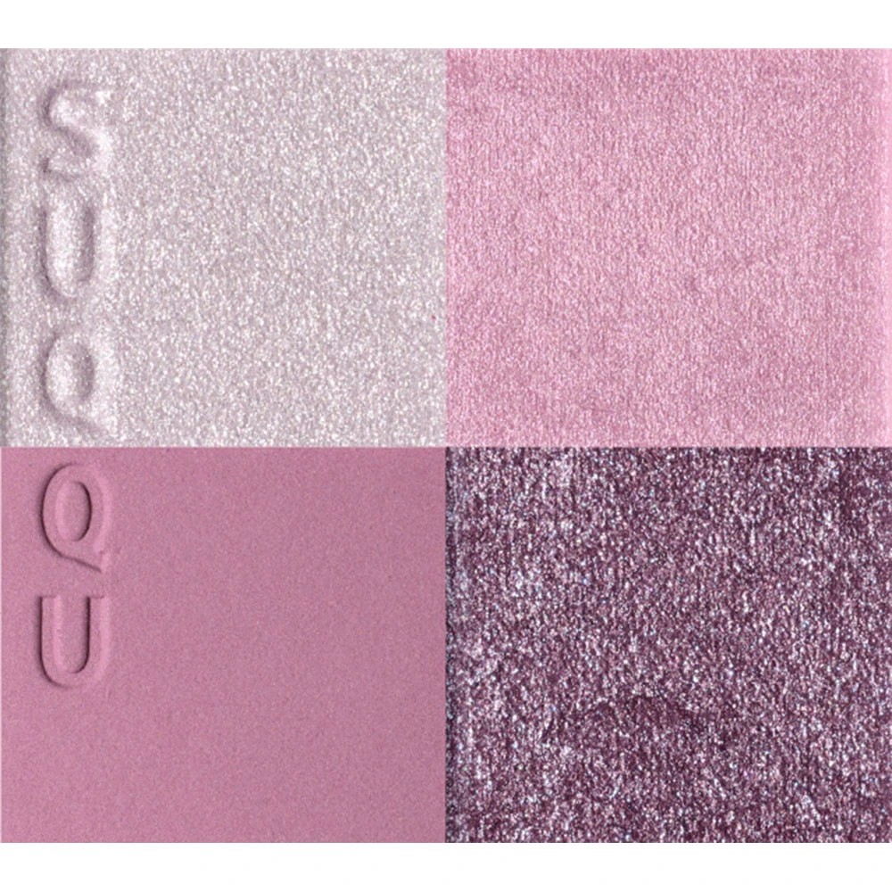
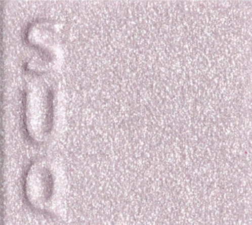
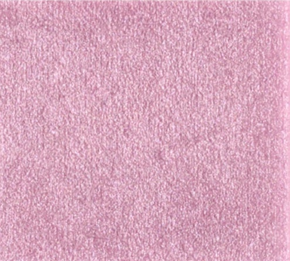
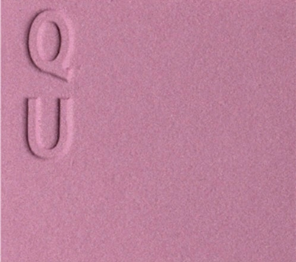
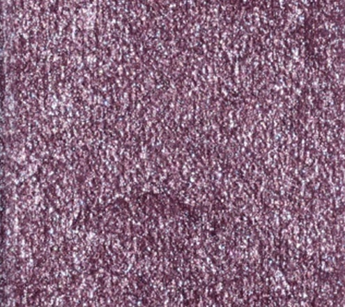

# SUQQU 4色 四色盘 春霞 Signature Color Eyes 149 Shunka
*发布：2025*

> 柔和的桃花粉与纯净的绢白光泽交织，宛如春日晨雾中漫漫升起的朦胧霞光。淡雅的丁香紫与银调冷光层叠而上，在眼睑描绘出一幅薄如蝉翼的春霞图景，轻盈透明，令人沉醉。

> *Delicate sakura pink and pure silken shimmer interweave like the soft glow of spring mist rising at dawn. Pale lilac and cool silver luminosity layered over the lids evoke a diaphanous spring haze — weightless, luminous, and quietly enchanting.*

---

**方法一（D→B→A→C）：** ①D沿睫毛根部晕染，②B扫下眼睑，③A精准点涂眼头，④C铺满眼窝。

**方法二（B→D→C→A）：** ①B铺满眼窝打底，②D晕染睫毛线三分之二处，③C铺于眼窝并与D融合晕开，④A从眼头叠加提亮。

---

## 色号 A：覆光色 Coat Color — 银白绢光

使用：Apply precisely to inner corner to add an airy silver-white shimmer that brightens the whole look.

##### 色号 A：覆光色 (Coat Color) —— 银白调绢光，含纤细珠光粒子，冷调而透亮，如春日晨露在花瓣上折射的点点光辉。
用途：精准点涂眼头及泪沟，或叠于底色上提亮整体光感；单独用于眼头可演绎清透仙气感妆容。

---

## 色号 B：底色 Base Color — 冷调樱花粉哑光

使用：Sweep across the eyelid as a soft, cool-toned pink base that complements all skin tones.

##### 色号 B：底色 (Base Color) —— 冷调粉色哑光，饱和度温柔，质地细腻，如春霞中透出的淡粉晨曦。
用途：均匀铺满眼窝作为基底，与A色的银调珠光相呼应，打造清冷透亮的春日眼妆底色。

---

## 色号 C：主色 Main Color — 淡雅锦葵紫哑光

使用：Blend across the lid to add a soft, wearable mauve-pink depth that reads as a refined flush of colour.

##### 色号 C：主色 (Main Color) —— 淡雅锦葵紫调哑光，介于粉与紫之间，柔和而有层次，令眼妆呈现成熟的朦胧美感。
用途：铺于眼窝中心叠于B色之上，向眼尾渐深并与D色融合，演绎从粉到紫的柔美渐变层次。

---

## 色号 D：深色 Deep Color — 深葡萄紫细闪

使用：Line the lash roots with this deep grape-purple glitter to define the eyes with a jewel-like shimmer.

##### 色号 D：深色 (Deep Color) —— 深葡萄紫调细闪，含银调闪粉，冷邃而华美，为粉紫系眼妆提供深邃的轮廓支撑。
用途：沿睫毛线晕染加深眼形，叠于C色外侧演绎精致紫调烟熏；细密银闪在灯光下折射出如宝石般的神秘光泽。
