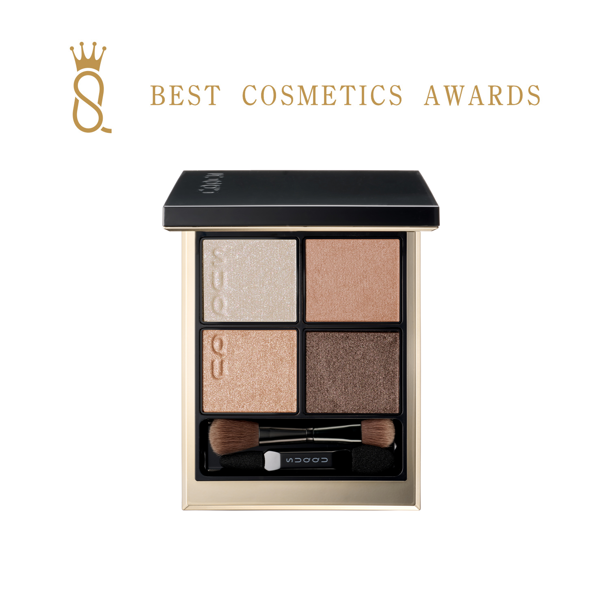
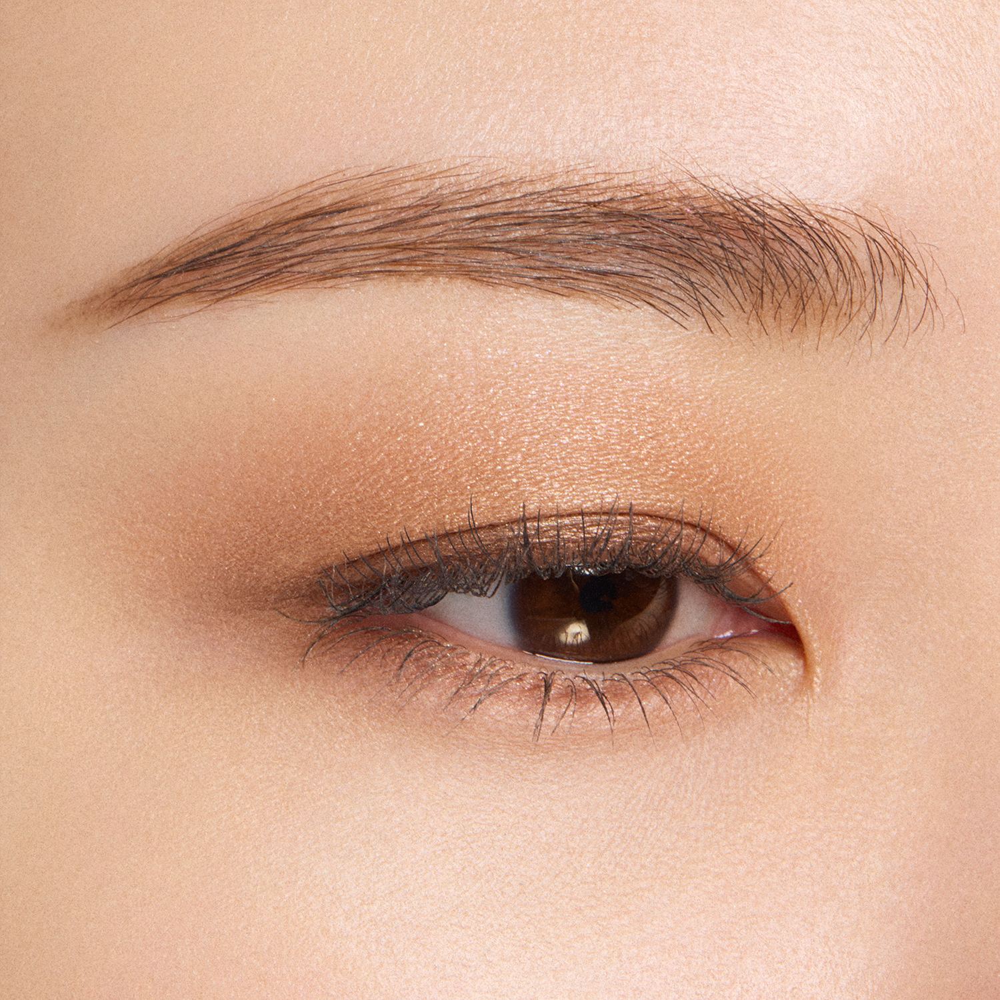
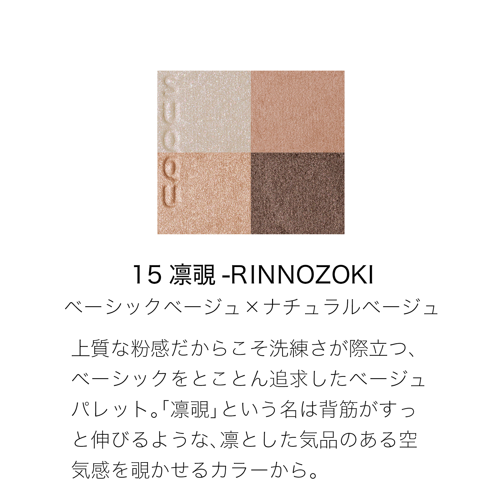
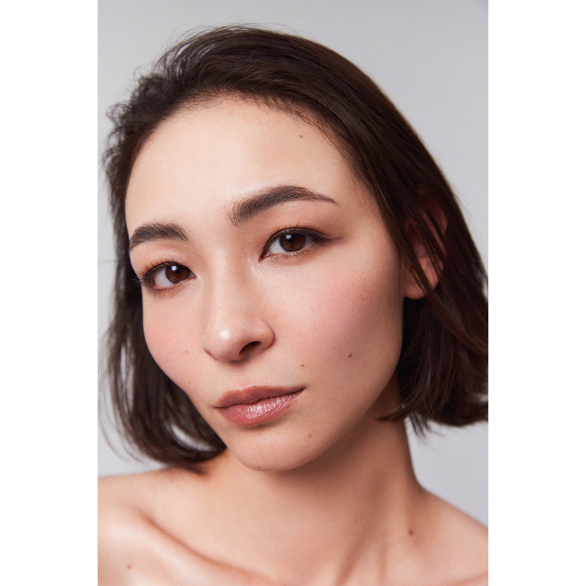
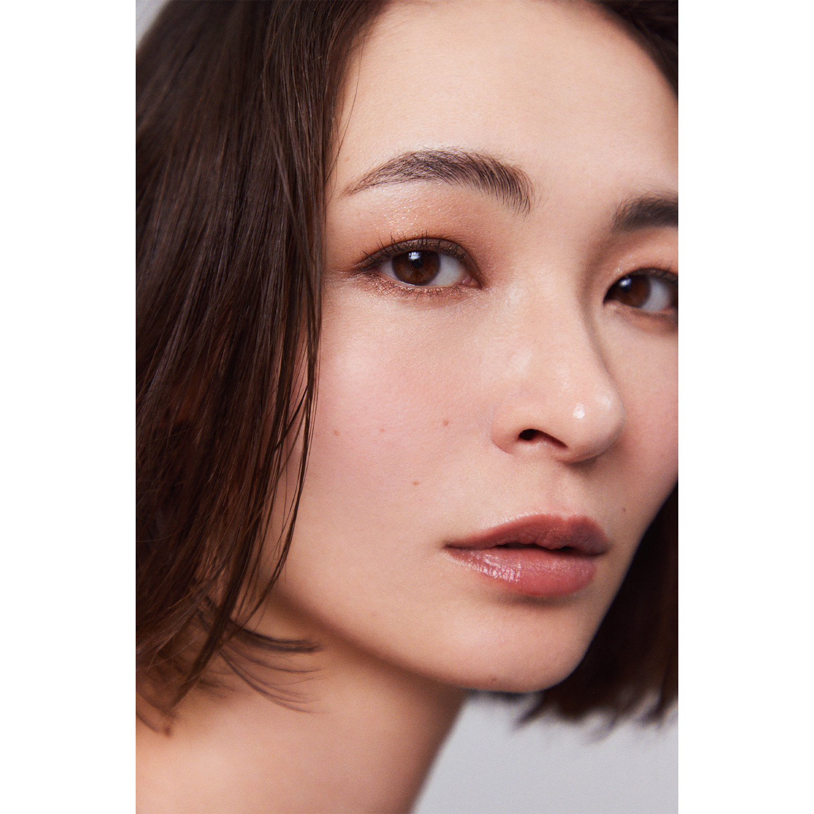
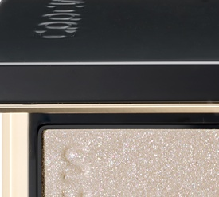
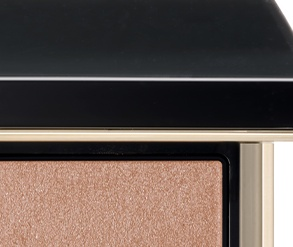
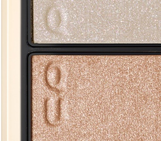
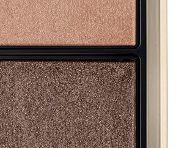

# SUQQU 4色 四色盘 凛覗 Signature Color Eyes 15 Rinnozoki
*发布：2022*

> 将「基础」发挥到极致的裸米色盘，高品质的粉质感令洗练感尤为突出。"凛覗"之名，来源于如同背脊挺直时那份凛然气品，仿佛将优雅从容的空气感悄然透露于眼眸之中。

> *A beige palette that pursues the essential to its finest — where high-quality powder texture makes refinement palpable. "Rinnozoki" evokes the feeling of standing tall with quiet elegance, as if that composed, dignified air is glimpsed through the eyes.*

---

### 使用方法 How To Use

| 方法一 | 方法二 |
|--------|--------|
|  |  |

**方法一（B→D→C→A）：** ①B铺眼窝，②D晕睫毛线三分之二处，③C铺眼窝并与D融合晕开，④A从眼头叠加提亮。

**方法二（D→B→A→C）：** ①D沿睫毛根部晕染，②B扫下眼睑，③A精准点涂眼头（不向外扩散），④C铺满眼窝。

---

## 色号 A：覆光色 Coat Color — 珠光白

使用：点于眼头，以纯净珠光白提亮眼神。

##### 色号 A：覆光色 (Coat Color) —— 珠光白，纯净通透，令整体裸色妆感更为明亮优雅。
用途：点涂眼头，轻柔提亮内眼角；亦可叠于其他色号增加整体透亮感，或轻扫眉骨。

---

## 色号 B：底色 Base Color — 暖裸粉

使用：铺满眼窝，以贴肤裸粉奠定柔和底色。

##### 色号 B：底色 (Base Color) —— 暖裸粉，细腻珠光，贴肤融合感极佳。
用途：铺满眼窝作为底色，为后续裸色系营造自然衔接；亦可单独使用呈现极简裸妆。

---

## 色号 C：主色 Main Color — 金珠光裸色

使用：铺于眼窝作为主体色，以金珠光裸色提升妆面质感。

##### 色号 C：主色 (Main Color) —— 金珠光裸色，于基础裸调中注入隐约金光，令妆感更为出彩。
用途：铺眼窝打造裸色主体妆感，与B色叠加展现细腻珠光渐变；亦可单独使用呈现精致日常妆。

---

## 色号 D：深色 Deep Color — 深咖棕

使用：沿睫毛根部晕染，以深咖棕为裸色眼妆收线定形。

##### 色号 D：深色 (Deep Color) —— 深咖棕，沉稳而不刻意，为极简裸妆提供精准的轮廓感。
用途：晕染睫毛线，加深眼形轮廓；与C色叠加可打造自然深邃的裸棕烟熏，凛然有度。
