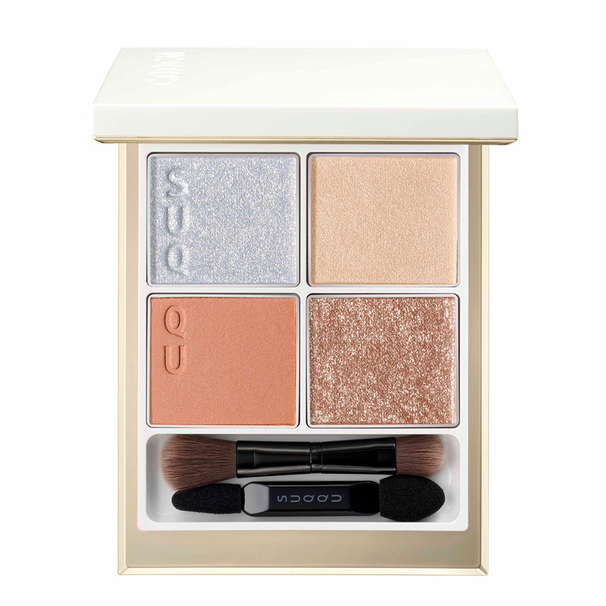
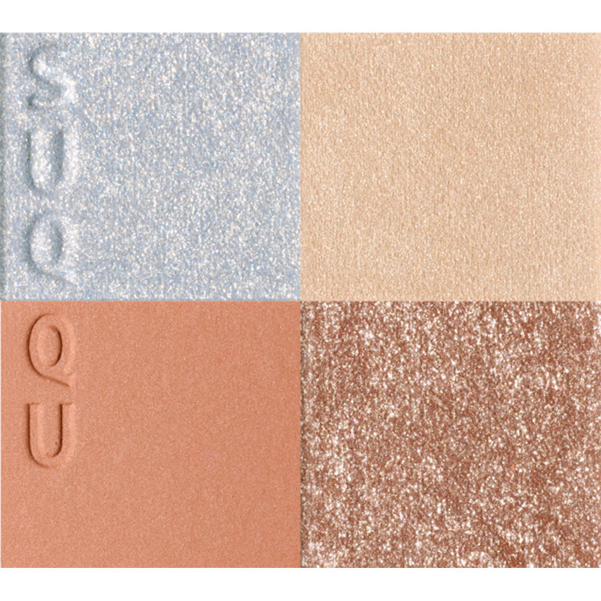
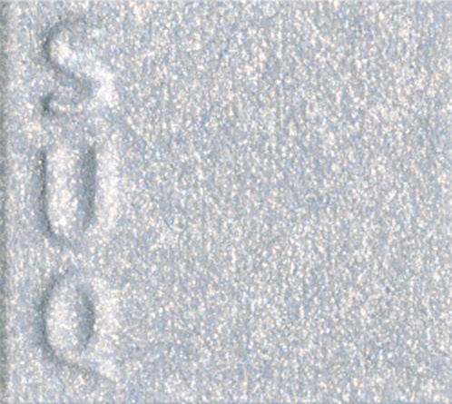
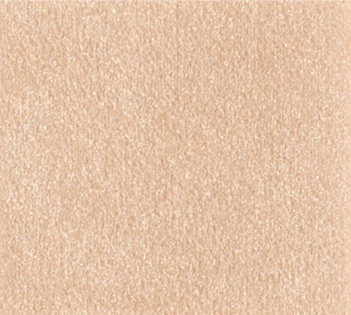
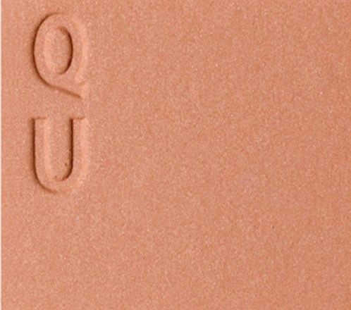
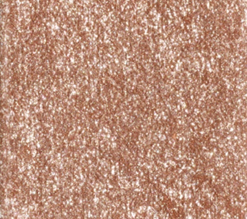

# SUQQU 4色 四色盘 光飾 Signature Color Eyes 150 Hikarikazari
*发布：2025*

> 冬日澄净的空气中，光芒如珍贵的装饰点缀万物。冰蓝细闪与柔香槟光泽层叠，以温暖的橙褐为基底，在眼睑勾勒出光辉飘飞、仿若桂花余香萦绕的奢华意象，精致隽永，令人过目难忘。

> *In the crystalline winter air, light adorns everything like precious ornament. Icy blue shimmer and soft champagne luminosity layer over a warm terracotta base, evoking the luxurious image of light drifting and shimmering — as though the lingering fragrance of osmanthus were caught in the gleam.*

---

**方法一（D→B→A→C）：** ①D沿睫毛根部晕染，②B扫下眼睑，③A精准点涂眼头，④C铺满眼窝。

**方法二（B→D→C→A）：** ①B铺满眼窝打底，②D晕染睫毛线三分之二处，③C铺于眼窝并与D融合晕开，④A从眼头叠加提亮。

---

## 色号 A：覆光色 Coat Color — 冰蓝银调细闪

使用：Apply to the inner corner to add a cool icy-blue shimmer that elevates the whole look with crystalline brightness.

##### 色号 A：覆光色 (Coat Color) —— 冰蓝调银白细闪，含密集珠光，冷冽通透，如冬日冰晶在阳光下折射出的纯净光芒。
用途：精准点涂眼头提亮，或叠于眼窝中央强化光感；与暖调底色形成冷暖对比，演绎精致的冬日光饰感。

---

## 色号 B：底色 Base Color — 香槟裸珠光

使用：Sweep across the lid as a warm, luminous champagne base that flatters all skin tones.

##### 色号 B：底色 (Base Color) —— 温柔的香槟裸色珠光，质感细腻柔和，带有若隐若现的金调光泽，如轻纱般贴合肤色。
用途：均匀铺满眼窝作为基底，以温柔香槟光奠定整体妆感；与A色冷调形成优雅的冷暖层次对比。

---

## 色号 C：主色 Main Color — 橙褐哑光

使用：Blend across the lid to create a warm, earthy depth that grounds the shimmer shades beautifully.

##### 色号 C：主色 (Main Color) —— 暖橙褐调哑光，饱和度适中，质感如丝绒般细腻，兼具秋叶与桂花的自然暖意。
用途：铺于眼窝中心叠于B色之上，向眼尾加深与D色融合，以暖调大地色烘托出整体的宝石光泽。

---

## 色号 D：深色 Deep Color — 铜棕细闪

使用：Line the lash roots to add a warm copper-bronze glitter that gives the eyes luxurious depth and sparkle.

##### 色号 D：深色 (Deep Color) —— 铜棕调细密亮闪，金属质感丰盈，暖调奢华，如琥珀宝石在灯光下映出的流光溢彩。
用途：沿睫毛线晕染加深眼形，叠于C色外侧演绎金铜调深邃眼神；丰富的细闪粒子在光线下折射出奢华的流动光泽。
