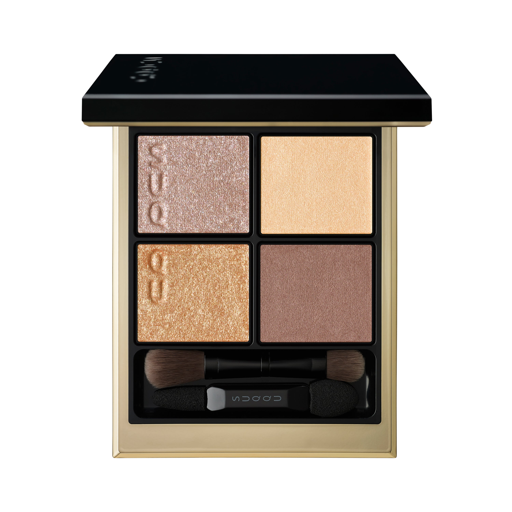
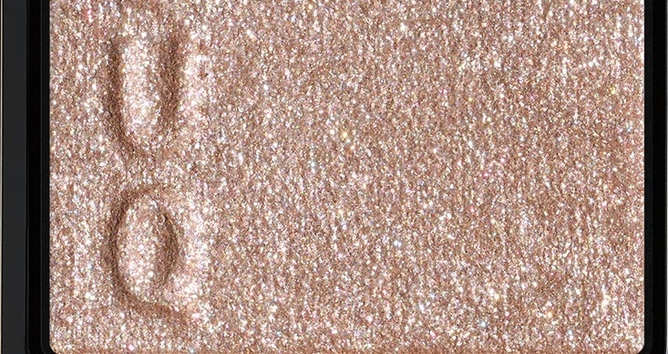
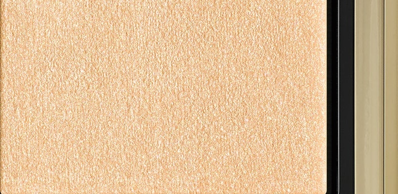
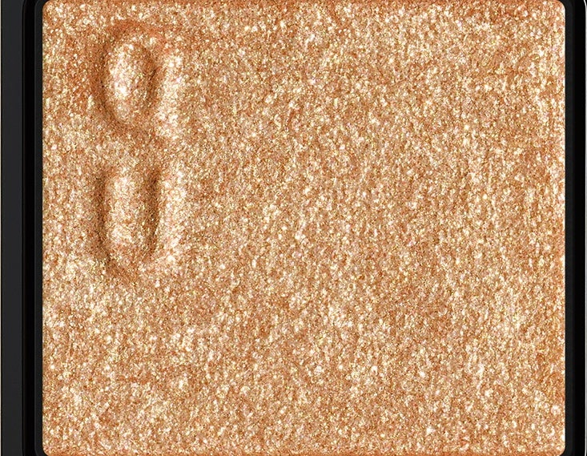
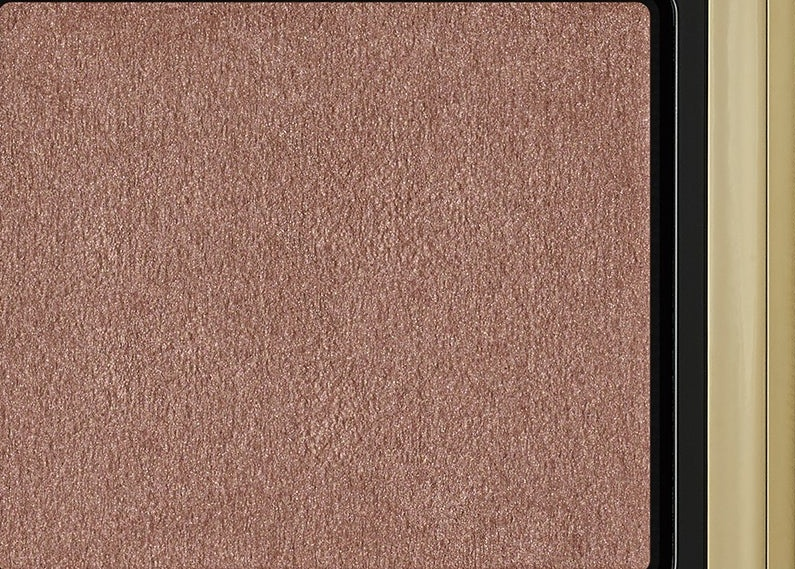

# SUQQU 4色 四色盘 暮靛 Signature Color Eyes 154 Kureai
*发布：2026*

> 黄昏的最后一抹光，将天际染成蓄满情感的暮靛色。米金交叠，橙绿偏光珠光随视角变换悄然流转，如魔法时刻的光线在眼睑上轻舞停驻。这是日落前的深情一瞥，赋予眼神迷人的情感深度。

> *The last light of dusk stains the horizon a deep, emotion-filled indigo. Warm beige and gold interplay, while polarised pearls shift from orange to green with every angle — like the magic hour's fleeting glow resting gently on the lids. A palette that captures the emotional depth of sunset's final glance.*

---

**方法一（D→B→A→C）：** ①D沿睫毛根部晕染，②B扫下眼睑，③A精准点涂眼头，④C铺满眼窝。

**方法二（B→D→C→A）：** ①B铺满眼窝打底，②D晕染睫毛线三分之二处，③C铺于眼窝并与D融合晕开，④A从眼头叠加提亮。

---

## 色号 A：覆光色 Coat Color — 暮光香槟珠

使用：点于眼头及眉骨，以暮光珠光为眼妆注入透亮光彩。

##### 色号 A：覆光色 (Coat Color) —— 香槟米珠光，细腻轻盈，折射暮色柔光，为眼妆带来水润透亮感。
用途：叠于眼头及底色上精准提亮，赋予整体眼妆如暮色般的情感光泽。

---

## 色号 B：底色 Base Color — 水蜜桃哑光

使用：铺满眼窝作为底色，营造柔和肤感底妆。

##### 色号 B：底色 (Base Color) —— 轻盈水蜜桃哑光，质地细腻，衬托眼部肤色清透自然。
用途：均匀铺满眼窝奠定暖桃底色，与金调色彩和谐搭配，打造日落暖意基底。

---

## 色号 C：主色 Main Color — 橙金极光

使用：铺于眼窝中心，以橙绿偏光珠光打造魔法时刻的绚丽眼效。

##### 色号 C：主色 (Main Color) —— 橙金色调，内含随角度变色的橙转绿偏光珠光，耀目而富有情感张力。
用途：铺于眼窝中心及下眼睑，叠于B色上层，打造日落时分光彩流动的华丽眼神。

---

## 色号 D：深色 Deep Color — 暖栗棕哑光

使用：沿睫毛根部晕染，为眼神增添沉稳轮廓。

##### 色号 D：深色 (Deep Color) —— 暖调栗棕哑光，低调内敛，为耀目的金调眼妆提供沉稳锚点。
用途：沿睫毛线晕染描绘轮廓，叠于眼尾加深层次，令整体眼妆兼具光感与深度。
