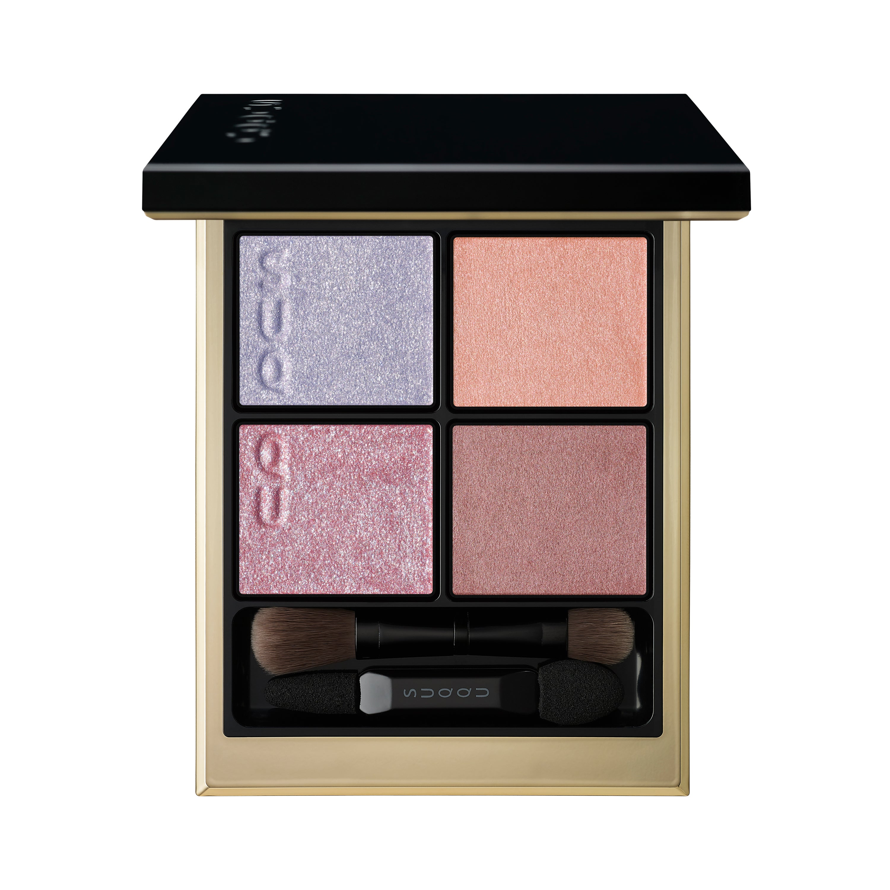
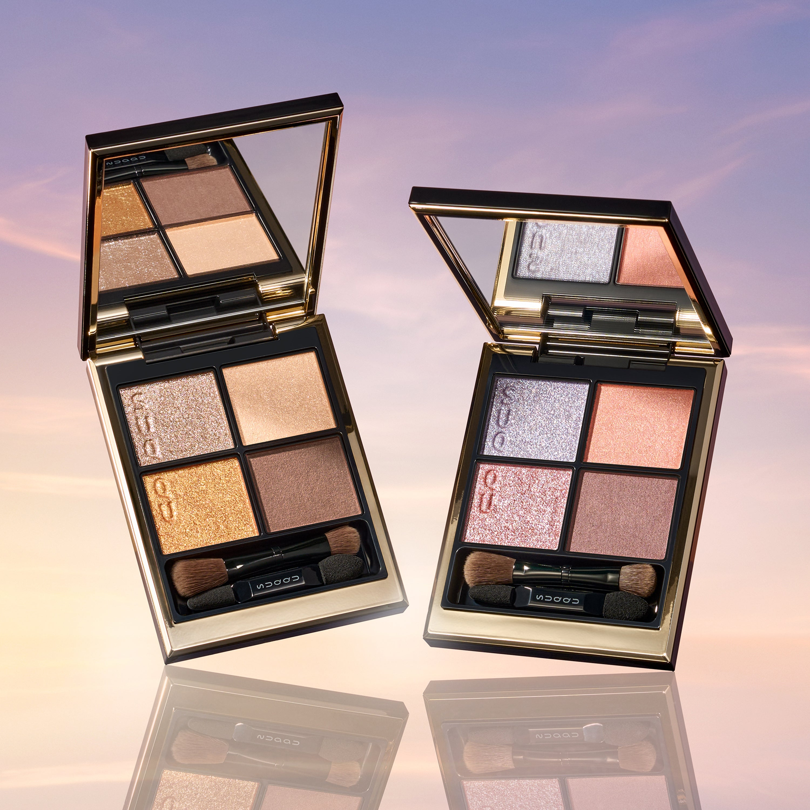
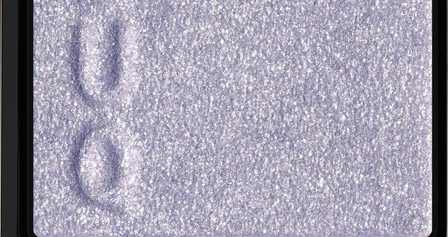
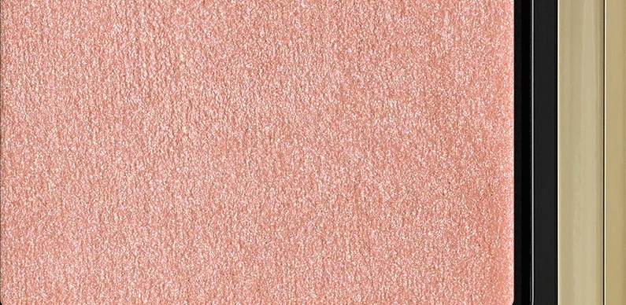
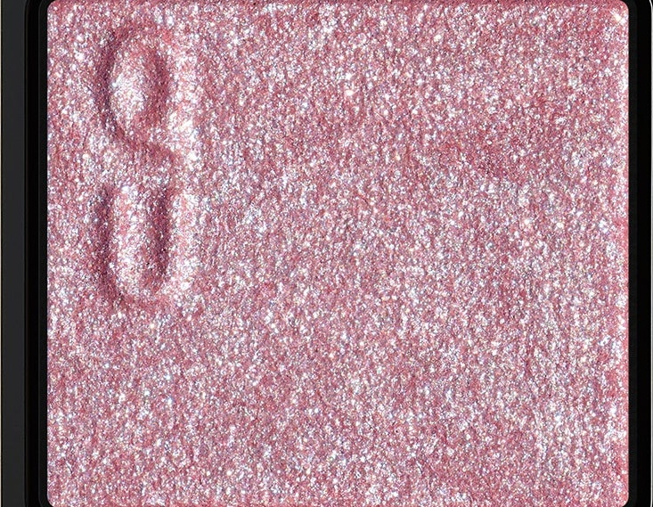
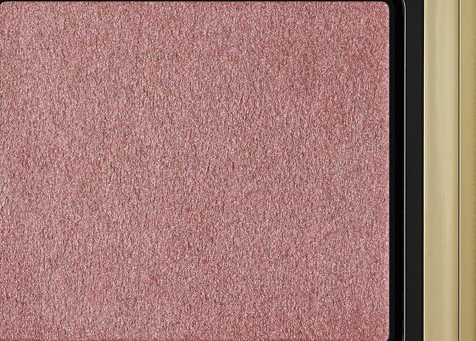

# SUQQU 4色 四色盘 藤双靛 Signature Color Eyes 155 Fujifutaai
*发布：2026*

> 黎明前的天空，紫调靛蓝与珊瑚微光交织成神秘浪漫的晨昏时分。蓝转粉的偏光珠光随视角悄然变色，如黎明前那一刻光的低语，在眼睑上演绎出静谧而略带神秘的清晨情感。

> *The sky before dawn — purple-tinted indigo and coral glow intertwine in a romantic, mysterious hour. Polarised pearls that shift from blue to pink with every angle whisper softly of the moment before sunrise, conjuring a quiet, enigmatic dawn upon the lids.*

---

**方法一（D→B→A→C）：** ①D沿睫毛根部晕染，②B扫下眼睑，③A精准点涂眼头，④C铺满眼窝。

**方法二（B→D→C→A）：** ①B铺满眼窝打底，②D晕染睫毛线三分之二处，③C铺于眼窝并与D融合晕开，④A从眼头叠加提亮。

---

## 色号 A：覆光色 Coat Color — 冰蓝紫偏光珠

使用：点于眼头，以冷调偏光珠光为眼妆注入清透神秘感。

##### 色号 A：覆光色 (Coat Color) —— 冰紫蓝调珠光，内含蓝转粉偏光珠光，随角度变幻，如黎明前的天空瞬息万变。
用途：叠于眼头及底色上提亮，令整体眼妆呈现如曙光乍现般的梦幻光彩。

---

## 色号 B：底色 Base Color — 珊瑚橘暖光

使用：铺满眼窝作为底色，以暖橘光感奠定柔和基底。

##### 色号 B：底色 (Base Color) —— 柔和珊瑚橘调，带有细腻缎光，温柔衬托眼周气色。
用途：均匀铺满眼窝，与冷调珠光形成互补，呈现暖冷交叠的魔法时刻层次感。

---

## 色号 C：主色 Main Color — 玫粉闪光

使用：铺于眼窝，以玫粉闪光打造浪漫华丽的黎明眼效。

##### 色号 C：主色 (Main Color) —— 玫粉色调，满布闪烁亮片，富有戏剧性光感，演绎浪漫而略带力量感的眼妆。
用途：铺于眼窝中心，叠于B色上层；亦可在眼头叠加A色，打造渐变色彩的梦幻眼神。

---

## 色号 D：深色 Deep Color — 烟玫粉缎光

使用：沿睫毛根部晕染，以含蓄玫调为眼神增添深度。

##### 色号 D：深色 (Deep Color) —— 烟灰调玫粉缎光，饱和度低调，为绚丽的眼妆提供沉稳而优雅的轮廓支撑。
用途：沿睫毛线晕染加深轮廓，叠于眼尾打造层次感；与C色融合可呈现从亮粉到烟玫的自然渐变。
