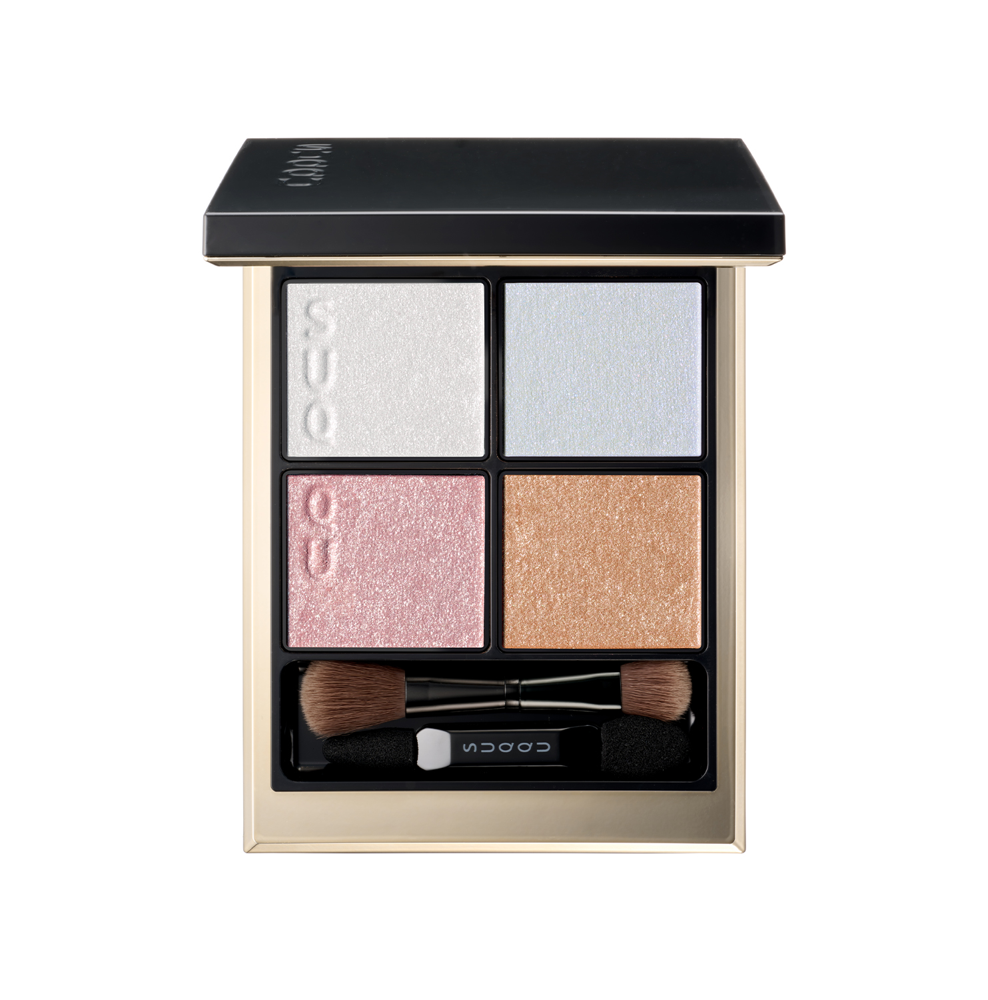
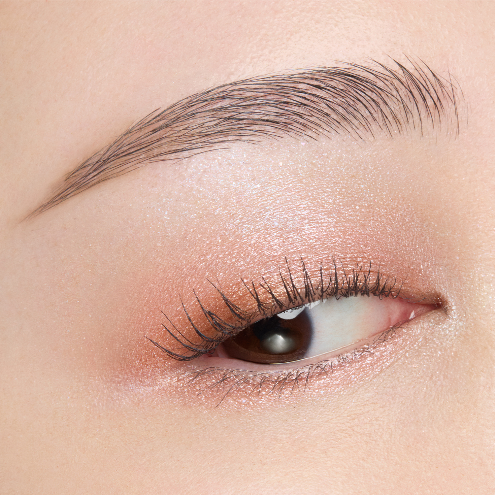
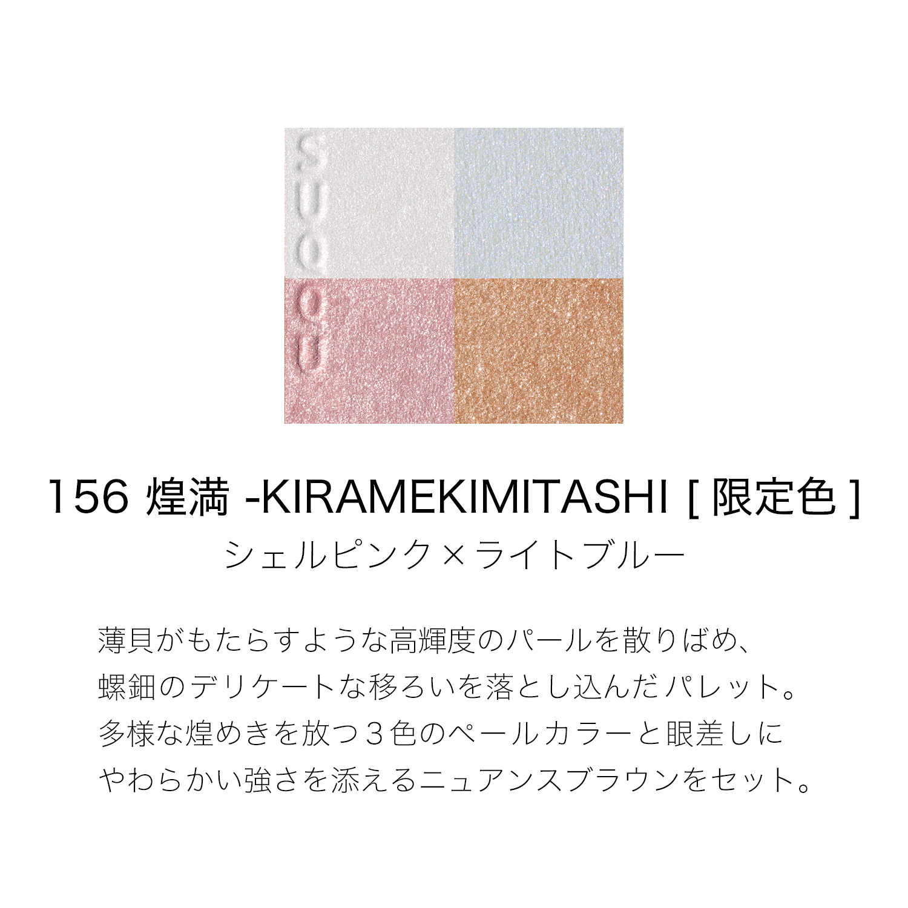
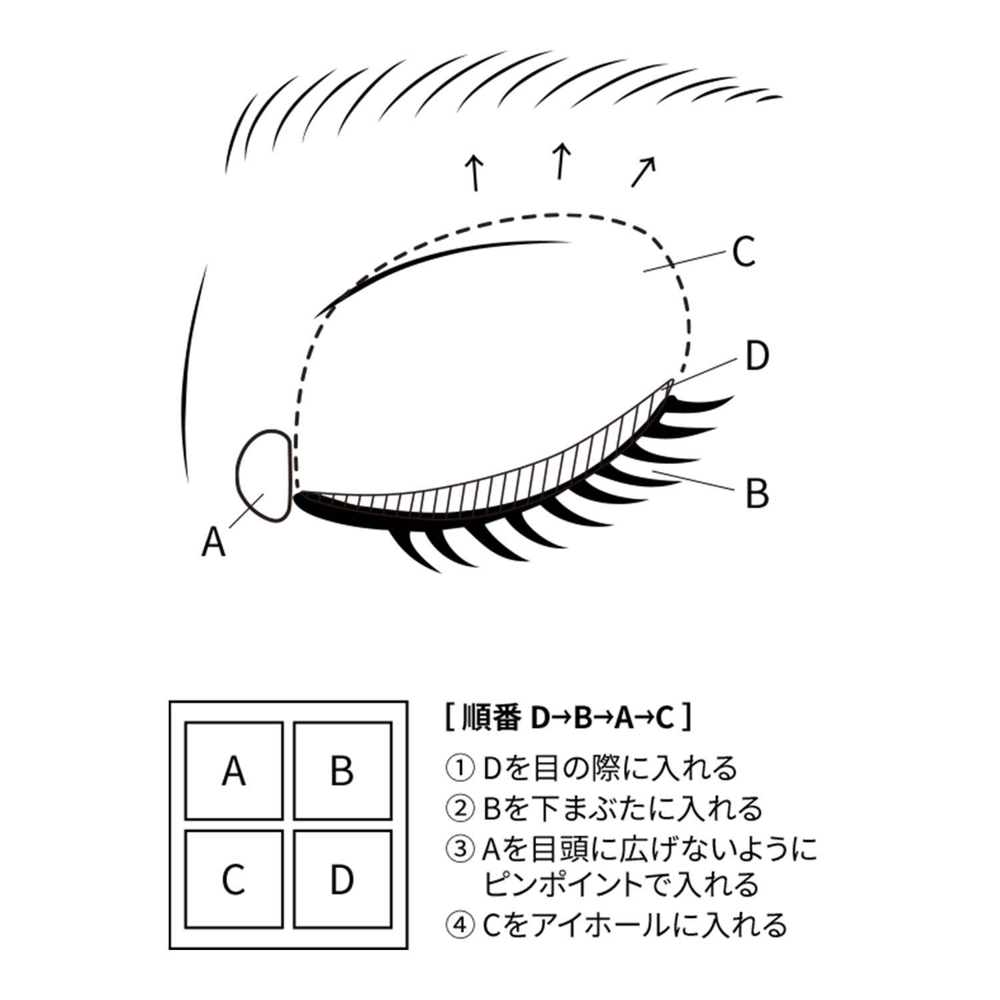
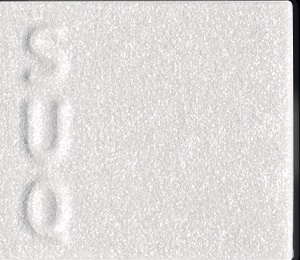
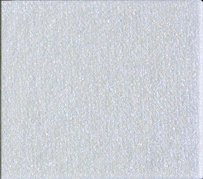
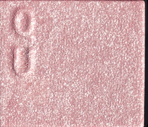
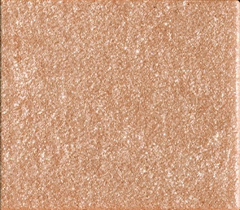

# SUQQU 4色 四色盘 煌满 Signature Color Eyes 156 Kiramekimitashi
*发布：2026*

> 受光摇曳，如同深邃变幻的贝壳，将奥深的闪耀与细腻色彩献予双眸。以高亮度的红、蓝、金珠光与层次丰富的色调，重现大自然既有力量又静谧安详的风情。随视线流转，光彩摇曳，演绎多变的迷人表情。

> *Light ripples and shifts like the depths of a shell — layering iridescent shimmer and delicate colour into the gaze. High-luminosity pearls in red, blue and gold intertwine with nuanced tones to capture nature's powerful yet tranquil beauty. A palette that captivates with ever-changing radiance as your gaze moves.*

---

### 使用方法 How To Use

| 方法一 | 方法二 |
|--------|--------|
|  |  |

**方法一（D→B→A→C）：** ①D沿睫毛根部晕染，②B扫下眼睑，③A点于眼头（避免向外扩散），④C铺满眼窝。

**方法二（B→D→C→A）：** ①B铺满眼窝，②D晕染睫毛线三分之二处，③C铺于眼窝并与D融合晕开，④A从眼头叠加提亮。

---

## 色号 A：覆光色 Coat Color — 银白珠光

使用：点于眼头，精准提亮内眼角与眉骨。

##### 色号 A：覆光色 (Coat Color) —— 银白色细腻珠光，如贝壳内壁般晶莹。
用途：精准点涂于眼头，避免向外大范围延伸；亦可叠于其他色号上增加整体光泽感。

---

## 色号 B：底色 Base Color — 冰蓝珠光

使用：铺满眼窝打底，或扫于下眼睑增添水润感。

##### 色号 B：底色 (Base Color) —— 淡冰蓝珠光，透亮清冽。
用途：作为底色铺满眼窝，奠定清透贝光氛围；或晕于下眼睑，赋予清亮水感。

---

## 色号 C：主色 Main Color — 贝粉珠光

使用：铺满眼窝作为主要眼色，叠加于底色上。

##### 色号 C：主色 (Main Color) —— 柔粉珠光，如薄贝染色般温柔发光。
用途：铺于眼窝作为主体色，与B色融合后打造如螺钿流光般的多层次光感；亦可单独晕开打造日常粉润眼妆。

---

## 色号 D：深色 Deep Color — 琥珀金光

使用：沿睫毛根部晕染，加深眼神轮廓，赋予眼眸柔和的力量感。

##### 色号 D：深色 (Deep Color) —— 暖调琥珀金棕，珠光细腻，为眼神添加温柔深度。
用途：沿睫毛线晕染，赋予眼妆轮廓感与立体度；与C色叠加可深化眼窝层次，打造深邃而不刻板的烟熏效果。
