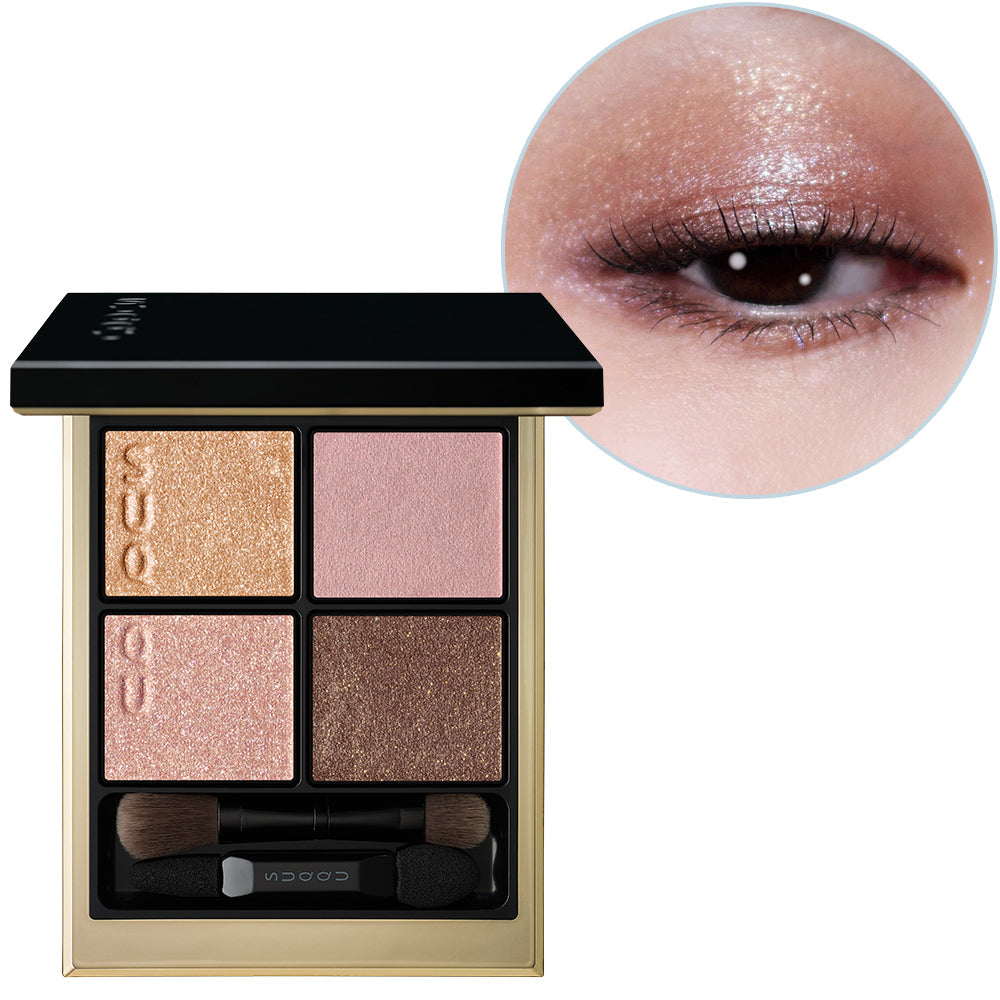
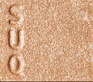
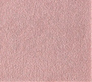
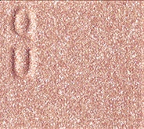
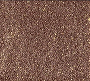

# SUQQU 4色 四色盘 色响 Signature Color Eyes 157 Irohibiki
*发布：2026*

> 冬日澄澈的空气中，色彩如共鸣般轻声回响。中性玫粉与冷蓝珠光叠于其上，再以金调珠光统一全妆，营造出自然而精致的成熟眼神，在寒冷透明的空气中，散发宁静而引人入胜的光泽。

> *In the crisp clarity of winter air, colour resonates quietly. A neutral mauve pink layered with cool blue pearl shimmer, unified by luminous gold pearls across the lids — creating a naturally refined look that radiates a poised, captivating presence in the transparent winter air.*

---

**方法一（D→B→A→C）：** ①D沿睫毛根部晕染，②B扫下眼睑，③A精准点涂眼头，④C铺满眼窝。

**方法二（B→D→C→A）：** ①B铺满眼窝打底，②D晕染睫毛线三分之二处，③C铺于眼窝并与D融合晕开，④A从眼头叠加提亮。

---

## 色号 A：覆光色 Coat Color — 金调蓝珠光

使用：点于眼头，以冷蓝金调珠光统一全妆光感。

##### 色号 A：覆光色 (Coat Color) —— 含冷蓝珠光的金调提亮色，轻盈而精致，为整体眼妆带来透亮统一的光感。
用途：精准点涂眼头及泪沟，或叠于底色上增添整体光泽，彰显冬日清冽空气中的细腻美感。

---

## 色号 B：底色 Base Color — 中性玫粉

使用：铺满眼窝，以中性玫粉打造自然精致的底妆。

##### 色号 B：底色 (Base Color) —— 中性调玫粉，饱和度温和，贴合多种肤色，营造自然优雅的眼妆底色。
用途：均匀铺满眼窝作为底色，为后续色彩层叠打下和谐基底。

---

## 色号 C：主色 Main Color — 玫粉缎光

使用：铺于眼窝，叠加于底色上，丰富层次感。

##### 色号 C：主色 (Main Color) —— 玫粉调缎光，较底色更显饱和，与A色的金调珠光形成呼应，精致而不张扬。
用途：铺于眼窝中心，向眼尾渐深，与D色融合打造精致轮廓感。

---

## 色号 D：深色 Deep Color — 深玫棕

使用：沿睫毛根部晕染，勾勒沉稳眼形轮廓。

##### 色号 D：深色 (Deep Color) —— 深玫棕调，沉稳内敛，为玫粉系眼妆提供清晰的轮廓支撑。
用途：沿睫毛线晕染描绘眼形，叠于C色外侧加深眼尾，演绎精致而耐看的冬日眼神。
