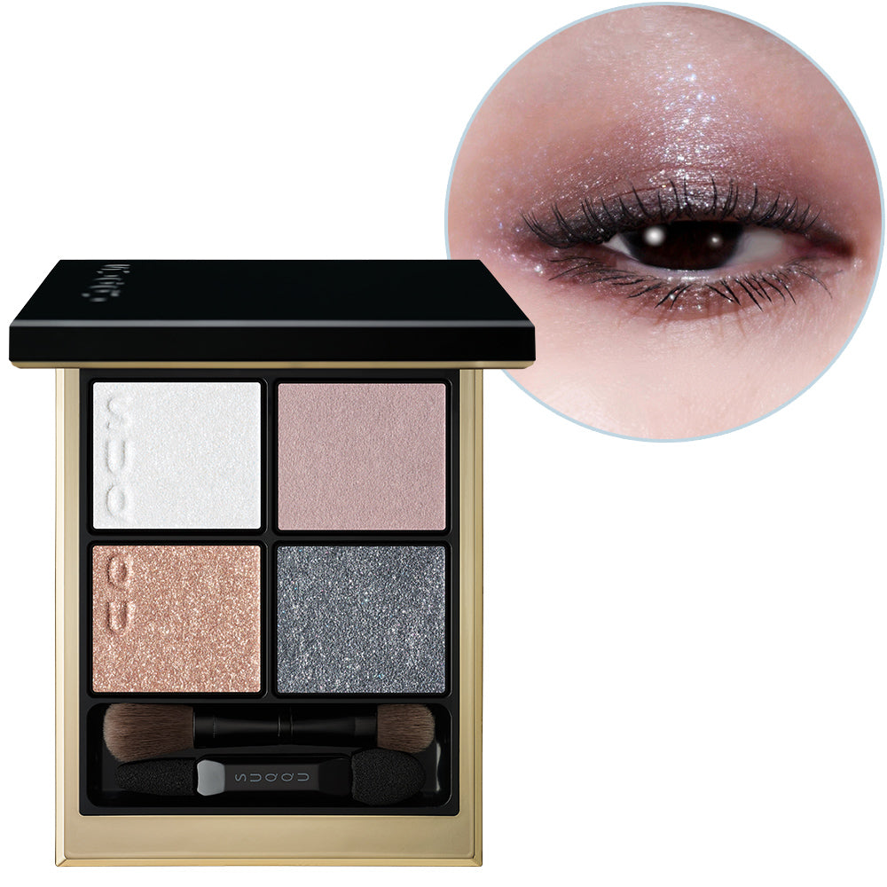
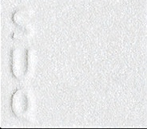
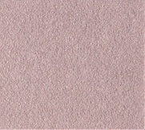
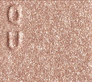
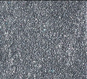

# SUQQU 4色 四色盘 冬光 Signature Color Eyes 158 Fuyuhikari
*发布：2026*

> 寒冬的空气澄净如玻璃，城市灯光与夜空交相辉映。雾紫与闪棕交织出精致现代的层次感，炭蓝底色中的银调珠光如冬夜灯光折射般耀目，演绎出从容自若、令人过目不忘的冬日光泽。

> *Winter air, clear as glass, reflects the shimmer of city lights against the night sky. Dusty lilac and glittering brown weave a refined, modern depth, while silver pearl in a charcoal blue base refracts like winter's urban glow — a poised impression that lingers.*

---

**方法一（D→B→A→C）：** ①D沿睫毛根部晕染，②B扫下眼睑，③A精准点涂眼头，④C铺满眼窝。

**方法二（B→D→C→A）：** ①B铺满眼窝打底，②D晕染睫毛线三分之二处，③C铺于眼窝并与D融合晕开，④A从眼头叠加提亮。

---

## 色号 A：覆光色 Coat Color — 银调雾光

使用：点于眼头，以银调冷光为眼妆赋予冬日透亮感。

##### 色号 A：覆光色 (Coat Color) —— 银调雾光，内含精细珠光，冷冽而精致，如冬夜灯光在冰雪上折射。
用途：叠于眼头及底色上精准提亮，令整体眼妆呈现冬日城市灯光般的通透光泽。

---

## 色号 B：底色 Base Color — 雾紫哑光

使用：铺满眼窝，以雾调紫灰奠定现代精致基底。

##### 色号 B：底色 (Base Color) —— 尘土调雾紫哑光，饱和度克制，打造现代感的冷调眼妆底色。
用途：均匀铺满眼窝，与闪棕和银珠光形成层次感；单独使用亦能演绎日常精致哑光眼妆。

---

## 色号 C：主色 Main Color — 闪光棕

使用：铺于眼窝，以炫目棕金为眼妆增添光感张力。

##### 色号 C：主色 (Main Color) —— 含细密亮片的棕金闪光色，光感丰富，为整体眼妆注入现代华丽感。
用途：铺于眼窝中心叠于B色之上，打造从哑光雾紫到亮棕的立体层次；亦可集中点于眼中央强调光感。

---

## 色号 D：深色 Deep Color — 炭蓝银珠深色

使用：沿睫毛根部晕染，以炭蓝银珠描绘精致深邃的眼形。

##### 色号 D：深色 (Deep Color) —— 炭蓝底色，内含银调珠光，冷邃而精练，为眼妆带来现代都市感的轮廓与深度。
用途：沿睫毛线晕染加深轮廓，叠于眼尾演绎精致烟熏效果；银调珠光在灯光下折射出迷人冷光。
