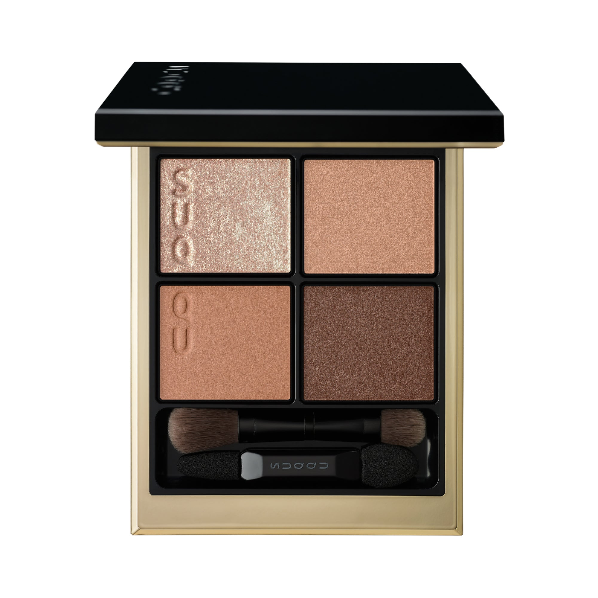
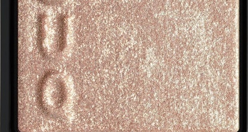
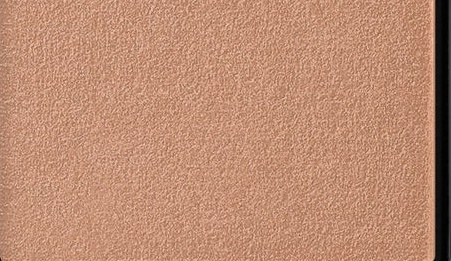
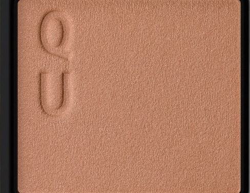
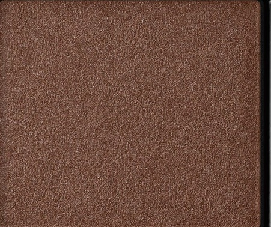

# SUQQU 4色 四色盘 霜落叶 Signature Color Eyes S01 Shimoochiba
*发布：2025*

> 深秋悄然转凉，霜华轻附落叶之上，枯金与沉棕凝结成冬日前夕最后的暖意。三枚棕调色彩层叠出天然深邃的眼神，左上角的霜光色调随视线流转隐隐折射出绿调珠光，如晨霜触阳般透亮清冽。

> *As autumn deepens into silence, hoarfrost settles on fallen leaves — warm golds and earthen browns hold the last warmth before winter. Three brown tones layer into natural depth, while the top-left shade catches the light with a subtle green-tinged shimmer, evoking frost touched by pale winter sun.*

---

**方法一（D→B→A→C）：** ①D沿睫毛根部晕染，②B扫下眼睑，③A精准点涂眼头（避免向外大范围延伸），④C铺满眼窝。

**方法二（B→D→C→A）：** ①B铺满眼窝打底，②D晕染睫毛线三分之二处，③C铺于眼窝并与D融合晕开，④A从眼头叠加提亮。

---

## 色号 A：覆光色 Coat Color — 霜光金棕珠

使用：点于眼头及眉骨，捕捉霜晨的透亮光泽。

##### 色号 A：覆光色 (Coat Color) —— 轻盈香槟金，内含绿调变色珠光，如晨霜触阳般折射清冽光芒。
用途：精准点涂眼头，或叠于眼窝底色上增添整体光泽；镜头下随角度闪烁绿调微光。

---

## 色号 B：底色 Base Color — 暖驼米哑光

使用：铺于眼窝作为底色，或扫于下眼睑塑造自然哑光感。

##### 色号 B：底色 (Base Color) —— 黄调驼米色哑光，肤感贴合，衬托肤色均匀透亮。
用途：作为底色均匀铺满眼窝，奠定自然棕调基底；亦可单独使用打造日常裸妆眼效。

---

## 色号 C：主色 Main Color — 棕驼哑光

使用：铺于眼窝中心及眼尾，叠加深度与轮廓。

##### 色号 C：主色 (Main Color) —— 中深棕驼哑光，质感如落叶般沉稳温厚。
用途：叠于B色之上铺眼窝，以晕开方式向眼尾渐深，打造层次感；亦可与D色融合加深眼神。

---

## 色号 D：深色 Deep Color — 深巧克力棕

使用：沿睫毛根部晕染，为眼神勾勒出深邃轮廓。

##### 色号 D：深色 (Deep Color) —— 深棕哑光，取意枯木深色，为眼妆带来沉稳力量感。
用途：沿睫毛线描绘轮廓，叠于C色外侧加深层次；少量晕于眼尾即可演绎清爽轮廓眼。
