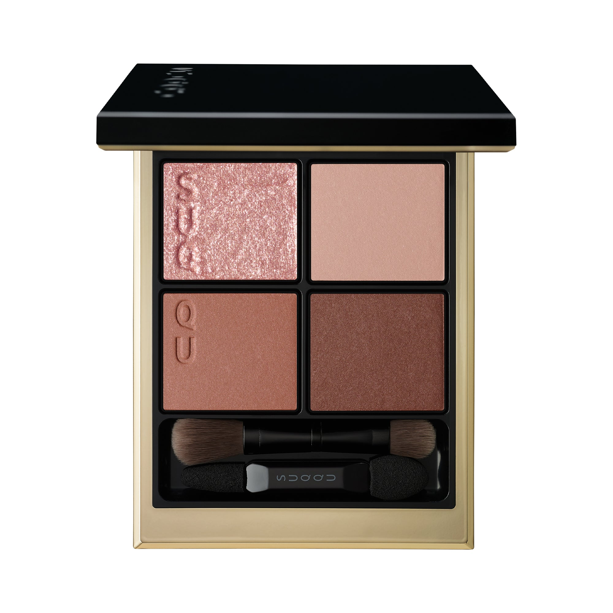
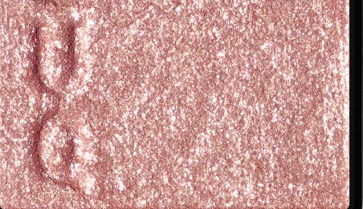
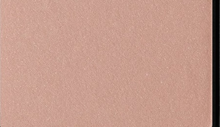
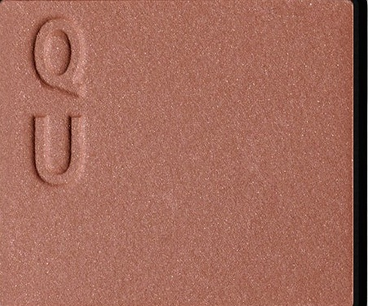
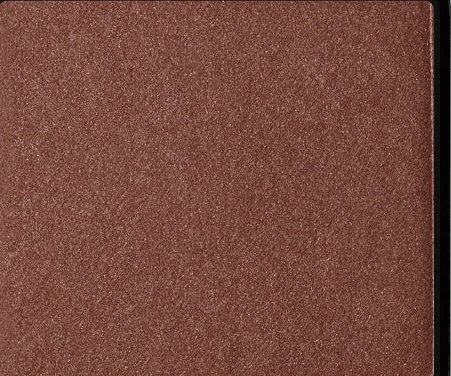

# SUQQU 4色 四色盘 霜花 Signature Color Eyes S02 Souka
*发布：2025*

> 霜华落处，残花未凋，暖棕与玫调雾色交融，细腻的粉调珠光如霜触花瓣般柔光晕散。冬日暖意藏于沉稳的赤棕之中，左上角的珠光薄色轻抚眼睑，传递出霜晨凝花的温柔余韵。

> *Where frost settles, flowers linger — warm browns and misty mauves interweave, while fine pink pearl shimmers softly like frost on petals. Winter's warmth rests in the depth of reddish-brown, and the pearlescent top-left shade grazes the lids with the quiet, tender afterglow of frosted blossoms.*

---

**方法一（D→B→A→C）：** ①D沿睫毛根部晕染，②B扫下眼睑，③A精准点涂眼头，④C铺满眼窝。

**方法二（B→D→C→A）：** ①B铺满眼窝打底，②D晕染睫毛线三分之二处，③C铺于眼窝并与D融合晕开，④A从眼头叠加提亮。

---

## 色号 A：覆光色 Coat Color — 玫粉细珠光

使用：点于眼头及内眼角，以温柔粉光为眼妆注入暖意。

##### 色号 A：覆光色 (Coat Color) —— 柔粉色调，内含细腻粉调珠光，光感轻盈，如霜华触碰花瓣般温柔。
用途：叠于眼头及眼窝底色上，赋予整体眼妆暖调光泽；单独点于泪沟处亦能自然提亮。

---

## 色号 B：底色 Base Color — 裸玫哑光

使用：作为底色均匀铺满眼窝，营造雅致玫调裸妆底。

##### 色号 B：底色 (Base Color) —— 淡调裸玫哑光，优雅含蓄，衬托温柔成熟气质。
用途：均匀铺于眼窝打底，奠定暖玫氛围；亦可单独扫于眼睑，打造日常温柔裸眼效果。

---

## 色号 C：主色 Main Color — 珊瑚棕缎光

使用：铺于眼窝中区及眼尾，叠加暖调轮廓。

##### 色号 C：主色 (Main Color) —— 暖调玫棕缎光，带有红调倾向，质感温润丰盈。
用途：叠于B色之上铺满眼窝，向眼尾自然渐深；与D色融合可打造温柔深邃的晕染效果。

---

## 色号 D：深色 Deep Color — 深栗红棕

使用：沿睫毛根部晕染，强调眼形轮廓，赋予眼神暖调深度。

##### 色号 D：深色 (Deep Color) —— 深栗棕缎光，红棕色调浓郁，演绎暖意盎然的成熟眼神。
用途：点于睫毛线加深轮廓，叠于C色外侧逐步加深；少量晕于下眼尾可增添华丽感。
