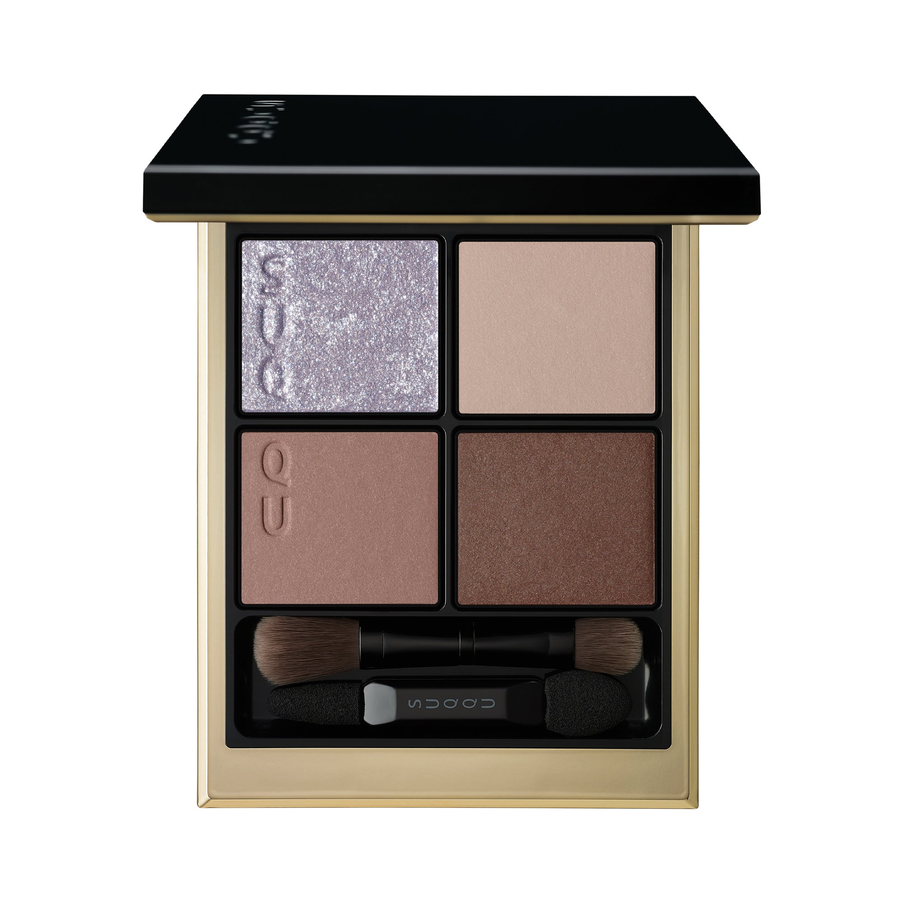
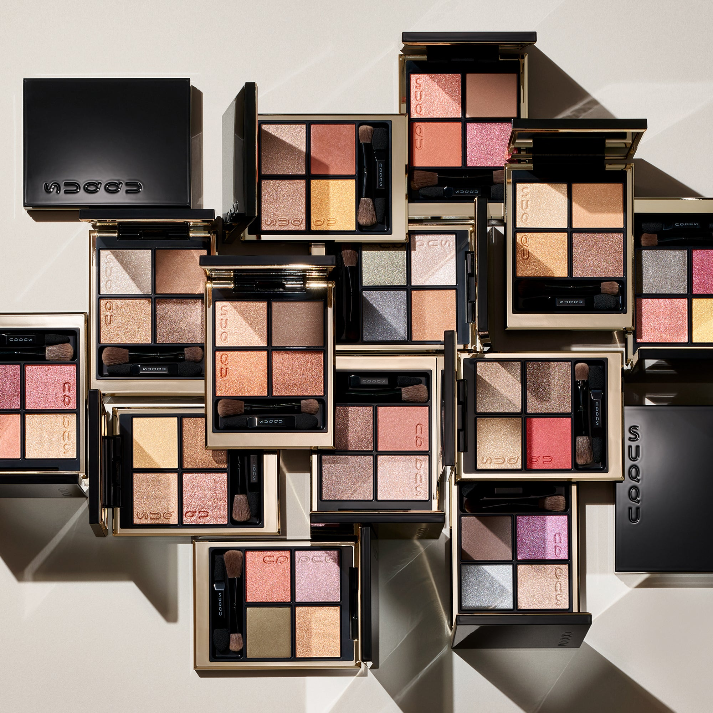
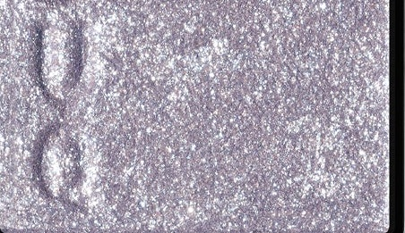
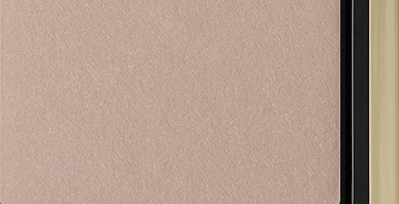
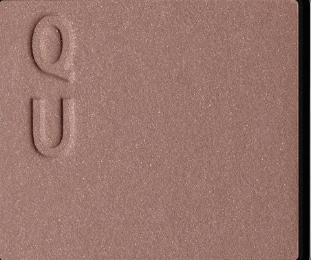
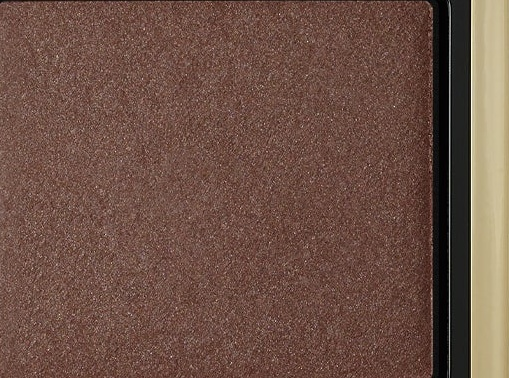

# SUQQU 4色 四色盘 霜来 Signature Color Eyes S03 Sourai
*发布：2025*

> 霜至，天地转凉，灰绿与蓝棕之间透出凛冽清澈之气。左上角银白冰蓝珠光如霜晶折射冬日微光，清冽而不刺目，将眼神映照为寒冬清晨的宁静风景。冷调层叠，带来沉稳中的精致优雅。

> *As frost arrives, cool tones of ash-greige and blue-tinged brown settle like the quiet, clear chill of winter. The silver shade accented with blue pearl refracts winter's pale light — crisp and refined, like the still clarity of a frost-touched morning.*

---

**方法一（D→B→A→C）：** ①D沿睫毛根部晕染，②B扫下眼睑，③A精准点涂眼头，④C铺满眼窝。

**方法二（B→D→C→A）：** ①B铺满眼窝打底，②D晕染睫毛线三分之二处，③C铺于眼窝并与D融合晕开，④A从眼头叠加提亮。

---

## 色号 A：覆光色 Coat Color — 霜银冰蓝珠

使用：点于眼头，以冷调霜光为眼妆带来透亮清冽感。

##### 色号 A：覆光色 (Coat Color) —— 银白色调内含蓝调偏光珠光，如霜晶折射冬晨微光，清冽而精致。
用途：叠于眼头及内眼角精准提亮；亦可轻拍于眼窝底色上，增添整体冷调光感。

---

## 色号 B：底色 Base Color — 灰米哑光

使用：铺满眼窝打底，营造清爽哑光底妆。

##### 色号 B：底色 (Base Color) —— 中性灰调米色哑光，质地细腻，为冷调眼妆奠定贴肤底色。
用途：均匀铺满眼窝作为底色，衬出冷调色彩的清透效果；亦可扫于眼睑打造日常干净眼妆。

---

## 色号 C：主色 Main Color — 冷调玫粉哑光

使用：铺于眼窝及眼尾，叠加冷调氛围。

##### 色号 C：主色 (Main Color) —— 冷调玫粉哑光，带有灰调倾向，演绎低调克制的冬日成熟感。
用途：叠于B色之上铺满眼窝，向眼尾自然渐深；与D色融合可呈现冷调深邃的立体眼神。

---

## 色号 D：深色 Deep Color — 深棕蓝调缎光

使用：沿睫毛根部晕染，以含蓝调的深棕为眼神赋予冷调轮廓感。

##### 色号 D：深色 (Deep Color) —— 深暖棕缎光，隐含蓝调倾向，与整体冷色系和谐统一，增添眼神立体深度。
用途：沿睫毛线晕染加深轮廓，叠于C色外侧逐步渐深；少量晕于下眼尾可演绎精致冷调眼妆。
