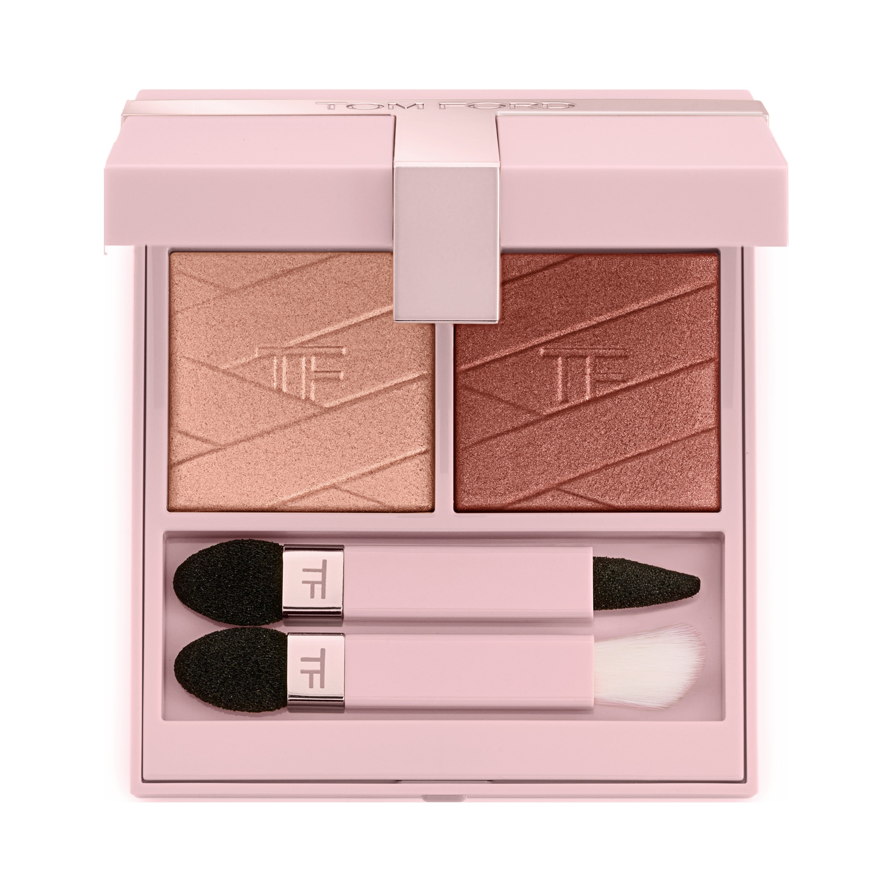
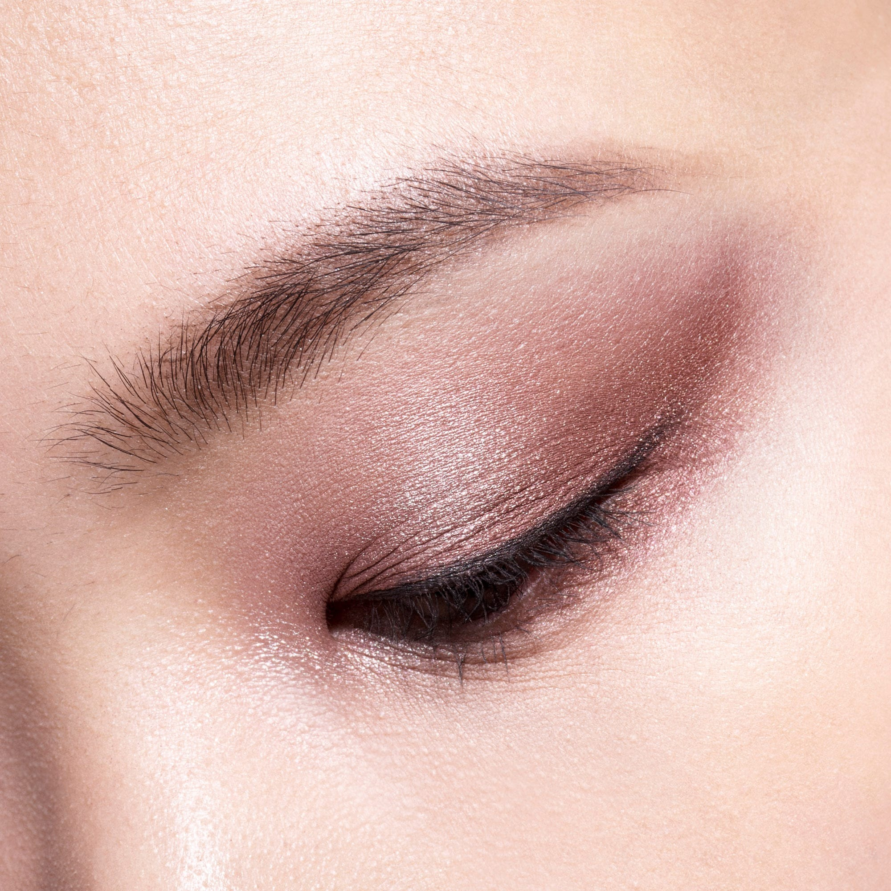
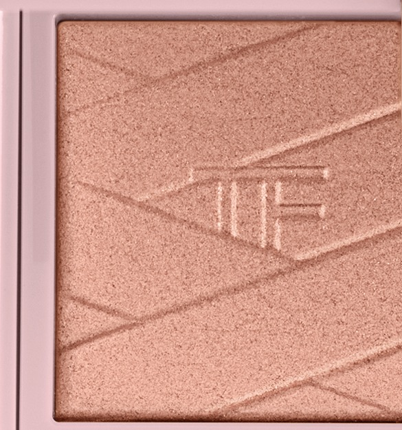
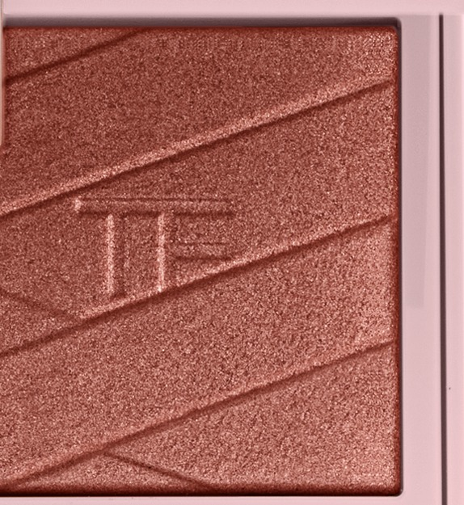

# Tom Ford 2色 双色盘 月光爱恋盘 Love Collection Eye Color Duo Lumière
*发布：~2021*

> 光的悄声细语，一瞬之间让肌肤发光。Love Collection Eye Color Duo Lumière 以超细微珍珠粉配方，将玫瑰香槟与燃铜沙褐压入两格之中——两色皆可独立成妆，亦可叠加出流动的金属质感。

> *Light captured in two pressed shimmers. The Lumière duo layers luminous rosé pink and a smouldering sable brown in a compact that borrows its blush-pink case from Tom Ford's Rose Prick world — then fills it with shimmer that glows from every angle.*

## Shade 1: Rose Lumière — Shimmering rosé pink.

Use: All over lid for a soft romantic shimmer, or concentrate on the inner corner and brow bone as a highlight. Layer over neutral mattes for a delicate rose metallic effect.

##### 色号 1：玫瑰月光 (Rose Lumière) —— 玫瑰香槟闪光。
用途：可作全眼铺色打造柔美浪漫光感，或点于眼头与眉骨作高光；叠加于中性哑光底色上呈现精致玫瑰金属感。

## Shade 2: Sable Lumière — Shimmering sable brown.

Use: All over lid for a smouldering metallic depth, or concentrate in the outer corner and crease for definition. Layer under or over Rose Lumière for a dimensional warm-toned eye.

##### 色号 2：沙褐月光 (Sable Lumière) —— 燃铜沙褐闪光。
用途：可作全眼铺色打造灼热金属深度，或集中叠加于眼尾和眼窝增添立体感；与玫瑰月光叠搭可打造多维暖调眼妆。
