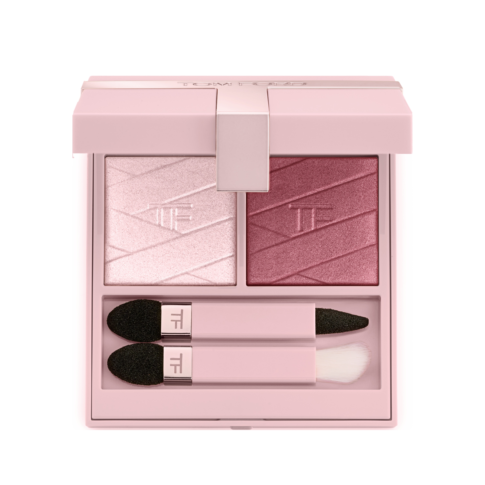
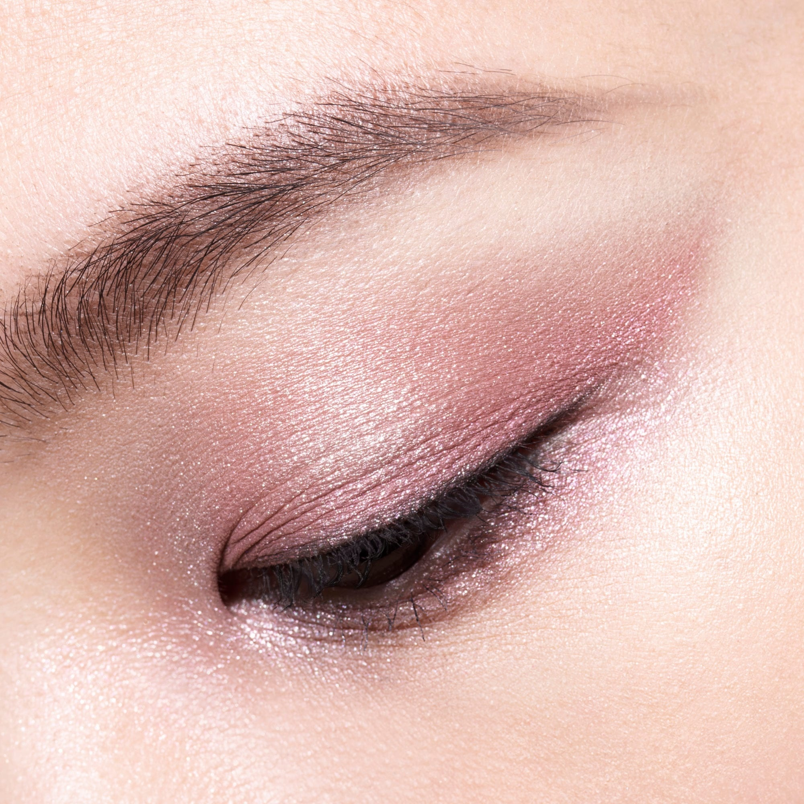
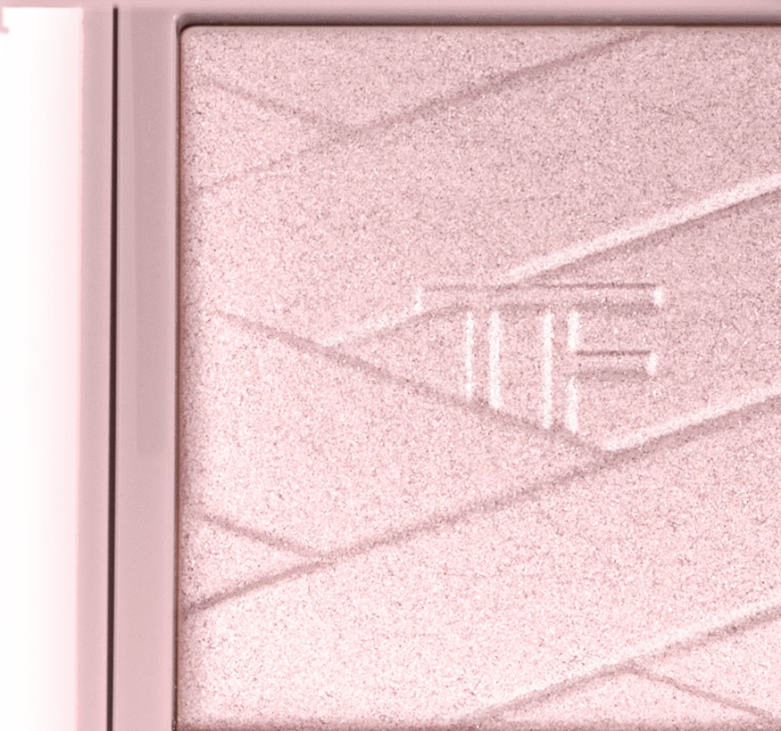
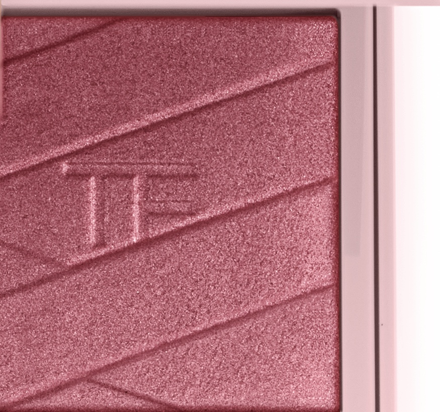

# Tom Ford 2色 双色盘 粉色心愿盘 Love Collection Eye Color Duo 01 Pink Desire
*发布：~2025*

> 欲望是一抹不自知的粉——浅得像脸红，深得像玫瑰刺。Pink Desire 将两种粉调闪光压入同一个盘：一格是几近透明的淡粉微光，另一格是沉进紫调的玫瑰石英闪。同色系两用，叠出层次，也可各自独立成妆。

> *Desire starts as a blush — barely there, then suddenly deep. Pink Desire pairs a translucent light-pink shimmer with a dusky rose quartz in the same blush-pink compact, letting the two shades read as a soft monochromatic duo or a layered pink eye in two moves.*

## Shade 1: Pink Desire — Shimmering light pink.

Use: All over lid for a sheer, skin-like shimmer wash, or concentrate on the inner corner and brow bone as a delicate highlight. Layer under Rose Quartz to anchor the look with an airy pink base.

##### 色号 1：粉色心愿 (Pink Desire) —— 浅粉闪光。
用途：可作全眼薄透铺色，呈现贴肤微光感；也可点于眼头和眉骨作轻盈提亮；叠加玫瑰石英之前作底色，打造通透粉调底妆感。

## Shade 2: Rose Quartz — Shimmering rose quartz pink.

Use: All over lid for a warm rose metallic effect, or concentrate in the crease and outer corner for depth. Layer over Pink Desire for a luminous, multi-toned pink eye, or wear alone for an effortless rosy shimmer.

##### 色号 2：玫瑰石英 (Rose Quartz) —— 玫瑰石英粉闪光。
用途：可作全眼铺色打造暖调玫瑰金属感，或集中叠于眼窝和眼尾增添深度；与粉色心愿叠搭可打造多维粉调眼妆；单独使用也可呈现轻松的玫瑰微光妆效。
