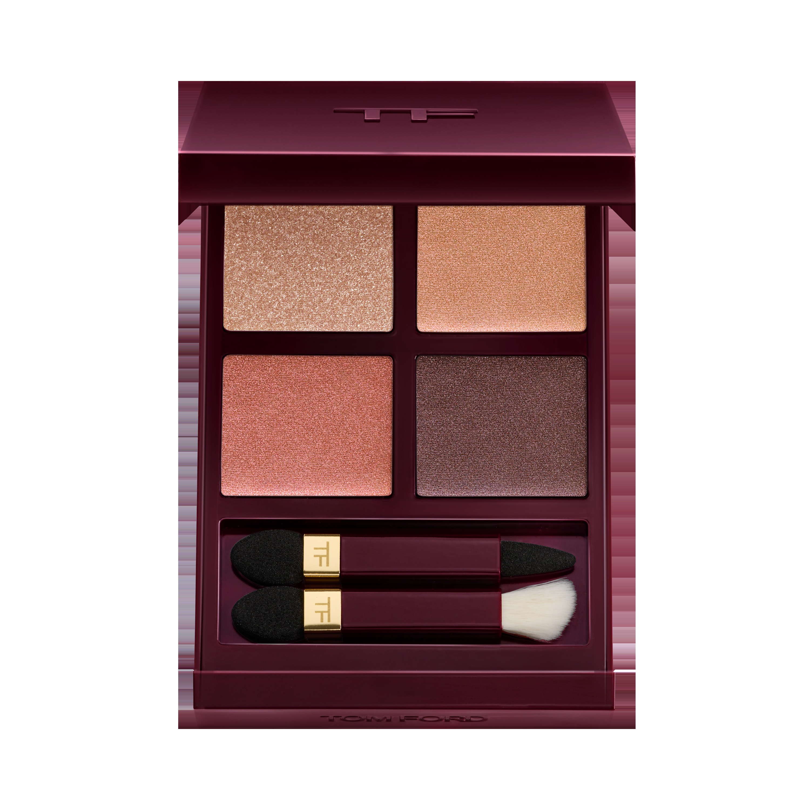
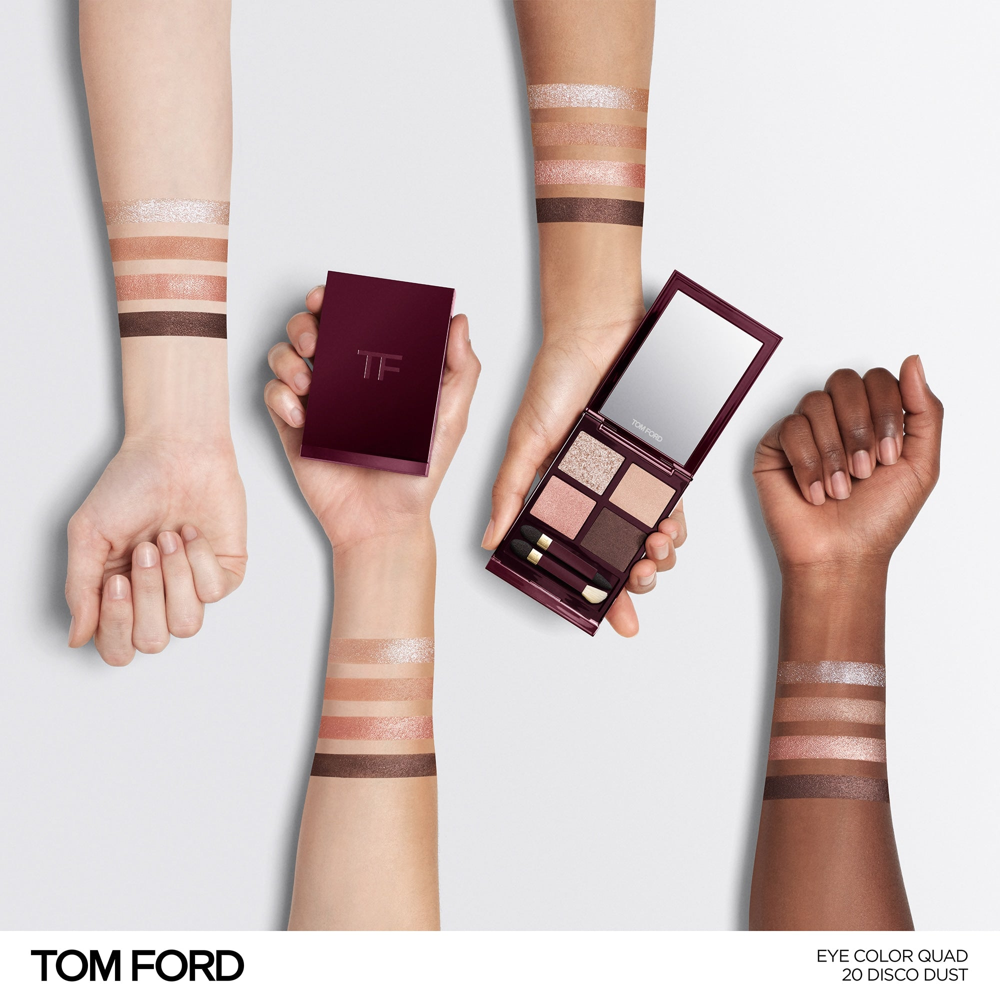
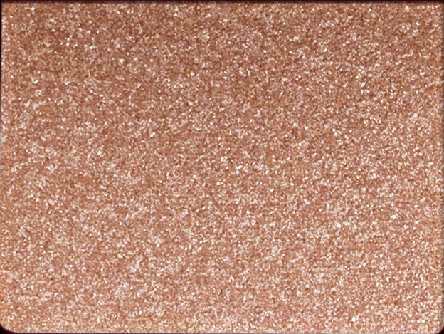
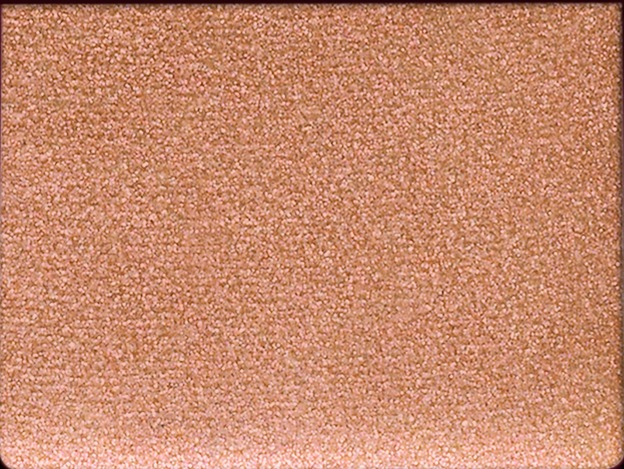
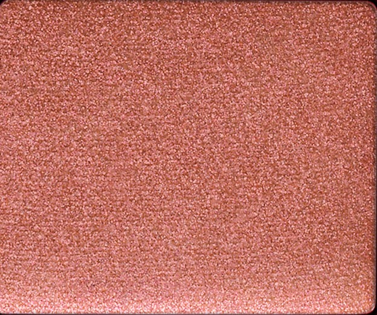
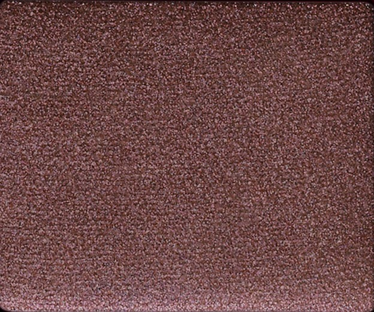

# Tom Ford 4色 四色盘 诱惑无花果盘 Figue Érotique Collection Eye Color Quad 20 Disco Dust
*发布：~2025*

> 无花果的气息，是甜蜜与暗涌并存的那种。闪光玫瑰金点亮眼头，暖铜珠光在眼窝氤氲，珊瑚玫瑰叠出温度，深梅金光最终收拢外眼角——四个动作，一场感官烟熏。

> *The scent of fig is sweetness and shadow at once. Sparkle rose gold opens the inner eye; warm copper shimmer warms the crease; shimmer rose tints the outer lid; metallic plum seals the outer corners — four moves, one sensual smoke.*

## Shade 1: Sparkle Rose Gold — Warm glittery rose gold sparkle.

Use: Step 1 — Apply to the inner corner with an applicator or brush to illuminate and open the eye with warm rose gold sparkle.

##### 色号 1：闪光玫瑰金 (Sparkle Rose Gold) —— 暖调闪光玫瑰金色。
用途：第一步——用刷具或点涂棒点于眼头，以暖调玫瑰金闪光提亮眼神。

## Shade 2: Shimmer Copper — Warm satin copper shimmer.

Use: Step 2 — Sweep into the crease to add warm copper depth and dimension.

##### 色号 2：珠光铜棕 (Shimmer Copper) —— 暖调珠光铜棕色。
用途：第二步——扫入眼窝，以暖调珠光铜棕为眼妆增添深度与立体感。

## Shade 3: Shimmer Rose — Warm shimmer coral rose.

Use: Step 3 — Sweep across the outer eyelid to tint the eye with warm shimmer rose.

##### 色号 3：珠光玫瑰 (Shimmer Rose) —— 暖调珠光珊瑚玫瑰色。
用途：第三步——扫于外眼睑，以暖调珠光玫瑰色染出丰盈眼色。

## Shade 4: Metallic Plum — Deep metallic plum-cocoa.

Use: Step 4 — Define the outer corners and lash line with this deep metallic plum to seal and intensify the look.

##### 色号 4：金属梅李 (Metallic Plum) —— 深调金属感梅李棕色。
用途：第四步——集中点于外眼角及睫毛根，以深色金属梅李精准收边，完成眼妆。
