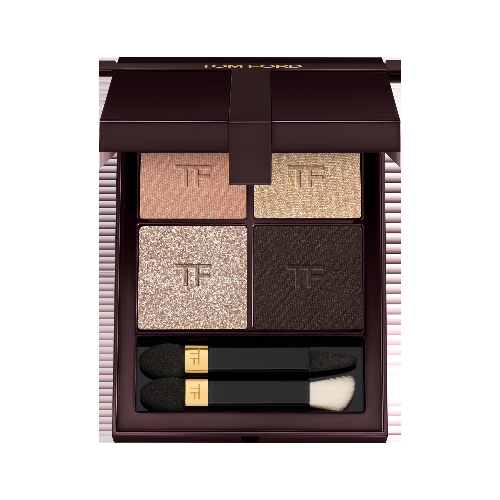
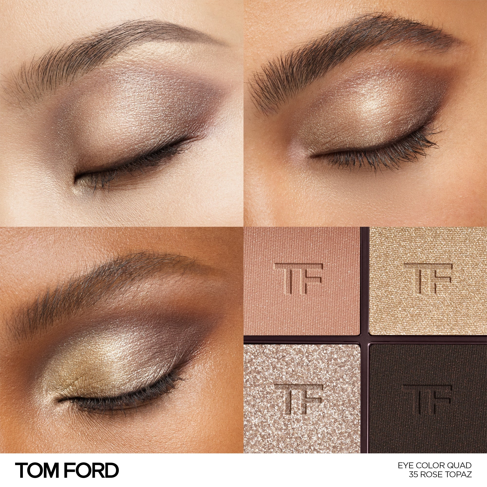
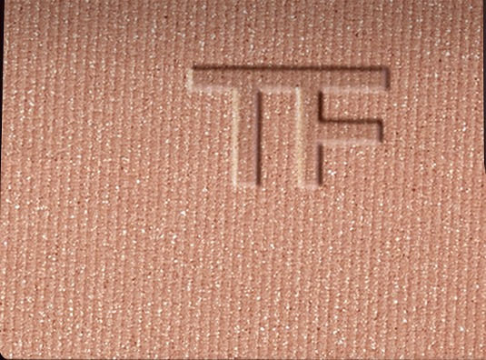
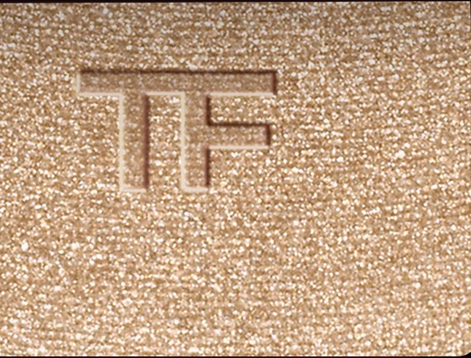
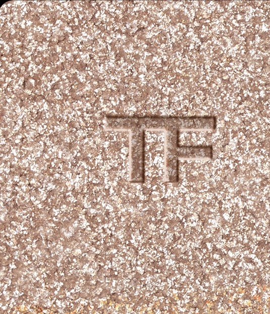
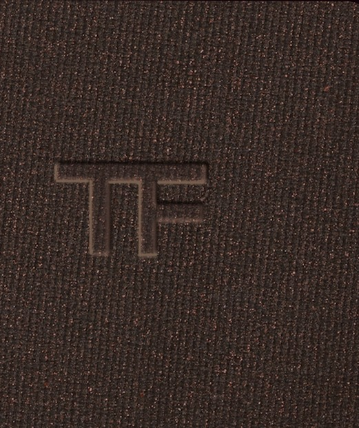

# Tom Ford 4色 四色盘 玫瑰黄玉盘 Runway Eye Color Quad Crème 35 Rose Topaz
*发布：~2025*

> 透过玫瑰黄玉的光，看到的是一种难以名状的温柔。米玫珠光铺就底色，柔金大闪粒子跳动在眼头，银灰调缎光温和雕塑，最终以一抹深棕令整幅妆容落定——色彩克制，光感奢华。

> *A classic veil of beige-rose, soft gold, silver taupe and deep brown. The Crème formula layers with precision — each shade pressing cleanly into the lid, blending with a slow, deliberate warmth.*

## Shade 1: Shimmer Beige Rose — Shimmering beige rose.

Use: Step 1 — Sweep this shimmering beige rose all over the lid to create a soft, rosy luminous base.

##### 色号 1：珠光米玫 (Shimmer Beige Rose) —— 珠光米白玫瑰色。
用途：第一步——以此珠光米玫色全眼铺底，打造柔润发光的玫调底妆。

## Shade 2: Sparkle Soft Gold — Soft gold sparkle.

Use: Step 2 — Apply to the inner corner and brow bone for a luminous soft gold highlight.

##### 色号 2：柔金闪光 (Sparkle Soft Gold) —— 柔和金调闪光。
用途：第二步——点于眼头与眉骨，以柔金闪光提亮打造温润光感。

## Shade 3: Sparkle Silver Taupe — Sparkle warm silver taupe.

Use: Step 3 — Blend into the crease and outer corners to sculpt subtle depth with silvery warmth.

##### 色号 3：银调暖灰 (Sparkle Silver Taupe) —— 闪光暖银灰色。
用途：第三步——晕入眼窝及眼尾，以银调暖灰闪光柔和塑形。

## Shade 4: Matte Deep Brown — Deep matte brown.

Use: Step 4 — Define the crease and lash line with this deep matte brown for a precise, polished finish.

##### 色号 4：哑光深棕 (Matte Deep Brown) —— 深哑光棕色。
用途：第四步——集中点于眼窝与睫毛根，以哑光深棕精准收尾定形。
