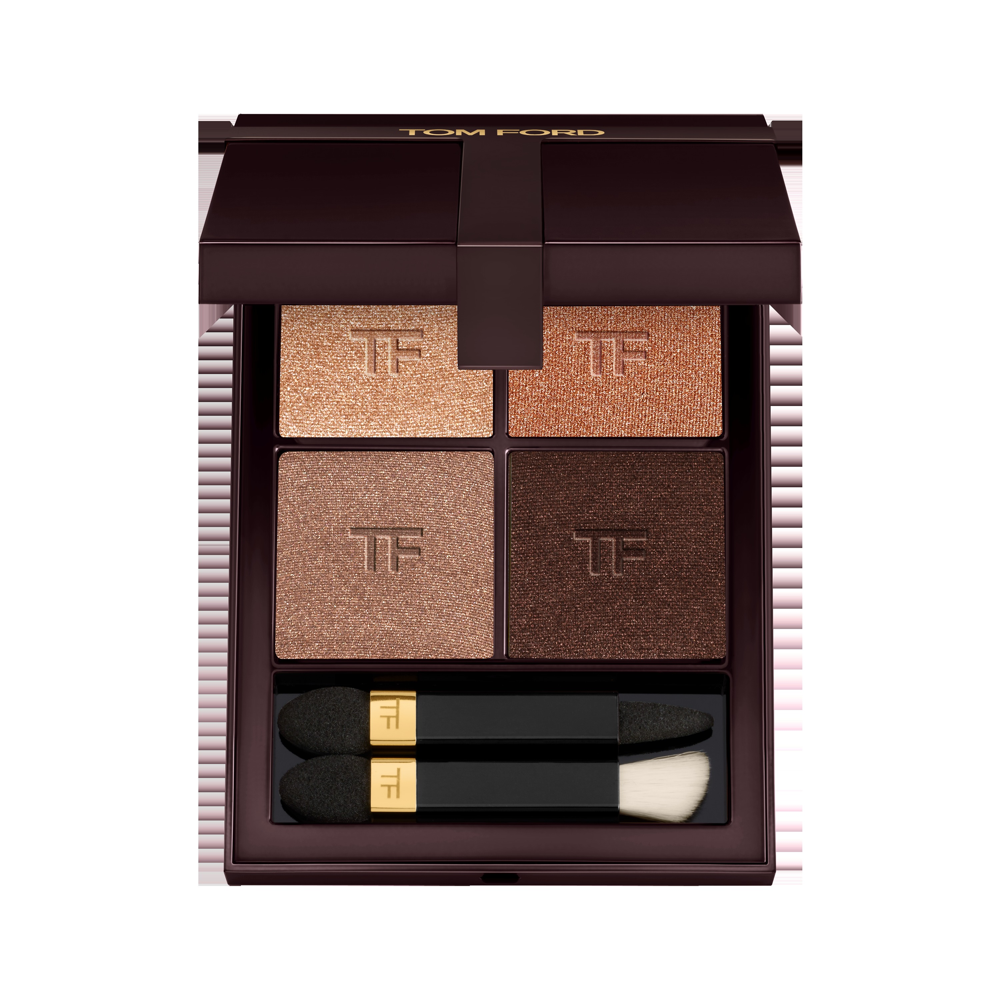
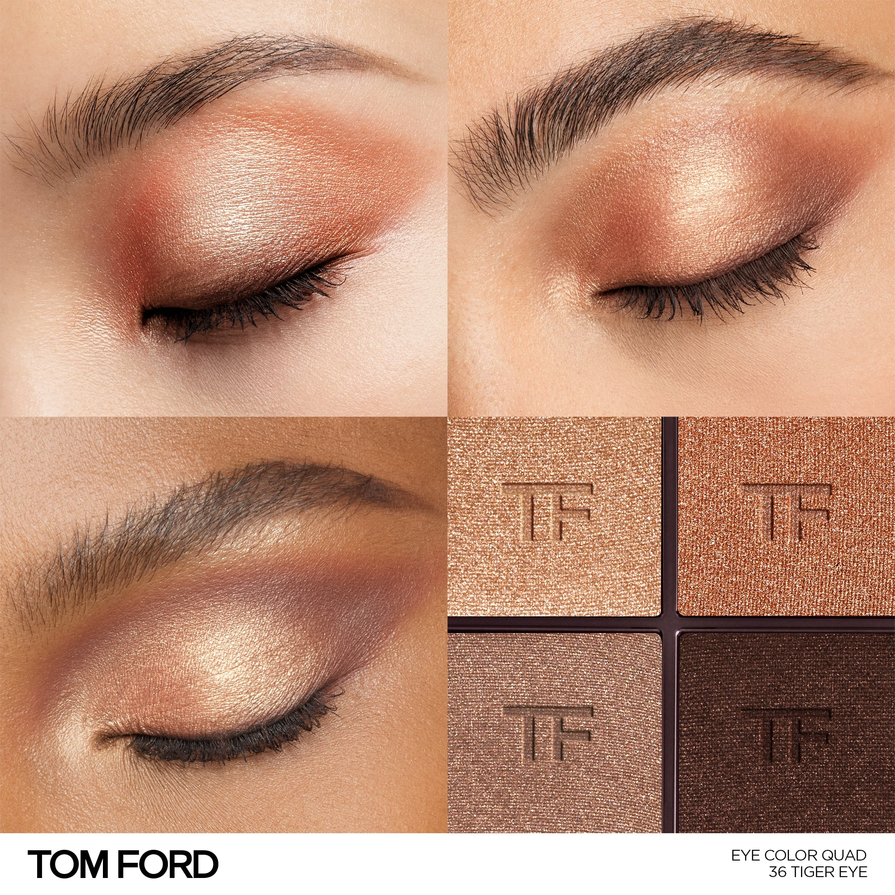
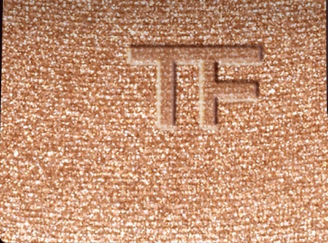
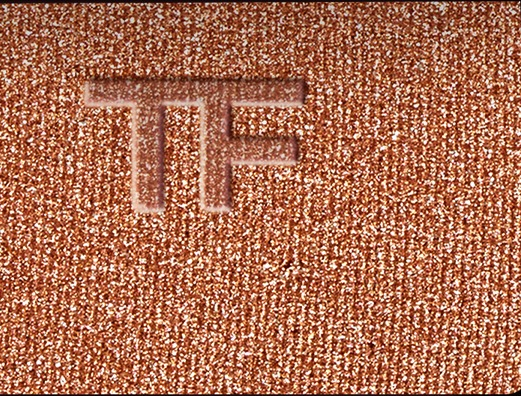
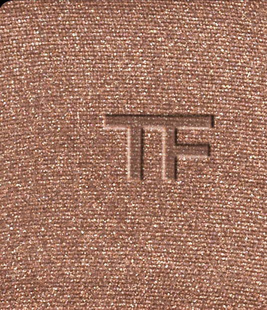
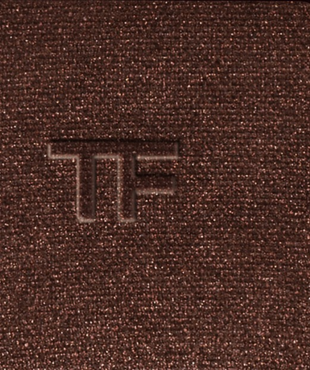

# Tom Ford 4色 四色盘 虎眼盘 Runway Eye Color Quad Crème 36 Tiger Eye
*发布：~2025*

> 虎眼石的光：那是一种横跨琥珀、焦铜与深棕的流动——温暖、猛烈、密不透风。四色依序升温，如猫科的凝视，沉静中藏着危险，奢华又原始。

> *The light inside a tiger's eye stone: amber shifting into copper, copper into bronze, bronze into dark espresso. Warm, layered, and dangerously alive.*

## Shade 1: Sparkle Amber — Warm sparkle amber.

Use: Step 1 — Sweep this warm sparkle amber all over the lid for a glowing, honeyed base.

##### 色号 1：闪光琥珀 (Sparkle Amber) —— 暖调闪光琥珀色。
用途：第一步——以此暖调闪光琥珀色全眼铺底，打造蜂蜜般的发光底色。

## Shade 2: Sparkle Copper — Warm sparkle burnt copper.

Use: Step 2 — Apply to the inner corner and center lid for a warm copper sparkle that intensifies the amber base.

##### 色号 2：闪光焦铜 (Sparkle Copper) —— 暖调闪光焦铜色。
用途：第二步——点于眼头与眼中，以闪光焦铜色叠加深化底色光感。

## Shade 3: Shimmer Bronze — Warm shimmer bronze.

Use: Step 3 — Blend into the crease and outer corners for layered warm bronze depth.

##### 色号 3：珠光古铜 (Shimmer Bronze) —— 暖调珠光古铜色。
用途：第三步——晕入眼窝及眼尾，以珠光古铜色叠出暖调深邃轮廓。

## Shade 4: Shimmer Espresso — Deep shimmer espresso.

Use: Step 4 — Define the crease and lash line with this deep shimmer espresso for an intense, smouldering finish.

##### 色号 4：珠光浓咖 (Shimmer Espresso) —— 深珠光浓咖棕。
用途：第四步——集中点于眼窝与睫毛根，以深珠光浓咖色描画烟熏轮廓。
