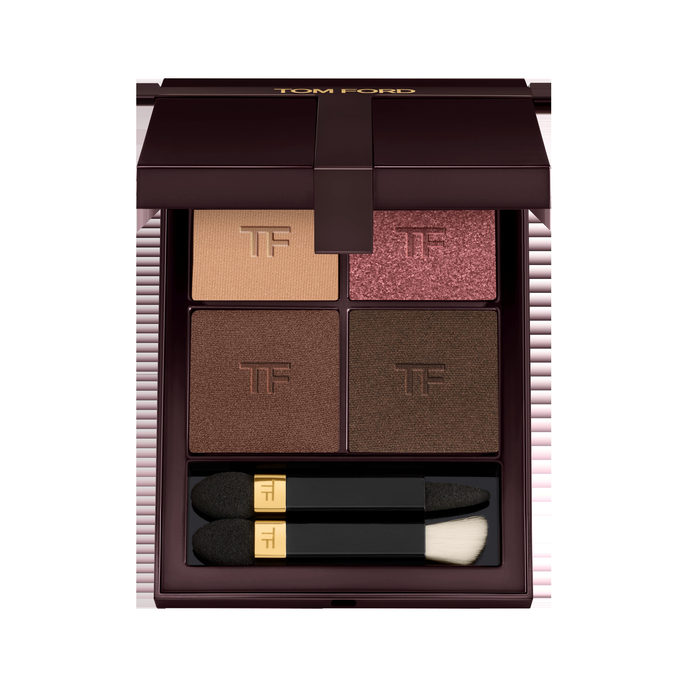
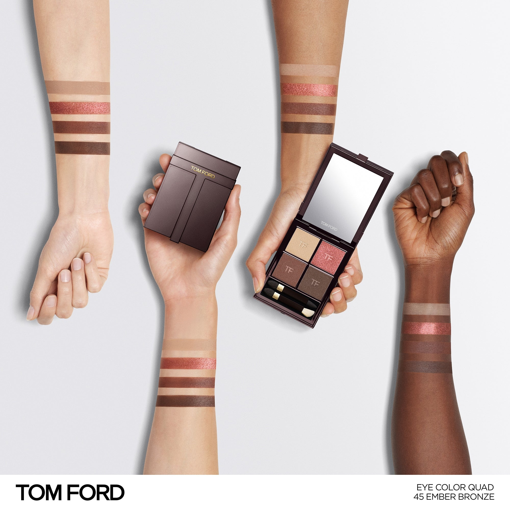
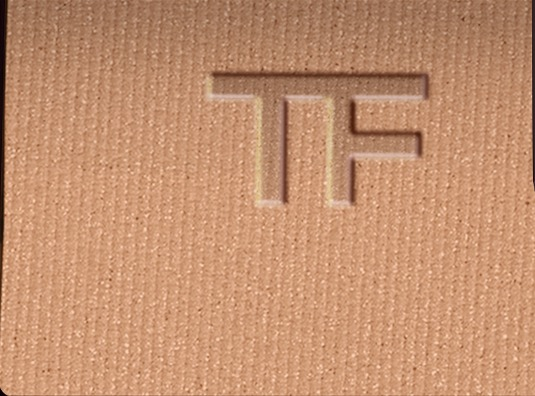
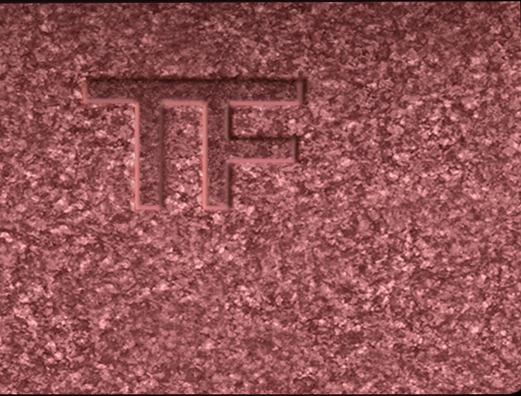
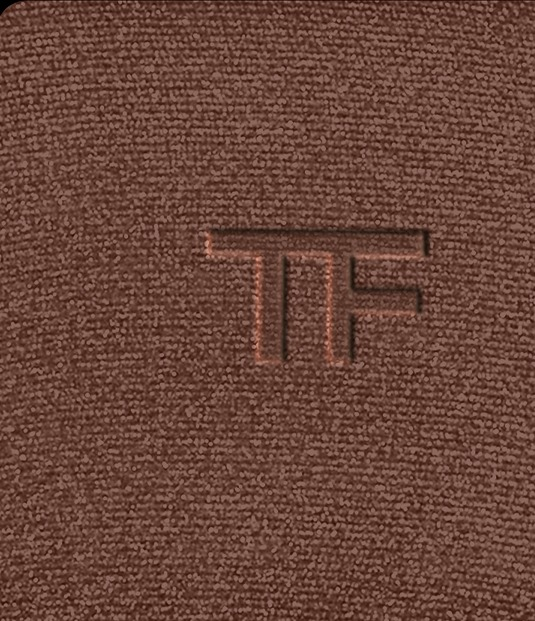
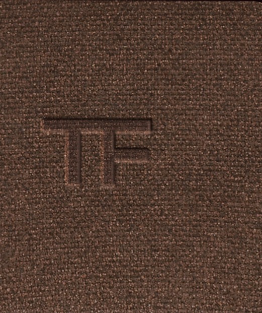

# Tom Ford 4色 四色盘 余烬铜光盘 Runway Eye Color Quad Crème 45 Ember Bronze
*发布：~2025*

> 余烬之美，在于残留的温度。琥珀珠光铺就灼热底色，玫瑰铜光如炽焰闪动，深铜棕层叠出炉火的景深，哑光深棕如灰烬沉落——是一场刚好褪去、却仍在发光的燃烧。

> *Beauty lives in what the ember leaves behind. Warm amber builds the glow; rose bronze flickers like flame; deep bronze presses into shadow; matte umber settles like ash — still warm, still burning.*

## Shade 1: Shimmer Amber — Warm shimmer amber.

Use: Step 1 — Sweep this warm shimmer amber all over the lid to build a glowing, ember-lit base.

##### 色号 1：珠光琥珀 (Shimmer Amber) —— 暖调珠光琥珀色。
用途：第一步——以此暖调珠光琥珀色全眼铺底，打造炙热发光的底色。

## Shade 2: Shimmer Rose Bronze — Warm shimmer rose bronze.

Use: Step 2 — Apply to the inner corner for a warm rose-bronze shimmer highlight with glowing intensity.

##### 色号 2：珠光玫铜 (Shimmer Rose Bronze) —— 暖调珠光玫瑰铜色。
用途：第二步——点于眼头，以珠光玫铜打造炽热感提亮效果。

## Shade 3: Shimmer Deep Bronze — Deep shimmer bronze.

Use: Step 3 — Blend into the crease and outer corners for rich, smouldering bronze depth.

##### 色号 3：珠光深铜 (Shimmer Deep Bronze) —— 深调珠光古铜色。
用途：第三步——晕入眼窝及眼尾，以深珠光古铜色叠出浓烈立体感。

## Shade 4: Matte Umber — Deep matte umber.

Use: Step 4 — Define the crease and lash line with this deep matte umber for a smoky, intense finish.

##### 色号 4：哑光深棕赭 (Matte Umber) —— 深哑光棕赭色。
用途：第四步——集中点于眼窝与睫毛根，以哑光深棕赭色收尾，打造余烬烟熏感。
