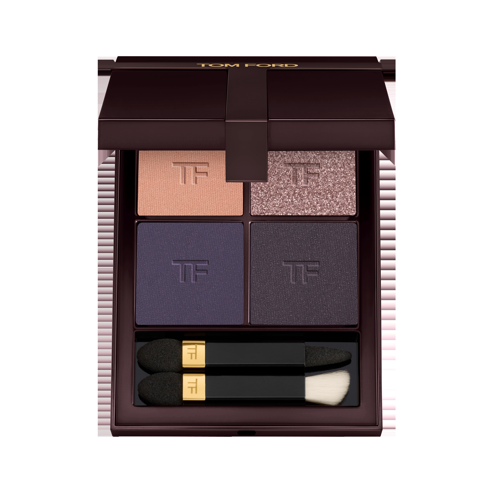
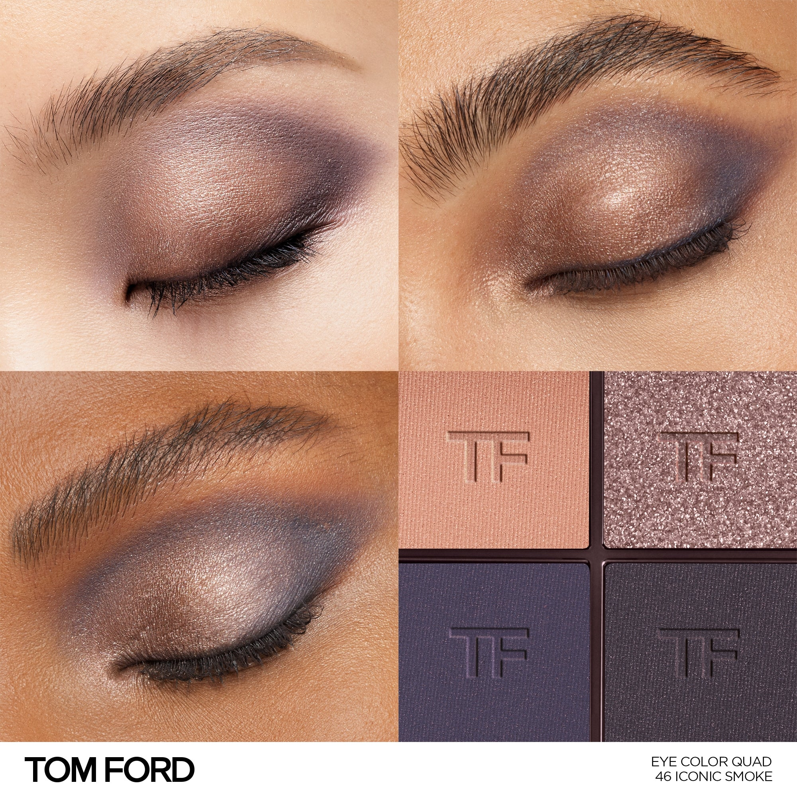
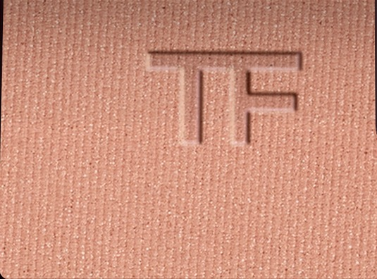
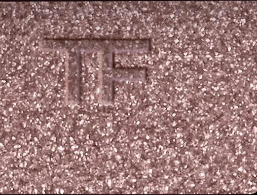
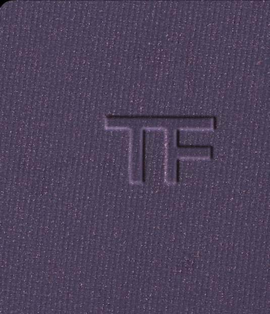
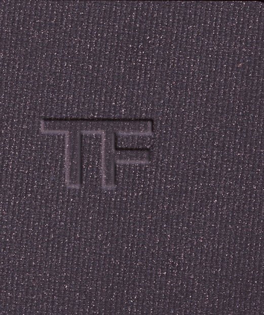

# Tom Ford 4色 四色盘 经典烟熏盘 Runway Eye Color Quad Crème 46 Iconic Smoke
*发布：~2025*

> 有些妆没有时间表，只有经典。暖调珠光玫瑰开场，玫灰闪光叠出过渡，深紫灰哑光与炭灰哑光在眼尾与眼窝收紧——是最正宗的烟熏配方，沉静，有力，无须解释。

> *Some looks don't follow trends — they define them. Warm shimmer rose; a sparkle taupe transition; deep slate and charcoal closing the eye with cool authority. The iconic smoke, done precisely.*

## Shade 1: Shimmer Rose — Warm shimmer rose.

Use: Step 1 — Sweep this warm shimmer rose all over the lid as a luminous, flattering base.

##### 色号 1：珠光玫瑰 (Shimmer Rose) —— 暖调珠光玫瑰色。
用途：第一步——以此暖调珠光玫瑰色全眼铺底，打造温润发光的底妆。

## Shade 2: Sparkle Rose Taupe — Neutral sparkle rose taupe.

Use: Step 2 — Apply to the inner corner and brow bone for a neutral sparkle transition that bridges the warm and cool shades.

##### 色号 2：闪光玫灰 (Sparkle Rose Taupe) —— 中性闪光玫灰色。
用途：第二步——点于眼头与眉骨，以闪光玫灰色衔接暖冷两端，打造过渡高光。

## Shade 3: Matte Slate — Cool matte dark slate.

Use: Step 3 — Blend into the crease and outer corners with this cool dark slate for the signature smoky depth.

##### 色号 3：哑光深板岩 (Matte Slate) —— 冷调哑光深紫灰色。
用途：第三步——晕入眼窝及眼尾，以冷调深板岩色打造经典烟熏的核心深度。

## Shade 4: Matte Charcoal — Cool matte dark charcoal.

Use: Step 4 — Concentrate along the crease and lash line with this intense charcoal to define and seal the smoky look.

##### 色号 4：哑光炭灰 (Matte Charcoal) —— 冷调哑光深炭灰色。
用途：第四步——集中点于眼窝与睫毛根，以哑光炭灰精准封锁烟熏轮廓。
