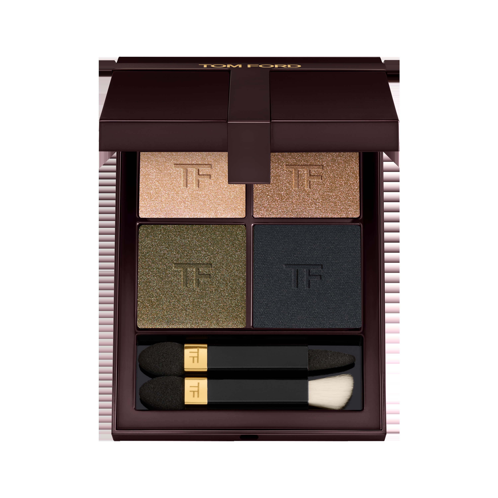
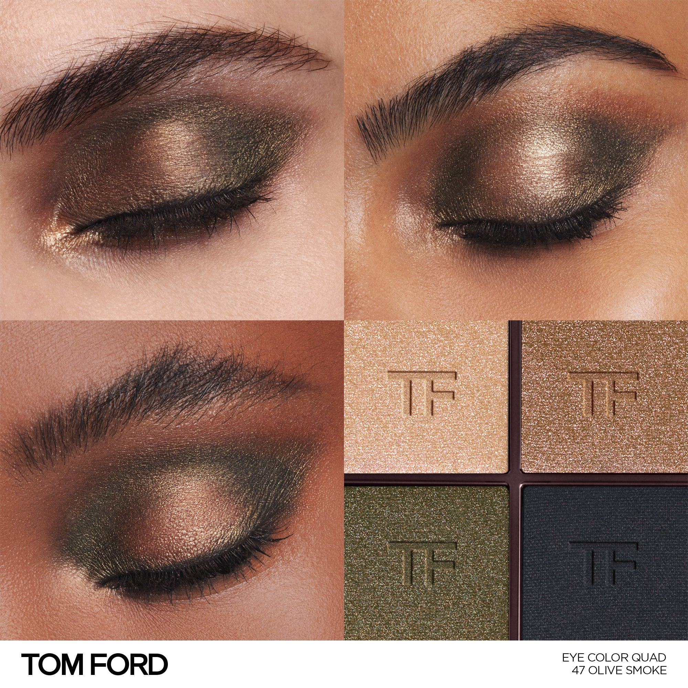
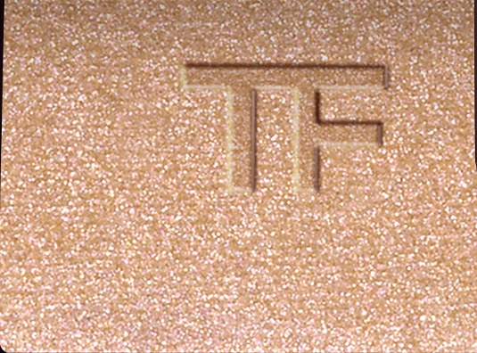
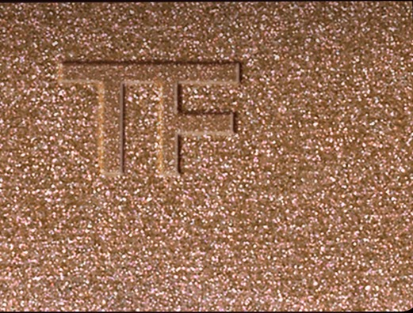
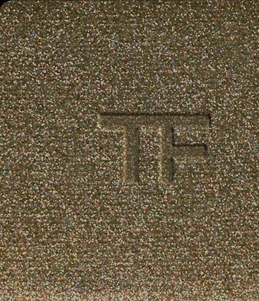
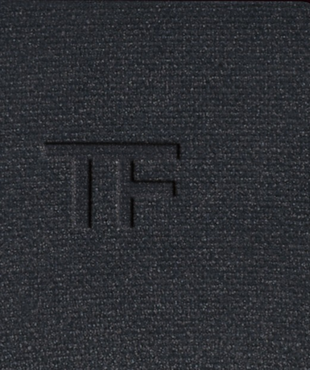

# Tom Ford 4色 四色盘 橄榄烟熏盘 Runway Eye Color Quad Crème 47 Olive Smoke
*发布：~2025*

> 烟雾中有草木的气息。香槟闪光铺底，橄榄铜光叠出绿意与温度，深橄榄珠光在眼窝低沉沉淀，哑光炭灰最终将一切收紧——这是烟，但不是普通的烟，是有林野气息的那种。

> *Smoke with something wild in it. Champagne sparkle opens the lid; olive bronze adds warmth and greenness; deep olive shimmer settles; matte charcoal seals it dark. Earthy, unexpected, precise.*

## Shade 1: Sparkle Champagne — Warm sparkle champagne.

Use: Step 1 — Sweep this warm champagne sparkle all over the lid to create a glowing, luminous base.

##### 色号 1：闪光香槟 (Sparkle Champagne) —— 暖调闪光香槟色。
用途：第一步——以此暖调闪光香槟色全眼铺底，打造发光感底妆。

## Shade 2: Sparkle Olive Bronze — Warm sparkle olive bronze.

Use: Step 2 — Apply to the inner corner and center lid for a warm olive-bronze sparkle that adds earthy depth to the base.

##### 色号 2：闪光橄榄铜 (Sparkle Olive Bronze) —— 暖调闪光橄榄铜色。
用途：第二步——点于眼头与眼中，以闪光橄榄铜叠加自然深度。

## Shade 3: Shimmer Olive — Dark shimmer olive.

Use: Step 3 — Blend into the crease and outer corners for moody, deep olive-khaki shimmer depth.

##### 色号 3：珠光橄榄绿 (Shimmer Olive) —— 深色珠光橄榄卡其。
用途：第三步——晕入眼窝及眼尾，以深色珠光橄榄绿塑造沉郁立体轮廓。

## Shade 4: Matte Charcoal — Cool matte dark charcoal.

Use: Step 4 — Concentrate along the crease and lash line with this deep cool charcoal to seal the smoky look.

##### 色号 4：哑光炭灰 (Matte Charcoal) —— 冷调哑光深炭灰色。
用途：第四步——集中点于眼窝与睫毛根，以哑光炭灰精准定形，完成橄榄烟熏妆。
