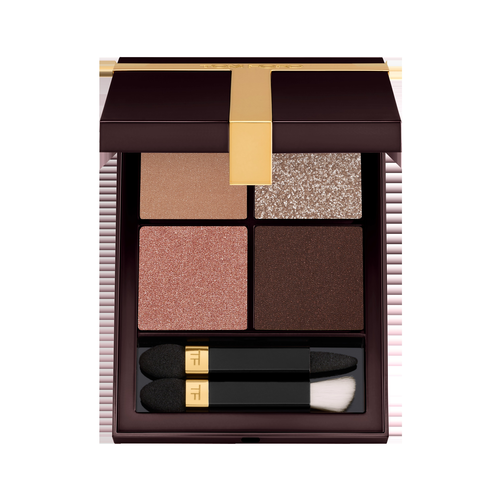
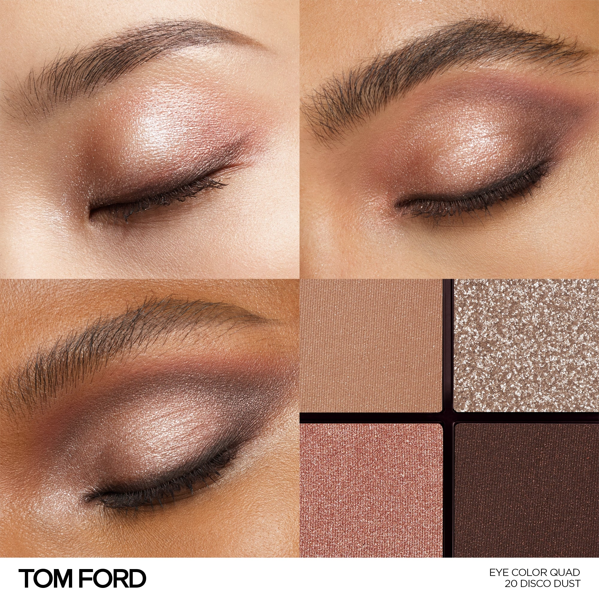
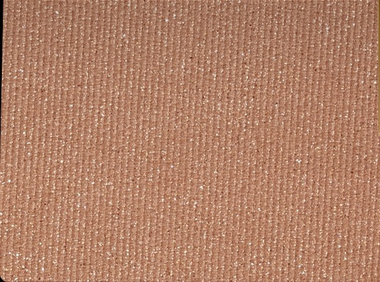
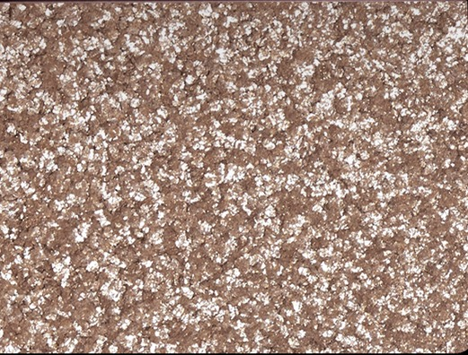
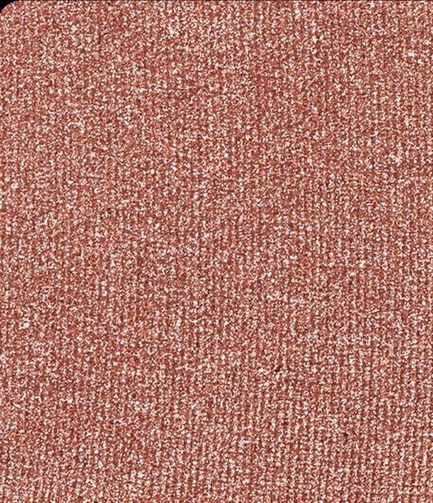
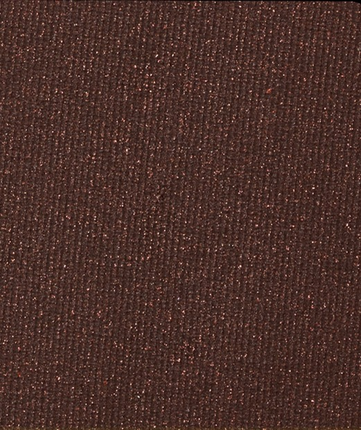

# Tom Ford 4色 四色盘 迷幻星尘盘 Runway Eye Color Quad Poudre 20 Disco Dust
*发布：~2025*

> 过剩之美。裸调中性色与迷幻金属光、肤感缎光交织叠现，20 Disco Dust 唤醒的是七十年代的迪斯科狂热——流光溢彩，沉醉奢靡。粉质细腻，轻盈而饱满；每一扫，都是舞台上的光。

> *An excess of beauty. Naked neutrals collide with glittering metallics and second-skin satins in a late-'70s fantasy of hedonism — every sweep a pulse of disco light on the lid.*

## Shade 1: Satin Bronze — Shimmering warm bronze satin.

Use: Step 1 — Sweep this warm satin bronze all over the lid to create a luminous, skin-close base.

##### 色号 1：缎光古铜 (Satin Bronze) —— 暖调缎光古铜。
用途：第一步——以此暖调缎光色全眼铺底，打造贴肤发光的底妆基础。

## Shade 2: Disco Glitter — Large-flake silver-neutral sparkle.

Use: Step 2 — Apply to the inner corner and center lid for a high-impact disco shimmer and a brightening effect.

##### 色号 2：星尘闪光 (Disco Glitter) —— 大颗粒银调闪光。
用途：第二步——点于眼头与眼中，以大颗粒银调闪光打造炫目迪斯科高光效果。

## Shade 3: Rose Sparkle — Warm rose-bronze sparkle.

Use: Step 3 — Blend into the crease and outer corners to add warm, glittering depth and dimension.

##### 色号 3：玫瑰闪光 (Rose Sparkle) —— 暖调玫瑰铜闪光。
用途：第三步——晕入眼窝及眼尾，叠加暖调玫瑰铜光，塑造闪耀立体轮廓。

## Shade 4: Deep Sable — Deep shimmer dark brown.

Use: Step 4 — Concentrate along the crease and lash line to define and intensify the look with smouldering depth.

##### 色号 4：深貂棕 (Deep Sable) —— 深色珠光棕。
用途：第四步——集中点于眼窝与睫毛根，以深貂棕描绘轮廓，打造烟熏深邃感。
