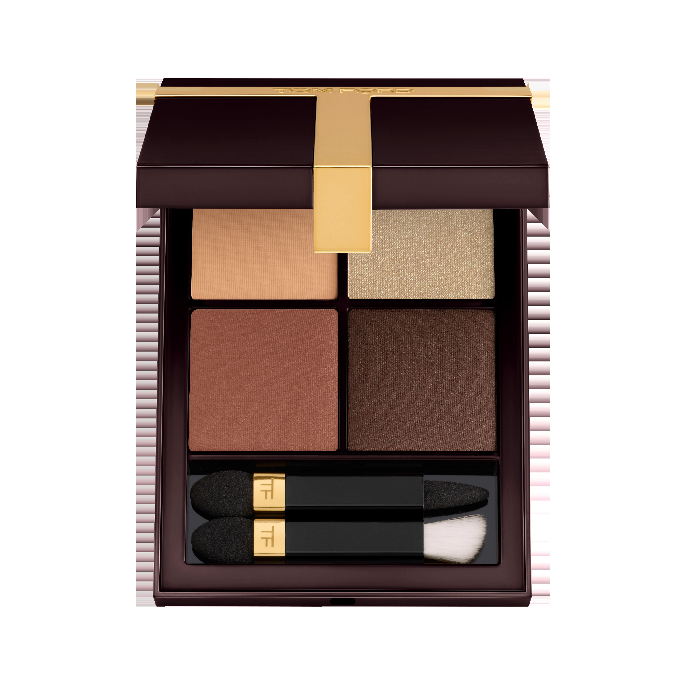
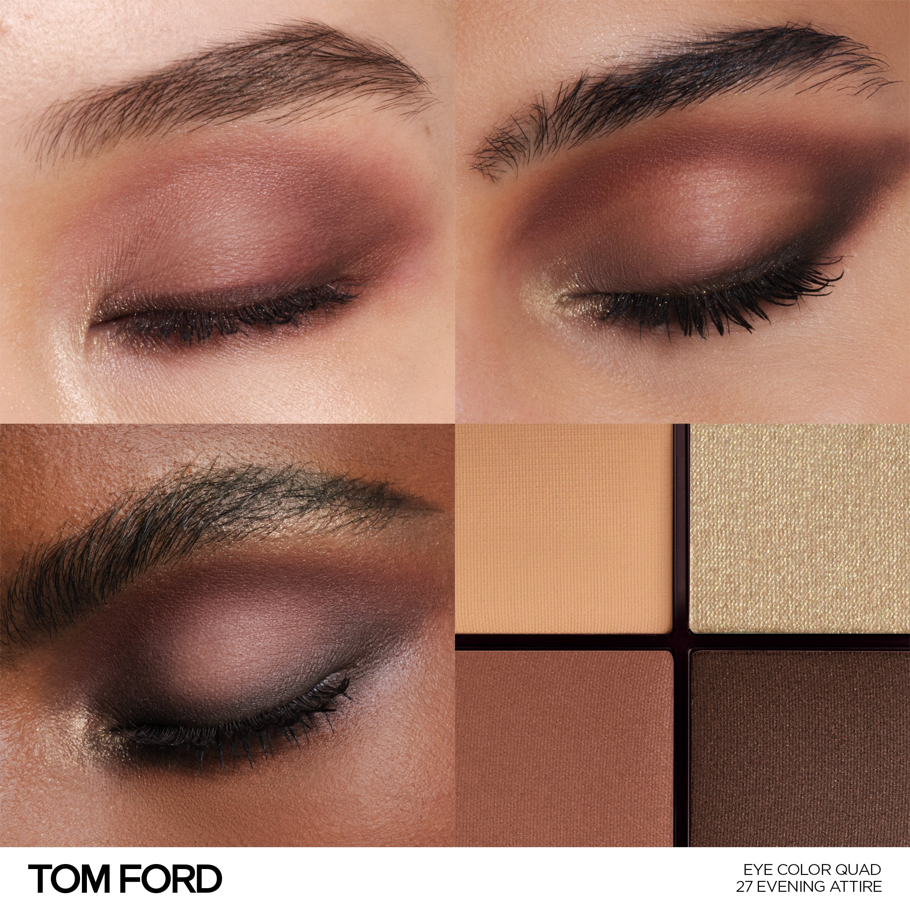
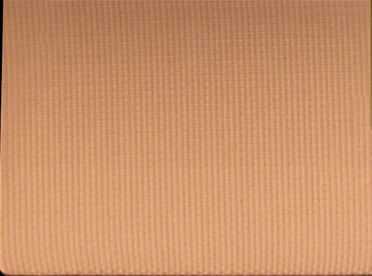
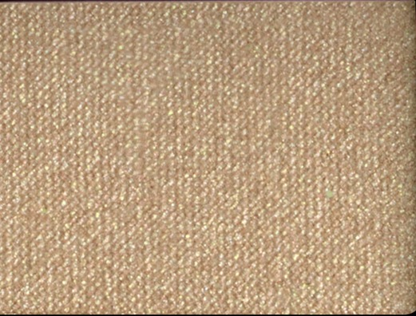
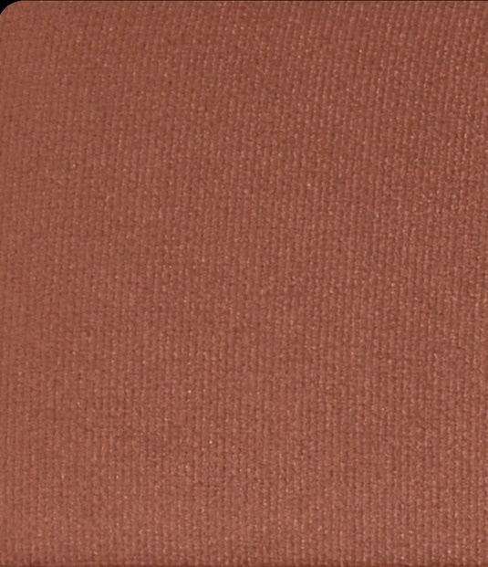
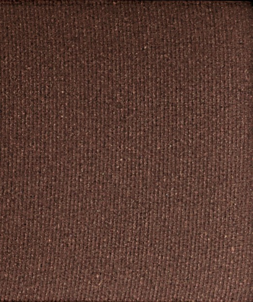

# Tom Ford 4色 四色盘 夜宴礼服盘 Runway Eye Color Quad Poudre 27 Evening Attire
*发布：~2025*

> 礼服裁定，色泽就位。暖裸调哑光与珠光在四格之间布局，从柔软的日间底色起势，经金调光泽的过渡，至深棕的最终收尾——是盛典前穿上礼服的那一刻，精致、笃定、无可挑剔。

> *Dressed for the occasion. Four warm-nude shades move from a matte base through shimmering gold to a defining deep brown — precise, deliberate, and made for the evening ahead.*

## Shade 1: Matte Buff — Warm matte buff beige.

Use: Step 1 — Sweep this neutral buff tone all over the lid as a smooth, even canvas for the look.

##### 色号 1：哑光裸米 (Matte Buff) —— 暖哑光裸米色。
用途：第一步——以此中性裸米色全眼铺底，打造均匀光滑的妆感底色。

## Shade 2: Shimmer Nude Gold — Shimmering warm nude gold.

Use: Step 2 — Apply to the inner corner and brow bone as a warm gold highlight to lift and open the eye.

##### 色号 2：珠光裸金 (Shimmer Nude Gold) —— 暖调珠光裸金色。
用途：第二步——点于眼头与眉骨，以暖裸金光感提亮放大眼形。

## Shade 3: Matte Russet — Warm matte russet brown.

Use: Step 3 — Blend into the crease and outer corners to sculpt warm, earthy depth.

##### 色号 3：哑光赤褐 (Matte Russet) —— 暖调哑光赤褐棕。
用途：第三步——晕入眼窝及眼尾，以暖调赤褐色雕塑立体轮廓。

## Shade 4: Matte Deep Brown — Warm matte deep brown.

Use: Step 4 — Concentrate along the crease and lash line for a precise, polished evening finish.

##### 色号 4：哑光深棕 (Matte Deep Brown) —— 暖调哑光深棕。
用途：第四步——集中点于眼窝与睫毛根，以哑光深棕精准收尾，打造精致夜妆轮廓。
