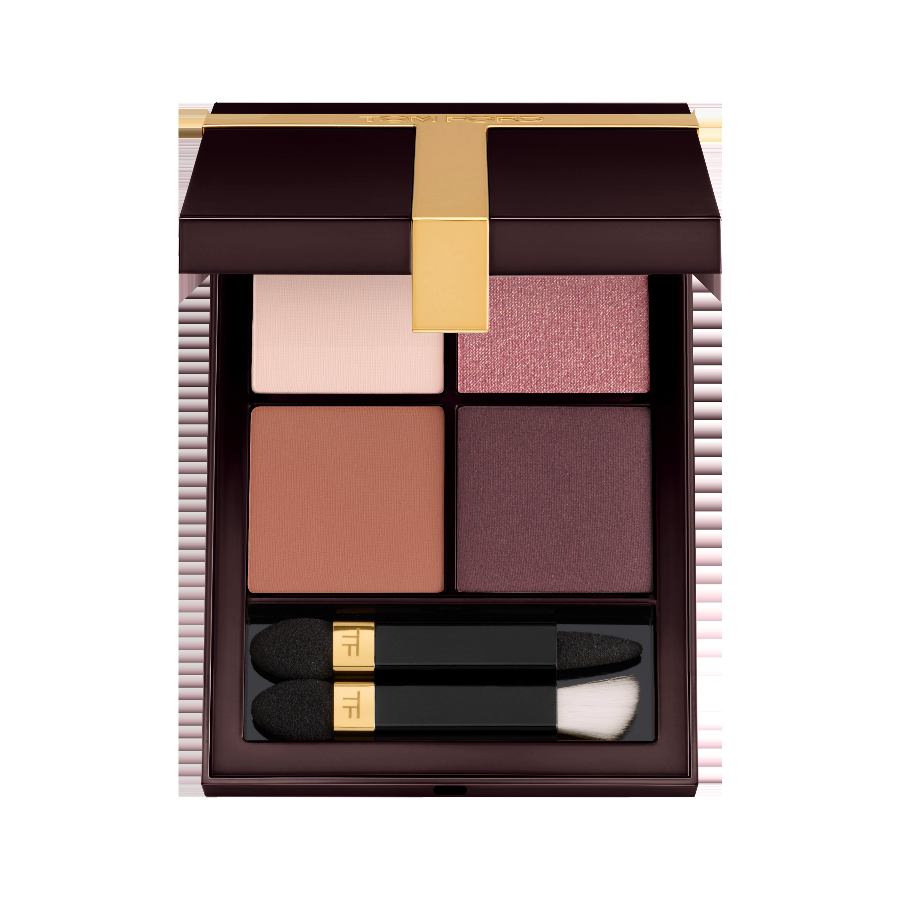
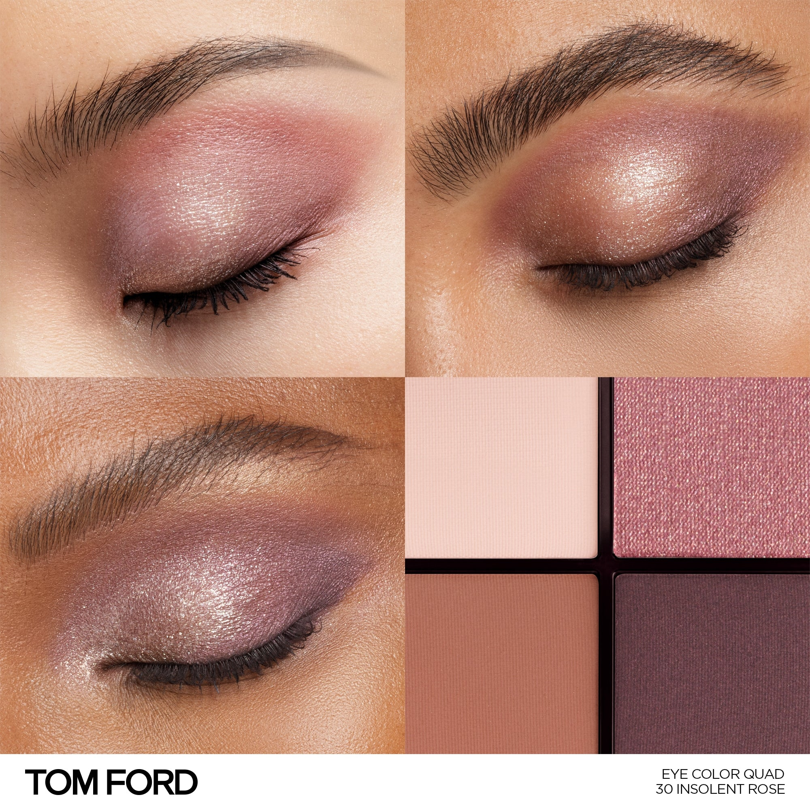
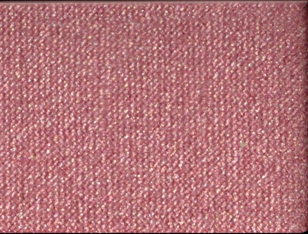
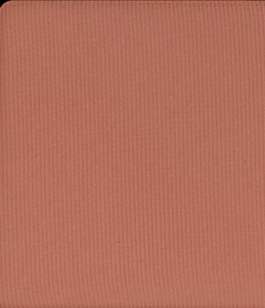
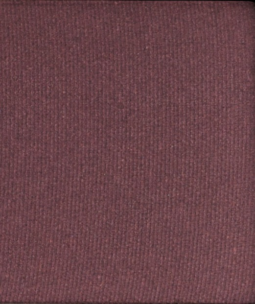

# Tom Ford 4色 四色盘 骄矜玫瑰盘 Runway Eye Color Quad Poudre 30 Insolent Rose
*发布：~2025*

> 玫瑰不必温顺。浅淡哑光粉底开场，珠光玫瑰点亮眼头，暖调玫瑰铜在眼窝中层层堆叠，最终以深哑光玫灰定格——这朵玫瑰，有刺，有光，有骄傲。

> *A rose with thorns. Pale matte blush lays the base; shimmer rose catches the light; warm rose bronze sculpts depth; dark mauve closes the look — insolent, radiant, unashamed.*

## Shade 1: Matte Blush — Pale warm matte blush.

Use: Step 1 — Sweep this delicate pale blush all over the lid to create a soft, rosy canvas.

##### 色号 1：哑光裸粉 (Matte Blush) —— 浅暖哑光腮红粉。
用途：第一步——以此柔淡裸粉全眼铺底，打造轻盈玫瑰底妆。

## Shade 2: Shimmer Rose — Shimmering warm rose.

Use: Step 2 — Apply to the inner corner and center lid to brighten and add a luminous rose glow.

##### 色号 2：珠光玫瑰 (Shimmer Rose) —— 暖调珠光玫瑰色。
用途：第二步——点于眼头与眼中，以珠光玫瑰色提亮并增添玫瑰光晕。

## Shade 3: Matte Rose Bronze — Warm matte rose bronze.

Use: Step 3 — Blend into the crease and outer corners for warm, sculptural rose-bronze depth.

##### 色号 3：哑光玫瑰铜 (Matte Rose Bronze) —— 暖调哑光玫瑰铜棕。
用途：第三步——晕入眼窝及眼尾，以哑光玫瑰铜棕雕塑温暖立体轮廓。

## Shade 4: Matte Dark Mauve — Deep matte dark mauve.

Use: Step 4 — Define the crease and lash line with this deep mauve for a smouldering, insolent finish.

##### 色号 4：哑光深玫灰 (Matte Dark Mauve) —— 深哑光玫灰棕。
用途：第四步——集中叠于眼窝与睫毛根，以深玫灰收尾定形，打造骄矜烟熏效果。
