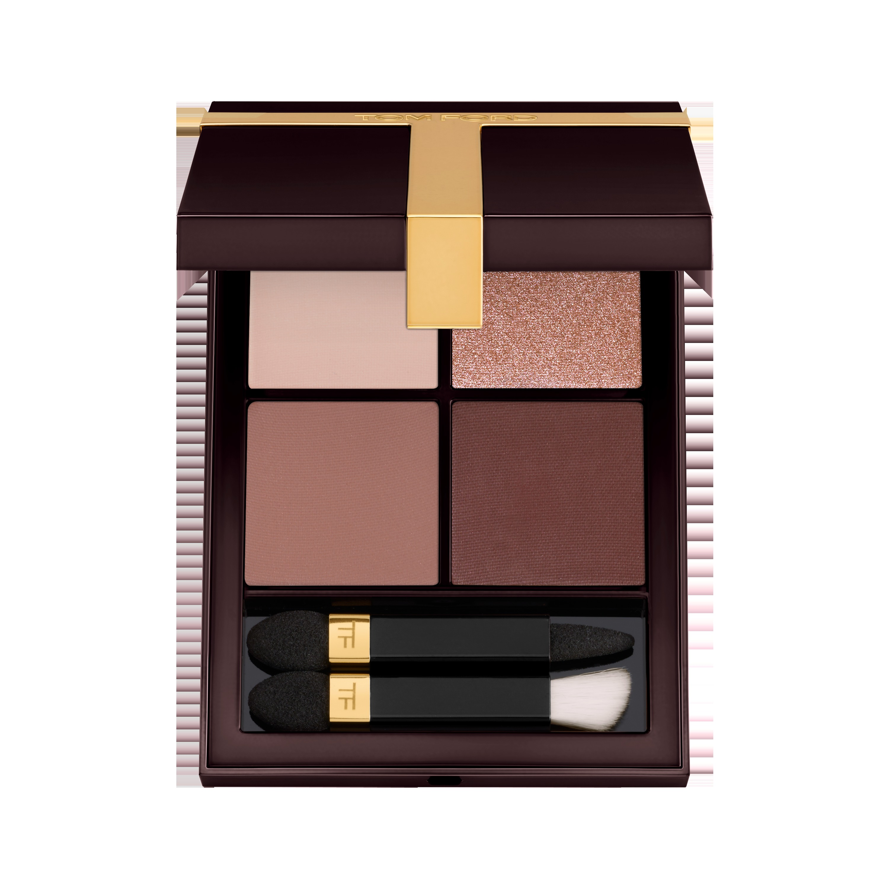
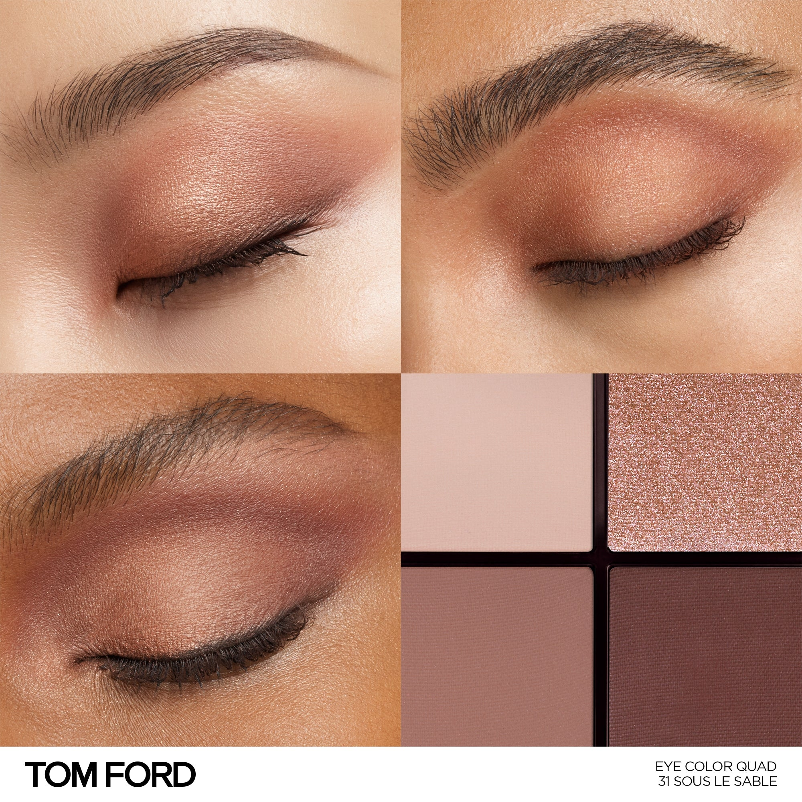
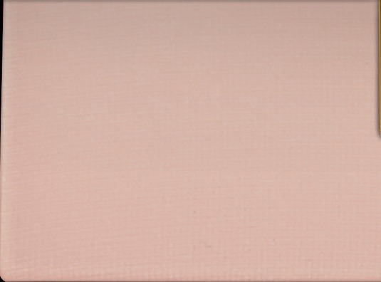
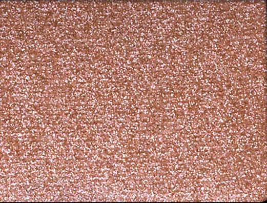
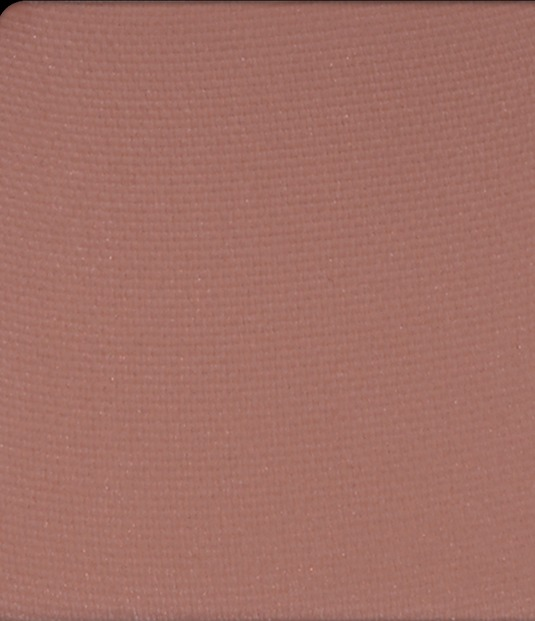
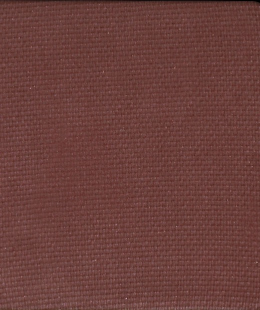

# Tom Ford 4色 四色盘 沙下秘境盘 Runway Eye Color Quad Poudre 31 Sous Le Sable
*发布：~2025*

> 沙粒之下，是另一个温度。浅沙色哑光铺展，沙砾般的闪光粒子叠出光感层次，哑光裸棕塑造低调轮廓，深哑光收尾如沙丘暮色——静默、温暖、耐人细看。

> *Under the sand, another warmth. Sandy matte opens the look; warm sparkle catches the light like sun-struck grains; nude bronze sculpts the crease; deep matte closes like dusk over dunes.*

## Shade 1: Matte Sand — Pale warm matte sand.

Use: Step 1 — Sweep this pale sandy tone all over the lid for a neutral, skin-blending base.

##### 色号 1：哑光沙色 (Matte Sand) —— 浅暖哑光沙色。
用途：第一步——以此浅沙色全眼铺底，打造贴肤的中性底妆。

## Shade 2: Sparkle Sand — Warm sparkle sand nude.

Use: Step 2 — Apply to the inner corner and center lid for a warm, sandy sparkle highlight.

##### 色号 2：闪光沙裸 (Sparkle Sand) —— 暖调闪光沙裸色。
用途：第二步——点于眼头与眼中，以暖调闪光沙色打造光感高光。

## Shade 3: Matte Nude — Warm matte nude.

Use: Step 3 — Blend into the crease and outer corners to sculpt warm, understated depth.

##### 色号 3：哑光裸棕 (Matte Nude) —— 暖调哑光裸棕。
用途：第三步——晕入眼窝及眼尾，以哑光裸棕雕塑低调自然的立体轮廓。

## Shade 4: Matte Dune — Warm matte deep brown.

Use: Step 4 — Concentrate along the crease and lash line to define with a warm, earthy depth.

##### 色号 4：哑光沙丘棕 (Matte Dune) —— 暖调哑光深棕。
用途：第四步——集中点于眼窝与睫毛根，以哑光沙丘棕精准强化轮廓。
