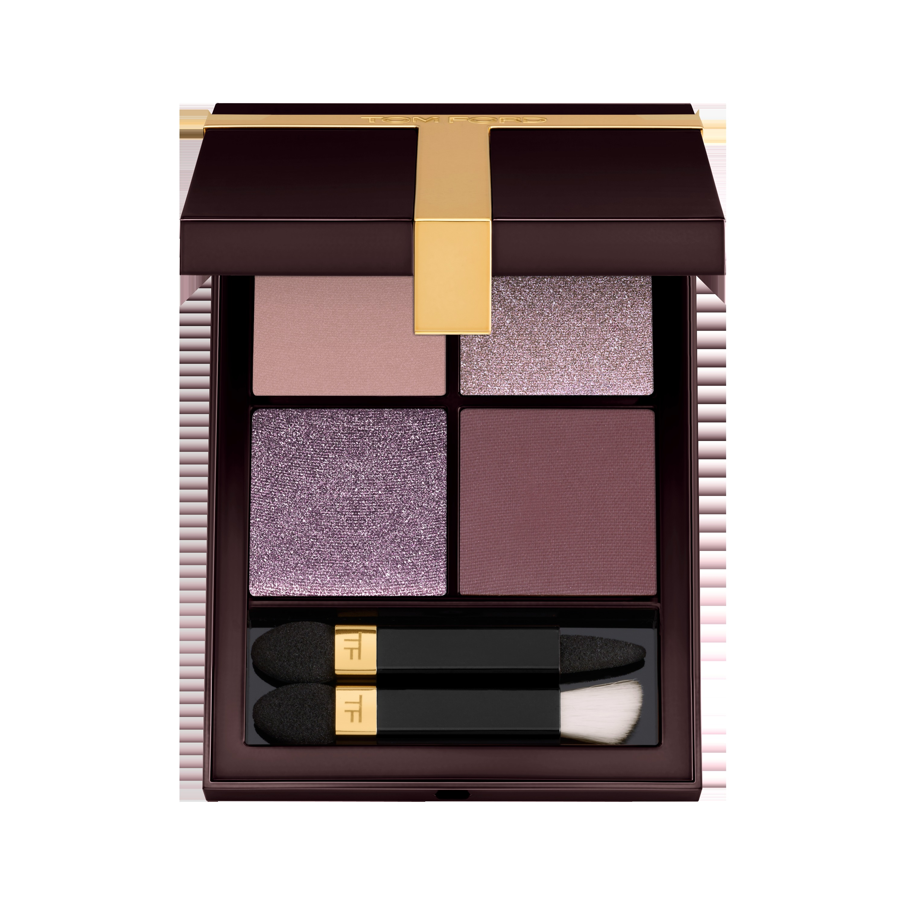
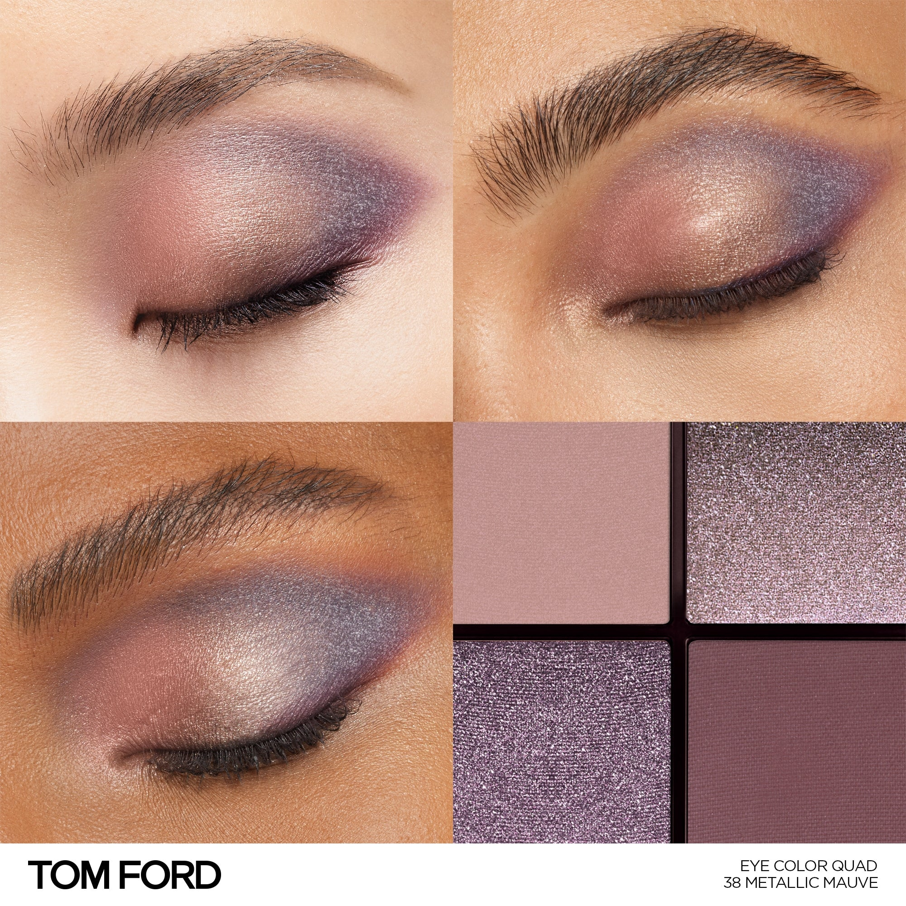
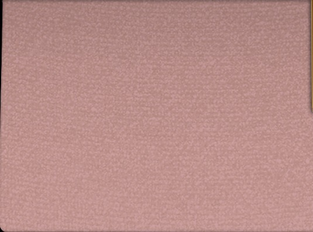
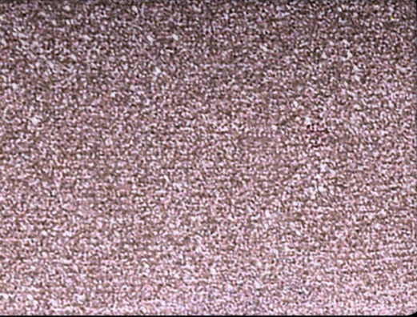
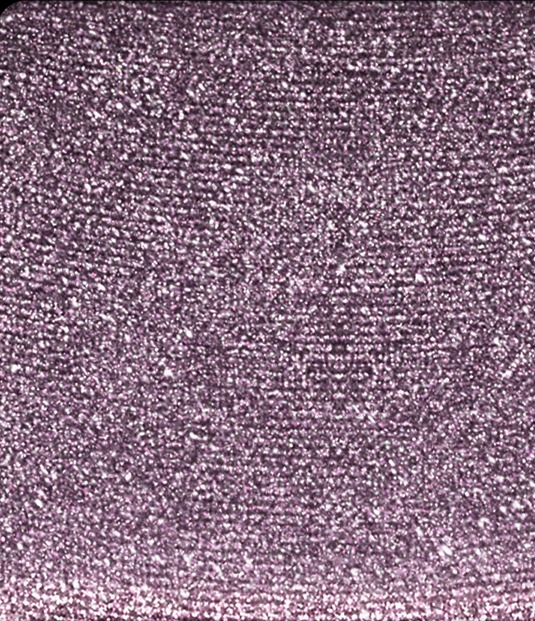
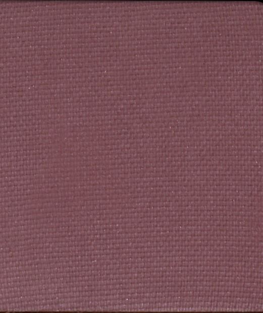

# Tom Ford 4色 四色盘 金属玫灰盘 Runway Eye Color Quad Poudre 38 Metallic Mauve
*发布：~2025*

> 灰玫之中，金属在说话。哑光玫灰为底，金属感大闪点亮眼头，薰衣草色调的冷光在眼窝散开，最终以深梅红哑光收拢轮廓——是感性与冷峻共存的一种妆，矛盾，迷人。

> *Between grey and mauve, metal speaks. A matte dusty base, a metallic sparkle highlight, cool lavender shimmer in the crease — and a deep plum to close. Sensuous and cool at once.*

## Shade 1: Matte Mauve — Matte dusty mauve.

Use: Step 1 — Sweep this neutral matte mauve all over the lid as a soft, dusty base.

##### 色号 1：哑光玫灰 (Matte Mauve) —— 哑光灰玫色。
用途：第一步——以此中性哑光玫灰全眼铺底，打造柔雾感底妆。

## Shade 2: Metallic Mauve — Sparkle metallic mauve.

Use: Step 2 — Apply to the inner corner and brow bone for high-impact metallic sparkle and a lifted eye effect.

##### 色号 2：金属玫灰 (Metallic Mauve) —— 闪光金属玫灰色。
用途：第二步——点于眼头与眉骨，以金属大闪打造炫目提亮效果。

## Shade 3: Sparkle Lavender — Sparkle cool lavender mauve.

Use: Step 3 — Blend into the crease and outer corners for cool lavender-mauve depth and dimension.

##### 色号 3：闪光薰衣草 (Sparkle Lavender) —— 冷调闪光薰衣草玫色。
用途：第三步——晕入眼窝及眼尾，以冷调闪光薰衣草色塑造层次轮廓。

## Shade 4: Matte Plum — Deep matte plum berry.

Use: Step 4 — Concentrate along the crease and lash line to define with an intense, smouldering plum.

##### 色号 4：哑光深梅红 (Matte Plum) —— 深哑光梅红浆果色。
用途：第四步——集中点于眼窝与睫毛根，以深梅红精准强化轮廓，打造浓郁烟熏感。
