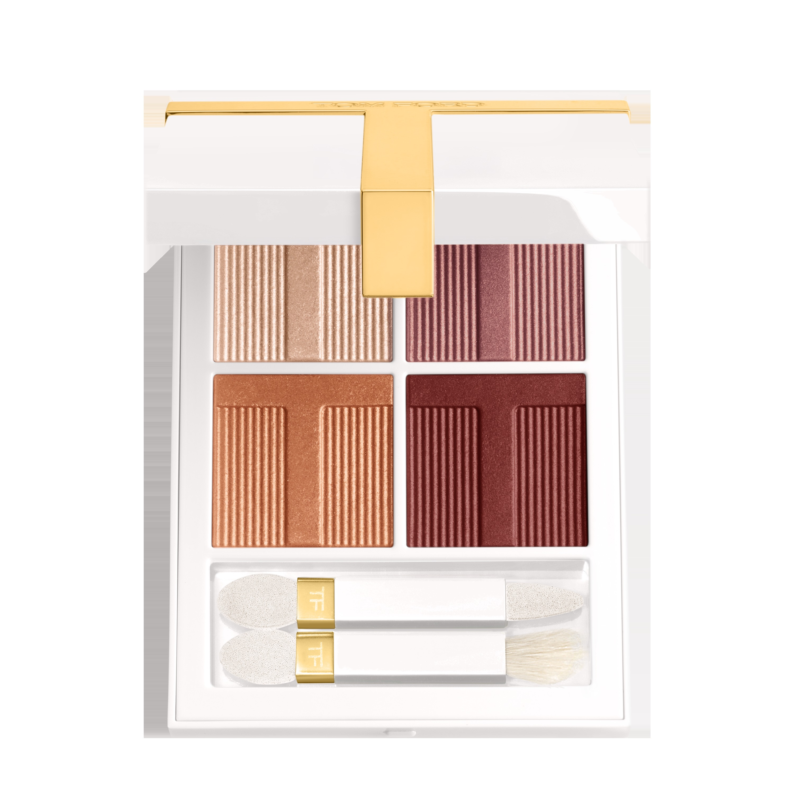
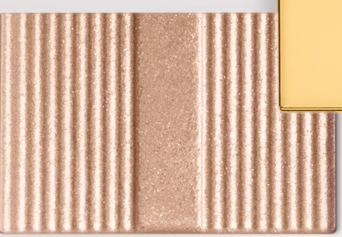
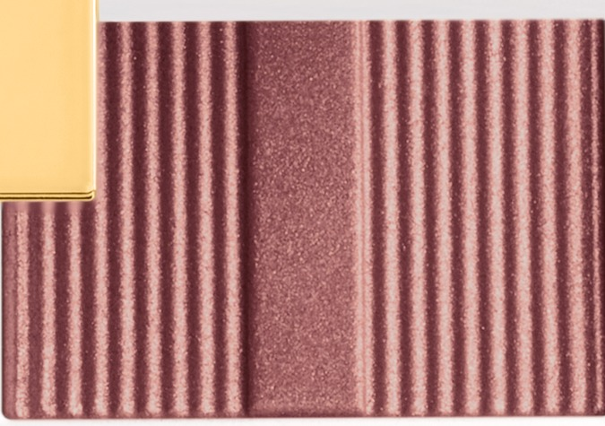
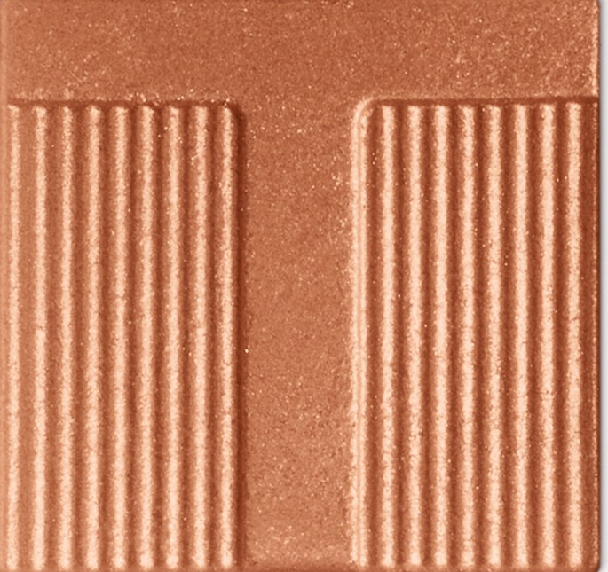
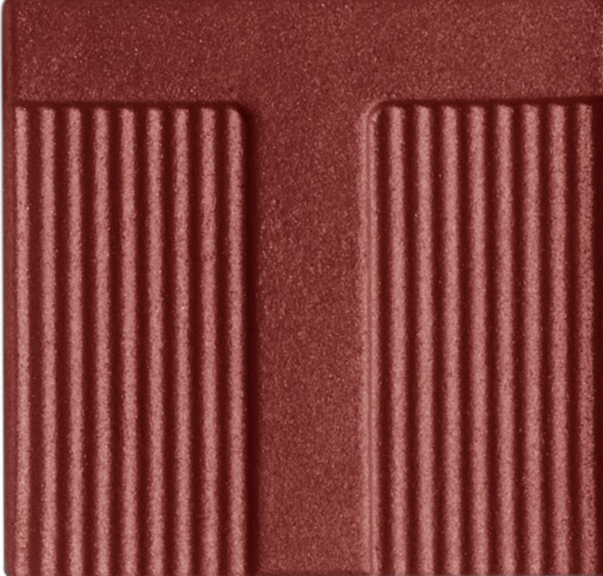

# Tom Ford 4色 四色盘 月色沉浸盘 Soleil Eye Color Quad Lumière 03 Moonlight Dip
*发布：~2025*

> 月光落入静水，浮起香槟、玫瑰金、暖金与深棕的倒影。Moonlight Dip 以极细珍珠粉配方，将四色微光压入白色盘中——光线稍动，眼妆便在裸调与暖金之间悄悄游移。

> *Moonlight dips into still water and leaves behind trails of champagne, rose gold, warm gold and brown. Four ultra-fine shimmer shimmers that shift with every angle — as quiet and inevitable as the tide.*

## Shade 1: Champagne — Shimmering champagne nude.

Use: All over lid for a sheer luminous base, or concentrate on the inner corner and brow bone as a delicate highlight. Use dry for a translucent shimmer veil; apply wet for a molten metallic intensity.

##### 色号 1：香槟色 (Champagne) —— 香槟裸色闪光。
用途：铺于全眼作薄透发光底色，或点于眼头与眉骨作轻盈提亮；干用呈现薄透微光，湿用打造金属质感。

## Shade 2: Pink Gold — Shimmering pink gold.

Use: Sweep all over lid as the main shimmer shade. Layer over shade 1 for a warm rose-gold dimensional effect.

##### 色号 2：玫瑰金 (Pink Gold) —— 玫瑰金闪光。
用途：铺满全眼作主色调；叠加于香槟底色之上，增添玫瑰金层次感。

## Shade 3: Gold — Shimmering warm gold.

Use: Concentrate on the outer corner and crease to add sculpted warmth. Layer over shade 2 for a deeper metallic finish.

##### 色号 3：暖金色 (Gold) —— 暖金闪光。
用途：集中叠于眼尾与眼窝，加深轮廓；叠加玫瑰金之上打造更浓郁的暖调金属感。

## Shade 4: Brown — Shimmering warm brown.

Use: Frame upper and lower lash line for a smouldering liner finish. Apply wet for maximum depth and intensity.

##### 色号 4：暖棕色 (Brown) —— 深棕闪光。
用途：沿上下睫毛根描画作烟熏眼线；湿用效果更深邃，打造灼烧感妆效。
