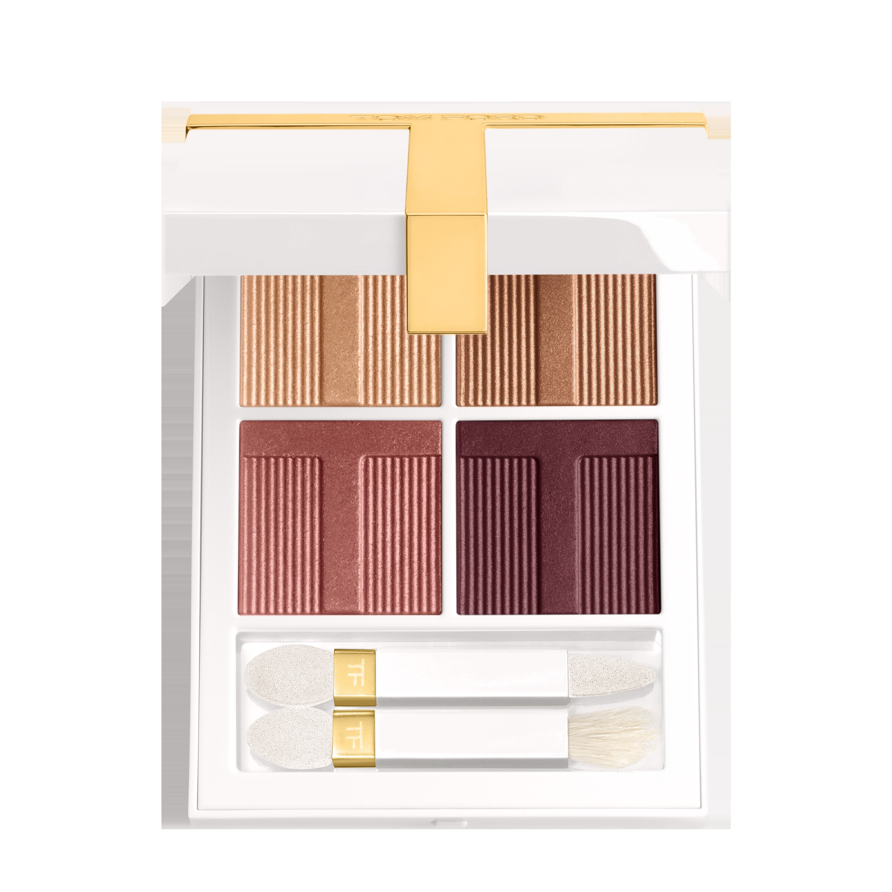
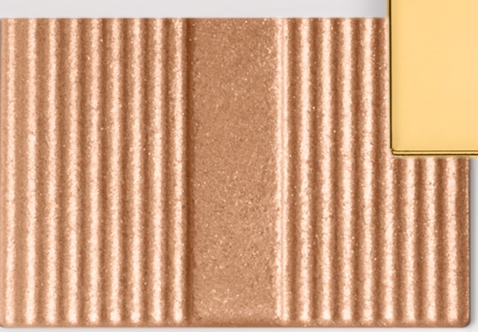
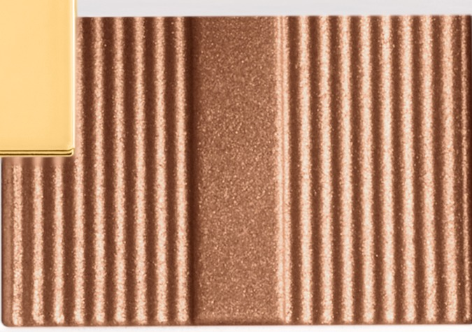
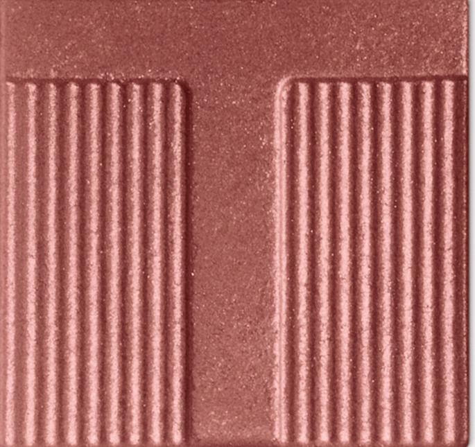
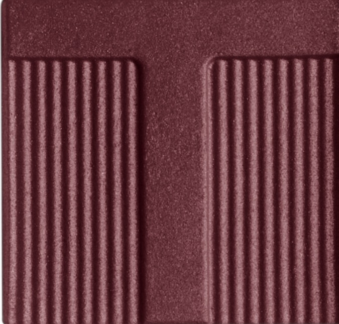

# Tom Ford 4色 四色盘 蜜月盘 Soleil Eye Color Quad Lumière 04 Honeymoon
*发布：~2025*

> 每段蜜月都有它的黄金时刻，它的莓果黄昏，它的深紫夜色。Honeymoon 将蜜桃金、暖铜棕、莓果玫瑰与深紫梅四色并收——从日出到日落，一盘完成旅途中最动人的眼神。

> *Every honeymoon has its golden afternoon, its rosy dusk, its deep plum evening. Honeymoon moves from honeyed peach through warm bronze and rosy berry to a rich twilight plum — the full arc of a sun-soaked day in four luminous shimmers.*

## Shade 1: Peach Gold — Shimmering peachy gold.

Use: All over lid for a warm luminous wash, or concentrate on the inner corner as a glowing highlight.

##### 色号 1：蜜桃金 (Peach Gold) —— 蜜桃金闪光。
用途：铺于全眼打造暖光感，或点于眼头作发光高光。

## Shade 2: Bronze — Shimmering warm bronze.

Use: Sweep all over lid as the main shade for a warm metallic effect. Layer over shade 1 for dimensional warmth.

##### 色号 2：暖铜棕 (Bronze) —— 暖铜棕闪光。
用途：铺满全眼作主色调，打造金属暖棕妆效；叠加蜜桃金之上增添层次感。

## Shade 3: Berry — Shimmering rosy berry.

Use: Concentrate in the outer corner and crease for a romantic rosy depth. Blend into shade 2 for a seamless gradient.

##### 色号 3：莓果玫瑰 (Berry) —— 玫瑰莓果闪光。
用途：集中叠于眼尾与眼窝，打造浪漫深度感；向内晕染融合暖铜棕，形成自然渐层。

## Shade 4: Plum — Shimmering deep plum.

Use: Frame upper and lower lash line for a dramatic smoky finish. Apply wet for an intense metallic liner effect.

##### 色号 4：深紫梅 (Plum) —— 深紫梅闪光。
用途：沿上下睫毛根描画，打造戏剧性烟熏效果；湿用可呈现高浓度金属眼线感。
