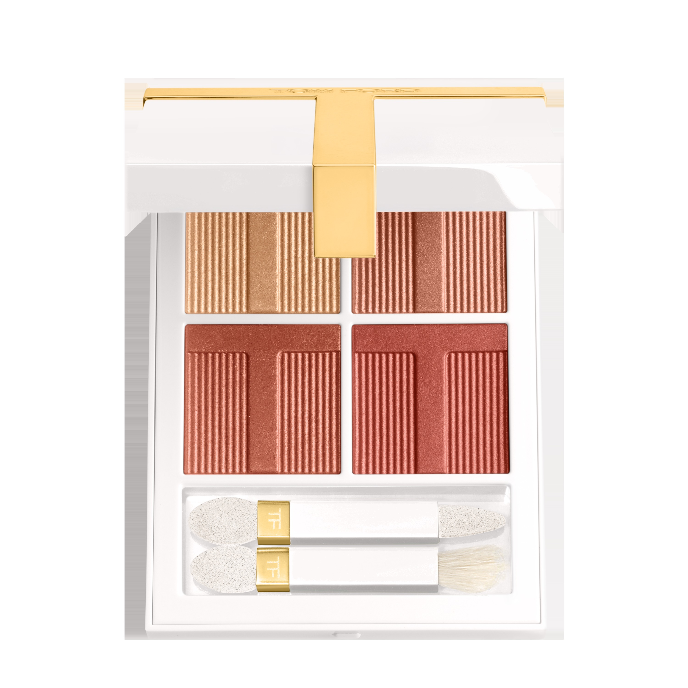
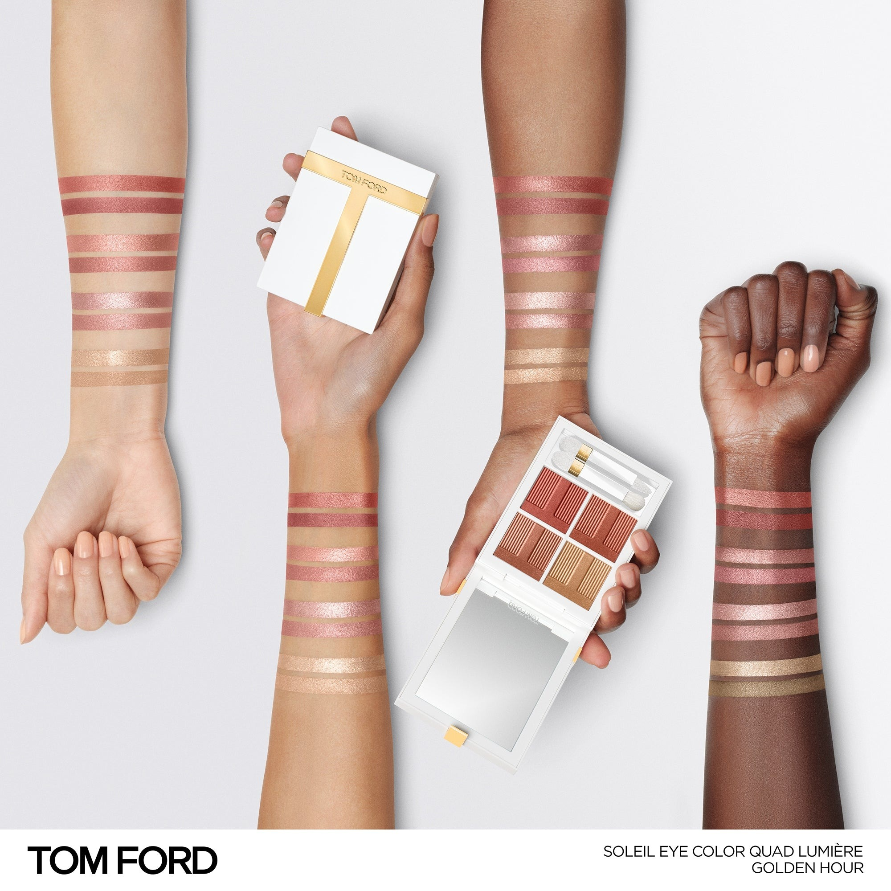
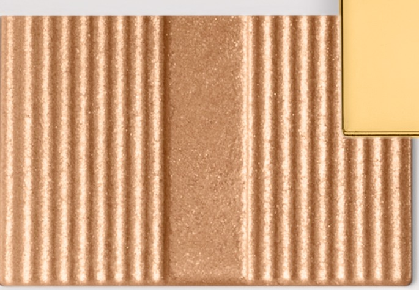
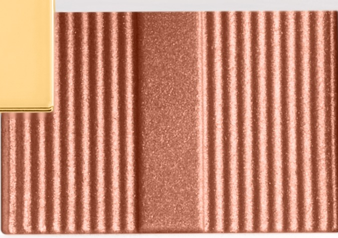
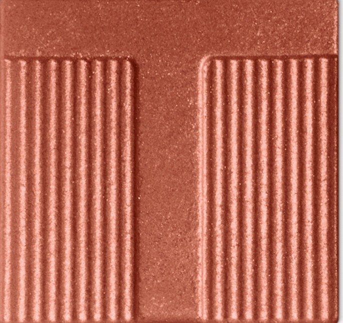
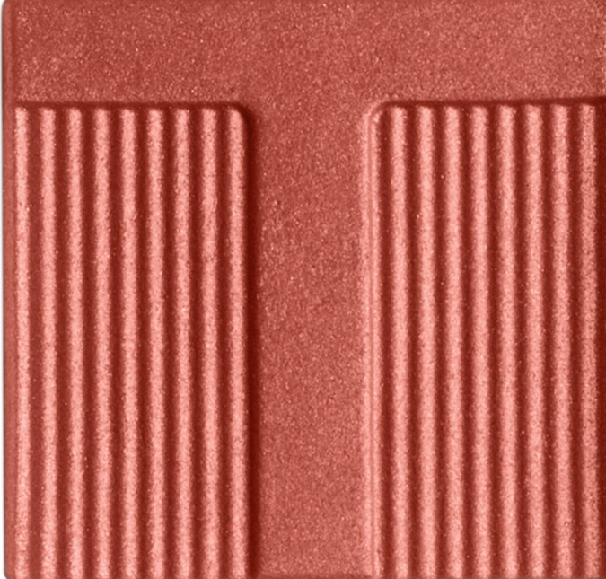

# Tom Ford 4色 四色盘 黄金时刻盘 Soleil Eye Color Quad Lumière 40 Golden Hour
*发布：~2025*

> 太阳触碰地平线的那一秒，天色从金变铜、从铜变砖红。Golden Hour 将日落最浓烈的四种色温压入一盘——暖金、玫瑰金铜、赤铜与砖红，让眼神如黄昏一样灼烁不止。

> *The second the sun meets the horizon, the sky cycles through gold, copper and brick red. Golden Hour captures that fleeting blaze in four luminous pressed shimmers — each one a different temperature of the same burning light.*

## Shade 1: Gold — Shimmering warm gold.

Use: All over lid for a sunlit shimmer base, or concentrate on the inner corner and brow bone as a radiant highlight.

##### 色号 1：暖金 (Gold) —— 暖金闪光。
用途：铺满全眼打造日光感底色，或点于眼头与眉骨作发光提亮。

## Shade 2: Rose Gold — Shimmering peach rose gold.

Use: Sweep all over lid as the main warm shimmer. Layer over shade 1 for a sun-kissed rose-gold finish.

##### 色号 2：玫瑰金铜 (Rose Gold) —— 蜜桃玫瑰金闪光。
用途：铺满全眼作暖调主色；叠加暖金之上，打造日晒玫瑰金妆效。

## Shade 3: Copper — Shimmering terracotta copper.

Use: Concentrate in the outer corner and crease for a sun-burnished depth. Blend inward over shade 2 for a warm smouldering gradient.

##### 色号 3：赤铜 (Copper) —— 赤铜土色闪光。
用途：叠于眼尾与眼窝，打造灼烧感立体轮廓；向内晕染，与玫瑰金铜形成渐层。

## Shade 4: Brick — Shimmering brick red.

Use: Frame upper and lower lash line for an intense glowing liner finish. Apply wet for a molten brick-red intensity.

##### 色号 4：砖红 (Brick) —— 砖红闪光。
用途：沿上下睫毛根描画作发光眼线，打造浓烈感；湿用可呈现熔岩般的砖红强度。
