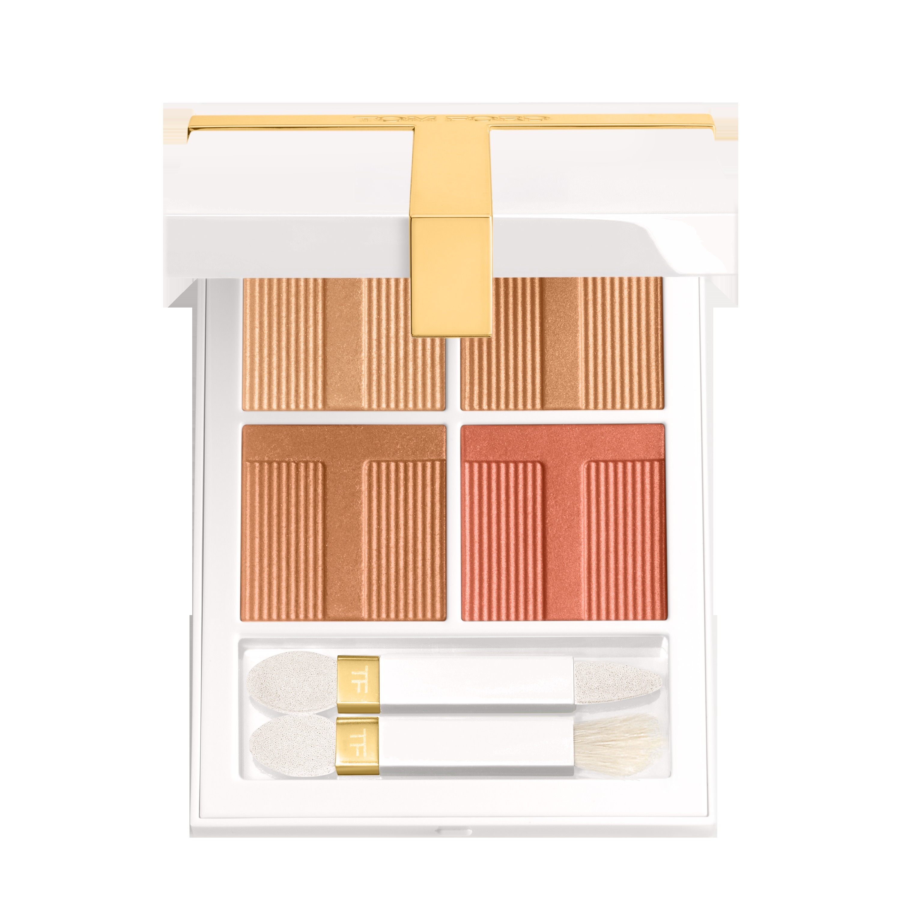
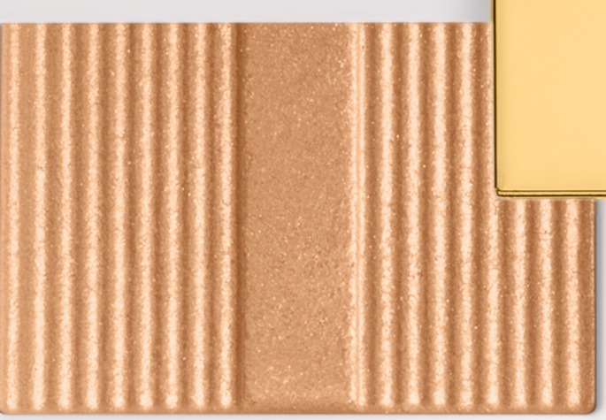
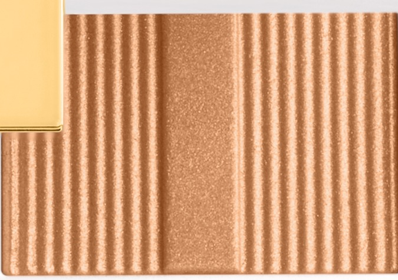
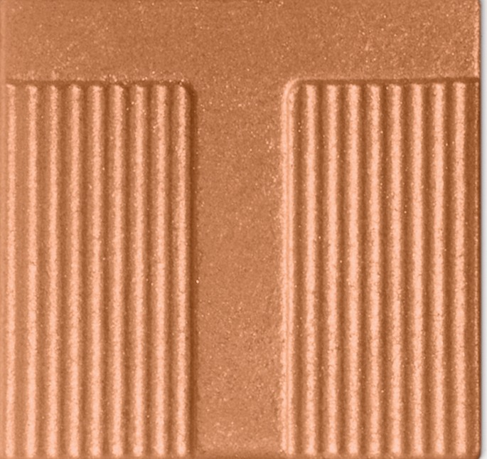
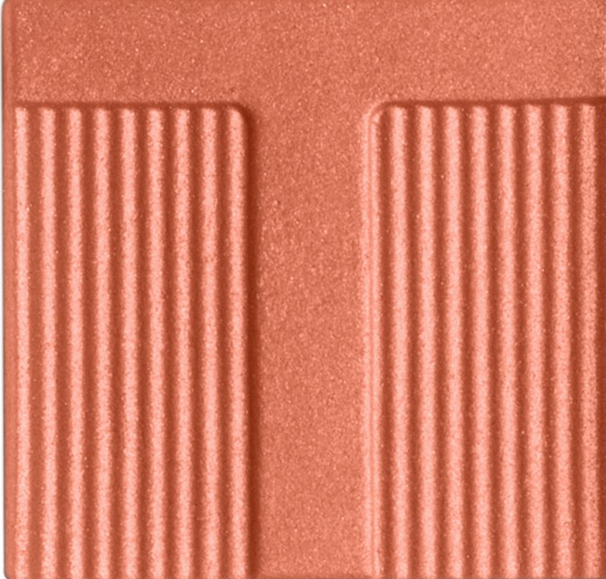

# Tom Ford 4色 四色盘 桃色晨曦盘 Soleil Eye Color Quad Lumière 41 Peach Dawn
*发布：~2025*

> 天光未透，地平线先染上一层淡金。Peach Dawn 以淡金、蜂蜜金、深铜棕与蜜桃珊瑚，还原清晨最短暂也最柔软的那道暖光——四色叠加，是醒来时恰好看见的第一缕日出。

> *Before the sky fully wakes, the horizon turns a soft apricot gold. Peach Dawn layers pale gold, warm honey, deep bronze and a finishing peach coral — four shades that read like the first warmth of morning light on the eyelid.*

## Shade 1: Pale Gold — Shimmering pale honey gold.

Use: All over lid for a translucent warm shimmer, or concentrate on the inner corner for a delicate highlight.

##### 色号 1：淡金 (Pale Gold) —— 淡蜂蜜金闪光。
用途：铺于全眼打造轻盈暖光感，或点于眼头作精致提亮。

## Shade 2: Honey — Shimmering warm honey gold.

Use: Sweep all over lid as the main shade for a deeper warm shimmer. Layer over shade 1 for honeyed dimension.

##### 色号 2：蜂蜜金 (Honey) —— 暖蜂蜜金闪光。
用途：铺满全眼加深暖金调；叠加淡金之上，打造饱满蜂蜜光感。

## Shade 3: Bronze — Shimmering warm bronze copper.

Use: Concentrate in the outer corner and crease for warm sculpted depth. Blend inward for a natural gradient.

##### 色号 3：深铜棕 (Bronze) —— 暖铜棕闪光。
用途：集中叠于眼尾与眼窝，打造暖调立体轮廓；向内晕染与蜂蜜金形成自然渐层。

## Shade 4: Peach — Shimmering peachy coral.

Use: Apply along the upper and lower lash line for a warm glowing finish, or layer in the outer corner as a coral accent.

##### 色号 4：蜜桃 (Peach) —— 蜜桃珊瑚闪光。
用途：沿上下睫毛根描画增添暖调光晕，或叠于眼尾作珊瑚色点缀。
