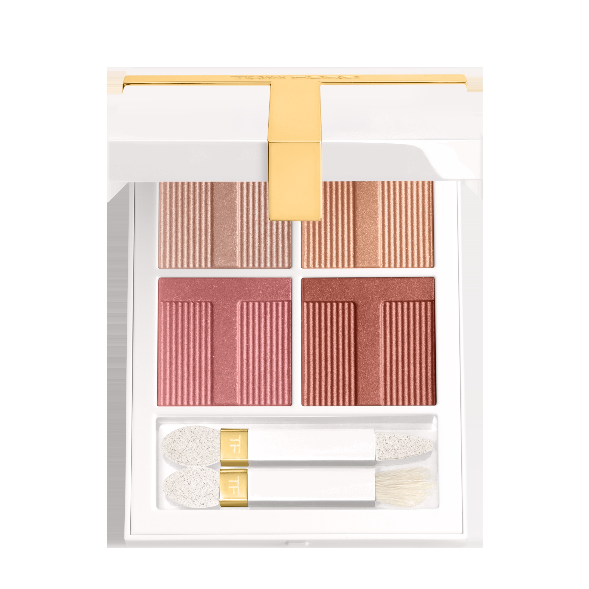
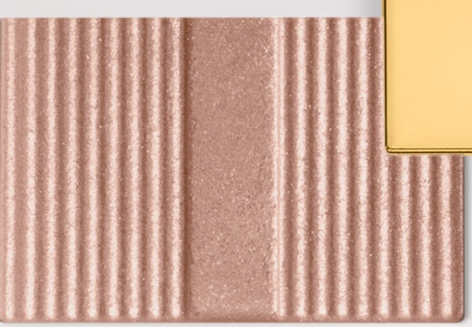
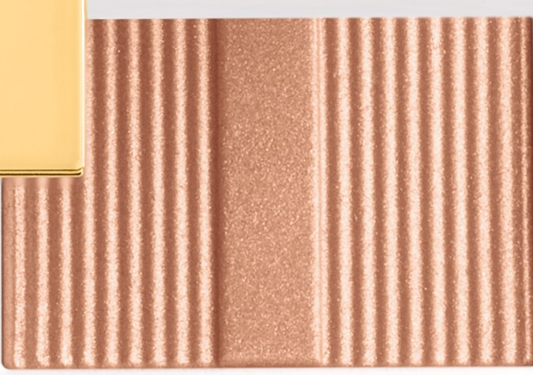
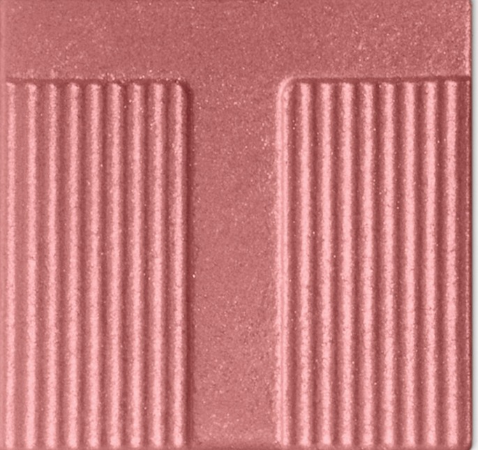
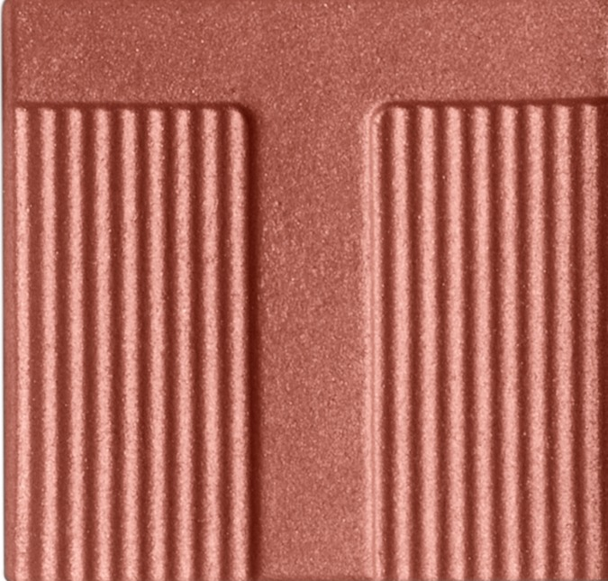

# Tom Ford 4色 四色盘 迷情感性盘 Soleil Eye Color Quad Lumière 42 Hazy Sensuality
*发布：~2025*

> 银粉的凉意，焦糖的甜蜜，玫瑰的温柔，酒红的深邃——四种矛盾的感性共存一盘，互相抵触，又彼此成全。Hazy Sensuality 是一种说不清的心动，雾里看花，越看越深。

> *Cool silver pink and warm caramel. Soft rose and a deep reddish brown. Four contradictory sensibilities pressed together — each one a reason to linger. Hazy Sensuality doesn't resolve the tension; it wears it.*

## Shade 1: Silver Pink — Shimmering pale silver pink.

Use: All over lid for a cool ethereal shimmer wash, or concentrate on the inner corner and brow bone as an icy highlight.

##### 色号 1：银粉 (Silver Pink) —— 银粉闪光。
用途：铺于全眼打造清冷微光感，或点于眼头与眉骨作冰感提亮。

## Shade 2: Caramel — Shimmering warm caramel copper.

Use: Sweep all over lid as a warm contrasting shade. Layer over shade 1 to warm up the eye or blend in the outer corner.

##### 色号 2：焦糖铜 (Caramel) —— 暖焦糖铜闪光。
用途：铺满全眼作暖调对比；叠加银粉可调和冷暖，或集中叠于眼尾加深。

## Shade 3: Rose — Shimmering rosy mauve.

Use: Concentrate in the outer corner and crease for a romantic, layered depth. Blend inward over shade 2.

##### 色号 3：玫瑰玫 (Rose) —— 玫瑰灰粉闪光。
用途：集中叠于眼尾与眼窝，打造浪漫渐层感；向内晕染与焦糖铜形成过渡。

## Shade 4: Burgundy — Shimmering deep reddish brown.

Use: Frame upper and lower lash line for a smouldering, intoxicating finish. Apply wet for deep metallic liner intensity.

##### 色号 4：深棕酒红 (Burgundy) —— 深棕酒红闪光。
用途：沿上下睫毛根描画，打造迷醉的烟熏效果；湿用呈现浓郁金属眼线感。
