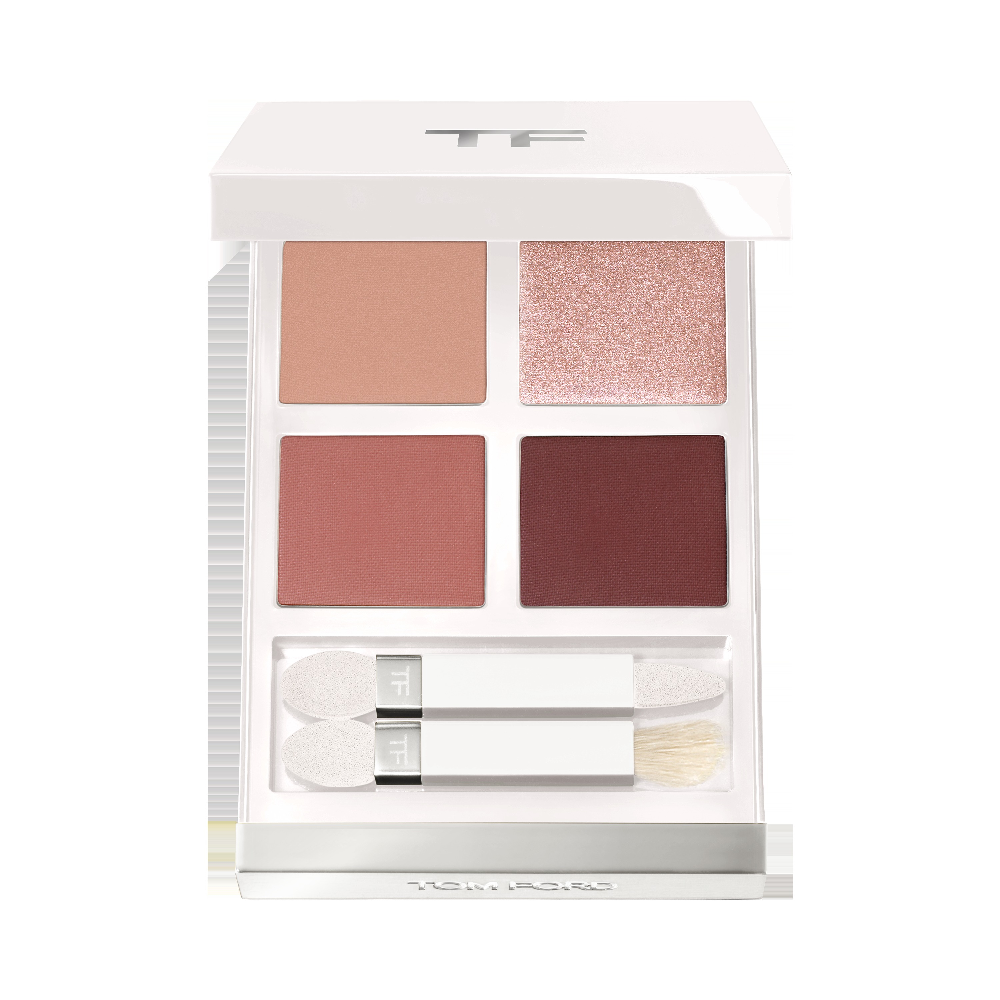
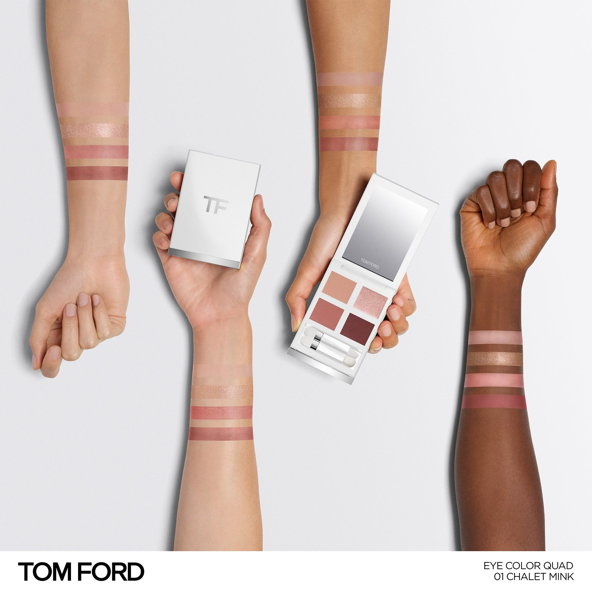
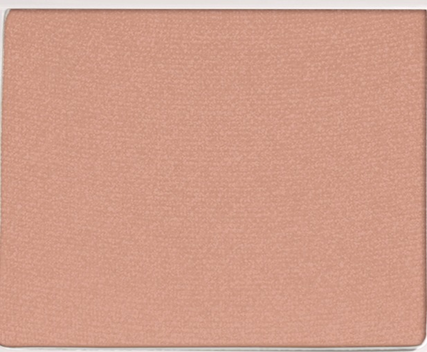
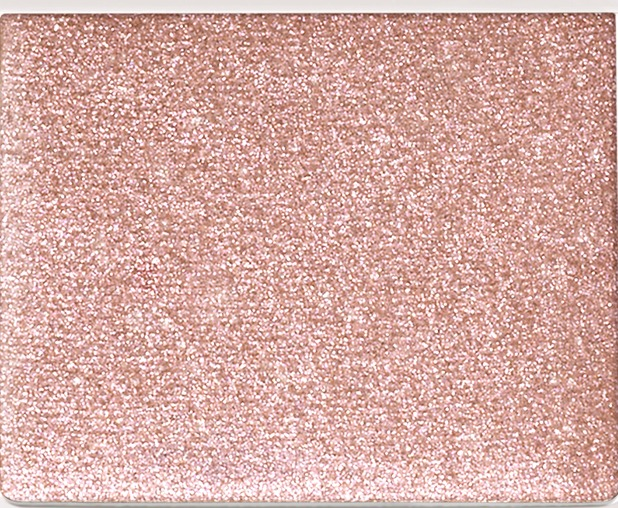
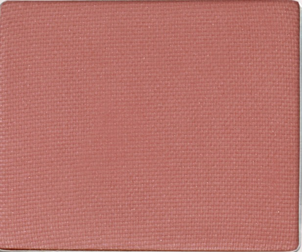
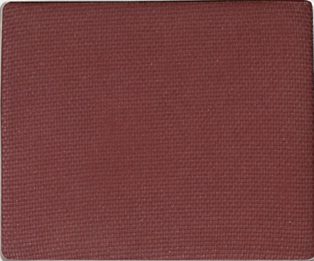

# Tom Ford 4色 四色盘 雪山貂影盘 Soleil Neige Eye Color Quad 01 Chalet Mink
*发布：~2025*

> 雪地之上，光影柔软流动。暖调香草缎光铺开朦胧底色，闪光玫瑰照亮眼头与眉骨，哑光玫粉从眼尾内收塑形，深哑光梅李在外眼角收笔定形——轻盈、过渡、带有日光映雪的微光感。

> *Soft light on snow. A warm satin vanilla opens the lid; sparkle rose illuminates the inner corner and brow; matte rose contours from the outer corner inward; deep matte plum defines the lash line — a lightweight, transitional smoky eye that glimmers with sunlit iridescence.*

## Shade 1: Satin Vanilla — Warm satin vanilla.

Use: Step 1 — Create a soft, tinted sheen over the upper eyelid area with this warm satin vanilla shade.

##### 色号 1：缎光香草 (Satin Vanilla) —— 暖调缎光香草色。
用途：第一步——以此暖调缎光香草色在上眼睑区域打造柔和、有色泽的底妆光感。

## Shade 2: Sparkle Rose — Shimmery warm sparkle rose.

Use: Step 2 — Apply around the tear duct and under the brow to illuminate the inner corner and brow bone with warm rose sparkle.

##### 色号 2：闪光玫瑰 (Sparkle Rose) —— 暖调闪光玫瑰色。
用途：第二步——点于眼头及眉下方，以闪光玫瑰色提亮眼头与眉骨。

## Shade 3: Matte Rose — Mid-toned matte dusty rose.

Use: Step 3 — Sweep from the outer corner inward on both upper and lower lash lines to gently contour the eye shape.

##### 色号 3：哑光玫粉 (Matte Rose) —— 中调哑光玫瑰粉色。
用途：第三步——从眼尾向内扫于上下睫毛线，以哑光玫粉柔和勾勒眼形轮廓。

## Shade 4: Matte Plum — Deep matte plum-cocoa.

Use: Step 4 — Add definition using this deep shade in the upper and lower outer corners of the lash line.

##### 色号 4：哑光梅李 (Matte Plum) —— 深调哑光梅李棕色。
用途：第四步——以此深色集中点于上下睫毛线外眼角处，精准加深轮廓。
