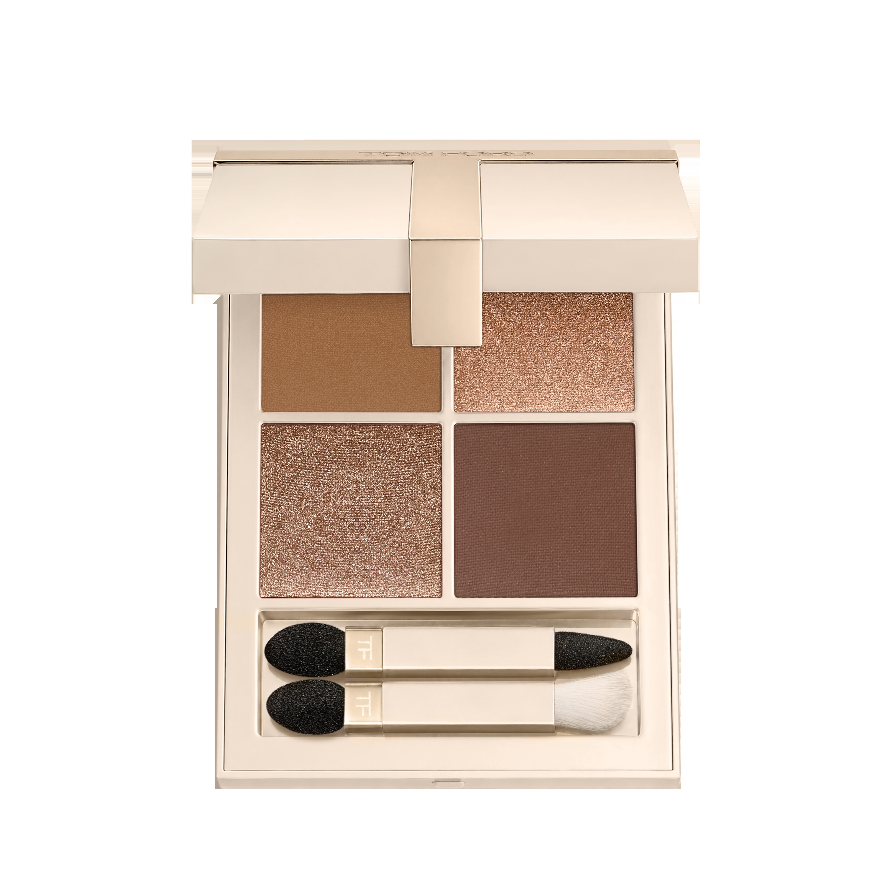
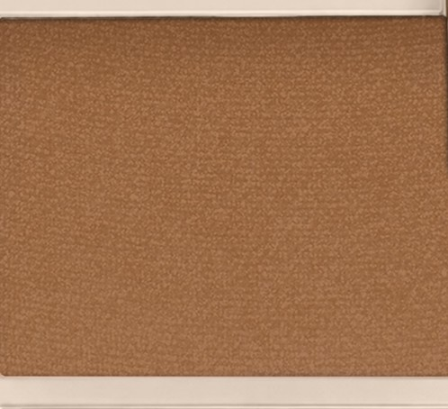
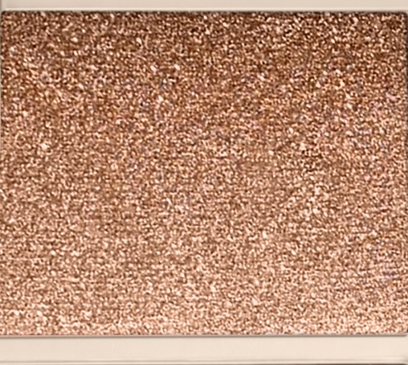
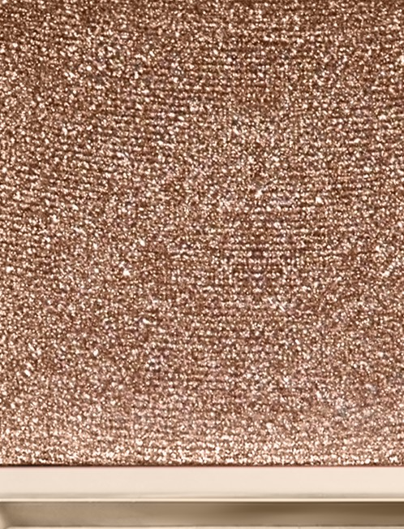
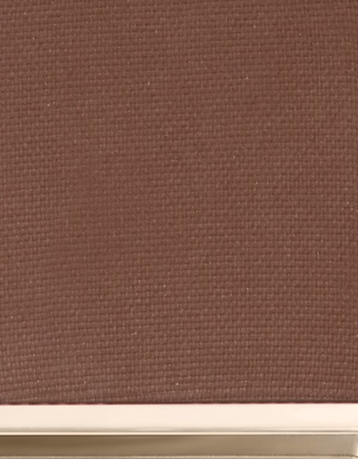

# Tom Ford 4色 四色盘 香草性感盘 Vanilla Sex Eye Color Quad 01 Metallust
*发布：~2025*

> 灵感源自 Tom Ford 标志性香水 Vanilla Sex，四种肤感中性色经由哑光与珠光的交替，从日间的柔软渐行至夜晚的深邃。米色铺底，玫瑰棕与暖棕叠出维度，最终以深哑光棕收尾定形——是香草与欲望混融后留在眼睑上的余温。

> *Drawn from the warmth of Tom Ford's Vanilla Sex fragrance, this quad moves from daytime softness to evening drama through four skin-close neutrals. A matte beige base, two shimmering warm browns, and a defining matte — silky in texture, precise in intention.*

## Shade 1: Matte Beige — Warm matte beige.

Use: Step 1 — Create a smooth, even canvas by sweeping this neutral shade all over the lid.

##### 色号 1：哑光米色 (Matte Beige) —— 暖哑光米色。
用途：第一步——以此中性色全眼铺底，打造均匀光滑的妆感底色。

## Shade 2: Shimmering Rose Brown — Shimmering warm rose brown.

Use: Step 3 — Blend into the crease and the upper and lower outer corners to sculpt depth.

##### 色号 2：珠光玫瑰棕 (Shimmering Rose Brown) —— 珠光暖玫瑰棕。
用途：第三步——晕入眼窝及上下眼尾，以珠光玫瑰棕雕塑眼部轮廓。

## Shade 3: Shimmering Brown — Shimmering warm brown.

Use: Step 2 — Highlight the inner corner and the center of the lid with this shimmery shade for dimension.

##### 色号 3：珠光暖棕 (Shimmering Brown) —— 珠光暖棕。
用途：第二步——点于眼头与眼中，以珠光暖棕提亮打造立体感。

## Shade 4: Matte Brown — Deep matte brown.

Use: Step 4 — Define and intensify by concentrating on the crease and lash line for a precise, dramatic finish.

##### 色号 4：哑光深棕 (Matte Brown) —— 深哑光棕。
用途：第四步——集中叠于眼窝与睫毛根，以哑光深棕精准强化轮廓，打造日落烟熏感。
