# Viseart 12色 大号/小号 哑光中性盘 01 Mattes Neutral 
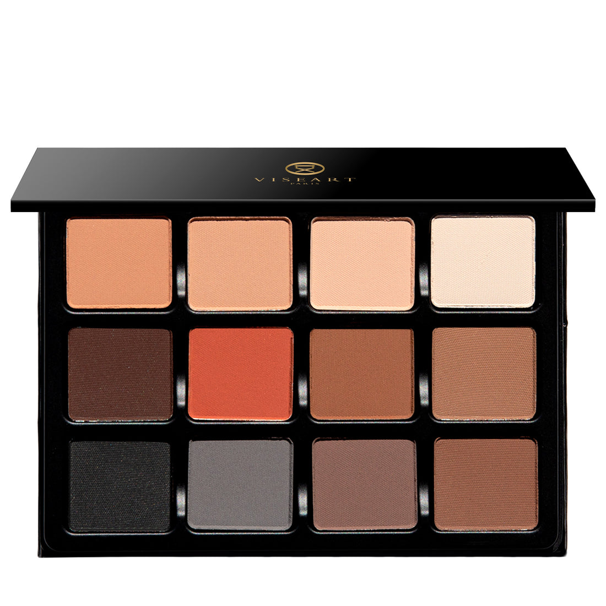
## Shade 1: Saumon/Canelle — Deep peach wth a matte finish. 
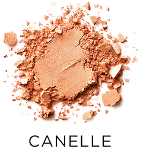

Use: Base tone for all skin types, can be used as a highlighter for deeper tones, a mid-tone for lightest skin tones. As a blush and peach adjuster for blue under the skin in the corner of the eye and under eye. Also used as a blush and contour for light skin. Tone can be used as a lid to lash base color, to brighten up the inner corner of the eye, and to highlight on the face - try using it on top of the cheekbone, down the nose, and along the jawline. 

##### 色号 1：三文鱼/肉桂 — 深桃色，哑光质地。
用途：适合所有肤色的打底色；深肤色可用作高光，极浅肤色可用作中间色。可用作腮红，或用于修饰眼角及眼下部位的青色（利用桃色调中和青色）。浅肤色人群也可将其用作腮红或修容。该色号可用作眼睑至睫毛根部的底色、提亮眼头，以及面部高光（建议涂抹于颧骨上方、鼻梁及下颌线处）。

## Shade 2: Beige — Warm peach beige with a matte finish.
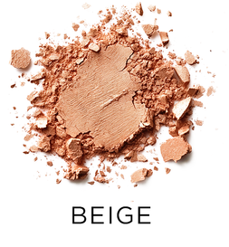

Use: Base tone for all skin types, can be used as a highlighter for deeper tones, a mid-tone for lightest skin tones. Tone can be used as a lid to lash base color, to brighten up the inner corner of the eye, and to highlight on the face - try using it on top of the cheekbone, down the nose, and along the jawline. Blush and peach adjuster for blue under the skin in the corner of the eye and under eye. Also used as a blush and contour for light skin.

##### 色号 2：米色 (Beige) —— 带有哑光质感的暖调蜜桃米色。
用途：适合所有肤色的底色；可用作深肤色的高光，或极浅肤色的中间色调。可用作眼睑至睫毛根部的打底色，提亮眼角内侧，以及面部高光（建议涂抹于颧骨上方、鼻梁及下颌线处）。亦可用作腮红，或作为蜜桃色调校正剂，修饰眼角及眼下部位透出的青蓝色调；对于浅肤色人群，还可用作腮红及修容。

## Shade 3: Pêche — Light peach beige with a matte finish.
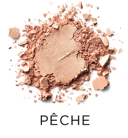

Use: Base tone for all skin types, can be used as a highlighter for deeper tones, a mid-tone for lightest skin tones. This super versatile color can be mixed with any of the other tones to lighten and brighten them. It can also be used to highlight anywhere on the face for light skin tones - try it under the brow, on top of the cheekbone, or the inner corner of the eye. Blush and peach adjuster for blue under the skin in the corner of the eye and under eye. Also used as a blush and contour for light skin.

##### 色号 3：蜜桃米色 (Pêche) —— 浅调蜜桃米色，哑光质地。
用途：适合所有肤色作为底色；可作深肤色高光或浅肤色中间色。该色非常百搭，可与盘中其他颜色混合以提亮与柔化色调。浅肤色可用于眉骨、颧骨上方与眼头提亮；也可作为腮红，或用于修饰眼角与眼下偏青色调；浅肤色人群亦可将其用于轻度修容。

## Shade 4: Ivoire — Bone white with a matte finish.
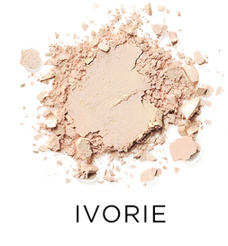

Use: Base tone for all skin types, can be used as a brow bone highlighter for all skin tones. This tone is a classic mix-in adjuster tone for all colours within the palette to lighten shades creating 12 new lighter eyeshadow shades.

##### 色号 4：象牙白 (Ivoire) —— 骨白色，哑光质地。
用途：适合所有肤色作为基础提亮色，也可用于眉骨高光。它是经典的调色提亮色，可与盘内任意颜色混合，降低明度并延展出更浅的眼影层次。

## Shade 5: Chocolat — Warm chocolate-red brown with a matte finish.
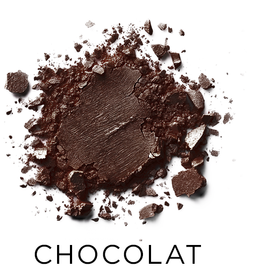

Use: All over tone for all skin types. Eyeliner and contour tone for all skin tones. Also can be used as a mix-in for the orange and black to create a dimensional smokey eye. Can be used alone with a damp brush for an intense liner, mix in black as eyeliner to create an espresso liner, and blend into the brown for a chocolate smokey eye.

##### 色号 5：巧克力棕 (Chocolat) —— 暖调巧克力红棕，哑光质地。
用途：适合所有肤色大面积铺色，也可作眼线与修容色。可与橙色、黑色混合打造层次烟熏；用湿刷单独上色可获得更浓郁眼线效果；与黑色混合可调出浓缩咖啡色眼线；与棕色晕染可完成巧克力烟熏妆。

## Shade 6: Brique — Warm sienna with a matte finish.
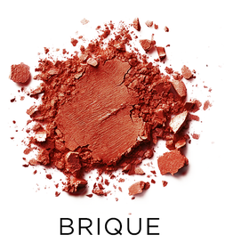

Use: All over solid tone for all skin types. Colour adjuster orange tone adds warmth and dimension to all lighter tones on eyes. Can also be used with the lighter tones to create blush. This pigment can also be used in combination with other pigments and used with Viseart lip balm as a natural lip blush! Give dimension to the crease, warm up the lid, or create the perfect brow on a redhead.

##### 色号 6：砖红赭色 (Brique) —— 暖赭石调，哑光质地。
用途：适合所有肤色的大面积实色铺陈。作为偏橙调的校色，可为浅色眼妆增加暖感与立体度；与浅色混合也可做腮红。还能与其他色粉搭配并混合润唇膏，做自然唇颊同色。可用于加深眼窝、暖化眼皮，或打造红发人群更协调的眉色。

## Shade 7: Taupe — Caramel warm brown with a matte finish.
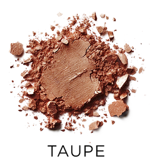

Use: All over solid tone for all skin types. Base tone, as well as mid-tone for eyeshadow depth and dimension. Also can be used in brows, and as contour.

##### 色号 7：焦糖棕 (Taupe) —— 焦糖暖棕，哑光质地。
用途：适合所有肤色做大面积主色，可作打底或中间过渡色，帮助建立眼影深浅层次与立体感；也可用于眉部与面部修容。

## Shade 8: Cafe — Taupe cool brown with a matte finish.
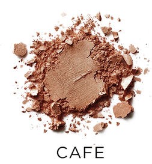

Use: All over solid tone for all skin types. Base tone, as well as mid-tone for eyeshadow depth and dimension. Also can be used in brows, and as contour.

##### 色号 8：咖啡棕 (Cafe) —— 冷调灰棕，哑光质地。
用途：适合所有肤色做大面积主色，可作底色或中间层次色，用于增强眼妆深度与轮廓；同时适用于眉部塑形与面部修容。

## Shade 9: Carbon — Natural black with a matte finish.
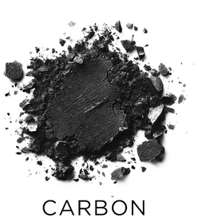

Use: All over solid tone for all skin types. Used as a mix in for all matte shades to create 11 new shades that have depth. Use as an eyeliner, and for brows.

##### 色号 9：碳黑 (Carbon) —— 自然黑，哑光质地。
用途：适合所有肤色加深使用。可与盘中任意哑光色混合，快速调出更深层次的颜色；也可直接作为眼线色与眉色使用。

## Shade 10: Souris — Deep gray with a matte finish.
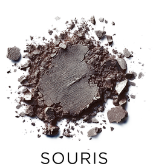

Use: All over solid tone for all skin types. Use as a base for a smokey eye, or simple everyday cool tone, also used as eyeliner and in brows.

##### 色号 10：鼠灰 (Souris) —— 深灰色，哑光质地。
用途：适合所有肤色的大面积实色铺陈。可作为烟熏妆打底，也可用于日常冷调眼妆；同样可作眼线与眉色。

## Shade 11: Cendre — Soft cool grey brown taupe with a matte finish.
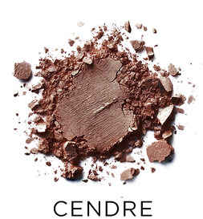

Use: All over solid tone for all skin types. Base tone, as well as midtone for eyeshadow depth and dimension. Use in brows, and as contour. This neutral taupe is perfect for creating shape on the lids, dimension in the crease, or contour on the face.

##### 色号 11：灰褐 (Cendre) —— 柔和冷调灰棕，哑光质地。
用途：适合所有肤色全眼铺色，可作底色或中间过渡色，增强眼影深邃度与结构感；可用于眉部和修容。该中性灰褐尤其适合塑造眼皮轮廓、加深眼窝层次，以及打造自然面部阴影。

## Shade 12: Noisette — Light cool brown with a matte finish.
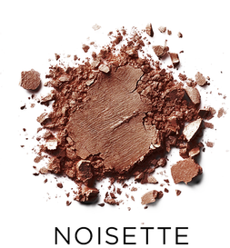

Use: All over solid tone for all skin types. Base tone, as well as mid-tone for eyeshadow depth and dimension. Use in brows, and as contour. Lid to crease, contour to brow, this color is the little black dress of brown eyeshadow.

##### 色号 12：榛子棕 (Noisette) —— 浅冷棕，哑光质地。
用途：适合所有肤色作为底色与中间层次色，帮助建立眼妆深度与立体感；可用于眉部与修容。从眼皮到眼窝、再到眉骨轮廓都可使用，是一支非常百搭的经典棕色眼影。