# Viseart 12色 大号/小号 02 梦幻波西米亚盘 Shimmers Bohème Dream
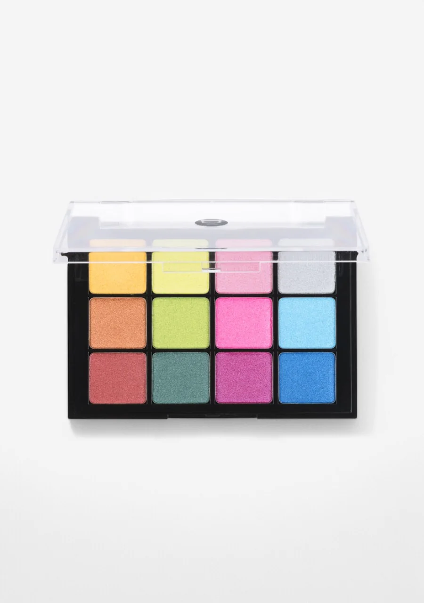

## Shade 1: Amber — Warm medium-dark yellow with a frosted finish.
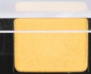

Use: This warm amber yellow can be used as an all-over lid shade to create a sunny, warm look. Pairs with copper and red tones for a warm metallic sunset eye. All skin tones.

##### 色号 1：琥珀黄 (Amber) —— 暖调中深黄色，霜光质地。
用途：可作全眼铺色，营造明艳暖调妆感；与铜色、暖红搭配可做暖金属日落眼妆。

## Shade 2: Citron — Warm very light yellow-green with a frosted finish.
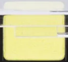

Use: This pale citrus yellow-green can be used as a highlight on the inner corner or brow bone. Layer with deeper greens for dimension or pair with Lime for a fresh citrus look. All skin tones.

##### 色号 2：柠檬绿 (Citron) —— 暖调浅柠檬黄绿色，霜光质地。
用途：适合用于眼头提亮或眉骨高光；与深绿叠加可增加层次，与 `Lime` 搭配可做清新柑橘眼妆。

## Shade 3: Rose Petal — Light-medium warm pink with a frosted finish.
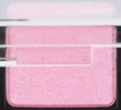

Use: This bright candy pink can be used as an all-over lid shade for a playful, feminine look. Blend into the crease with magenta for drama. All skin tones.

##### 色号 3：玫瑰粉 (Rose Petal) —— 浅中暖粉色，霜光质地。
用途：可作全眼铺色，营造俏皮女性化妆感；与品红叠加晕染眼窝可增添戏剧感。

## Shade 4: Crystal — Very cool light icy silver with a metallic finish.
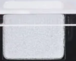

Use: This icy silver can be used to highlight the inner corner, center of the lid, and brow bone. Use a wet brush to intensify for a high-shine foiled finish. All skin tones.

##### 色号 4：冰晶银 (Crystal) —— 冷调浅冰银色，金属质地。
用途：适合眼头、眼皮中央和眉骨提亮；湿刷可强化光泽，做出高定箔光效果。

## Shade 5: Copper — Warm light-medium copper with a frosted finish.
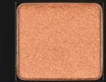

Use: This vibrant copper orange can be used as an all-over lid shade on all complexions. Pairs beautifully with red and warm tones for a bold metallic eye. All skin tones.

##### 色号 5：铜橘色 (Copper) —— 暖调浅中铜橘色，霜光质地。
用途：可作全眼铺色；与暖红色搭配可做浓郁金属眼妆。

## Shade 6: Lime — Warm light green with a frosted finish.
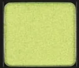

Use: This electric chartreuse green can be used as an all-over lid shade for a bold editorial look. Pairs with teal for a green-toned smokey eye. All skin tones.

##### 色号 6：荧光绿 (Lime) —— 暖调浅黄绿色，霜光质地。
用途：可作全眼铺色，打造大胆编辑风妆感；与青色搭配可做绿调烟熏妆。

## Shade 7: Fuchsia — Very cool light fuchsia with a frosted finish.
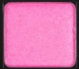

Use: This vivid hot pink can be used as an all-over lid shade or in the outer corner for a bold pop of colour. Pairs with Crystal for a cool graphic look. All skin tones.

##### 色号 7：荧光粉 (Fuchsia) —— 冷调浅品红色，霜光质地。
用途：可作全眼铺色，或集中在眼尾做大胆跳色；与 `Crystal` 搭配可做冷调图形感妆容。

## Shade 8: Ciel — Moderately cool light blue with a metallic finish.
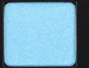

Use: This bright sky blue can be used as an all-over lid shade or blended into the outer corner. Pairs with Royal for a deep blue dimension. All skin tones.

##### 色号 8：天空蓝 (Ciel) —— 偏冷调浅蓝色，金属质地。
用途：可作全眼铺色，或晕染到眼尾加深；与 `Royal` 搭配可做层次深蓝妆。

## Shade 9: Poppy — Very warm medium red with a frosted finish.
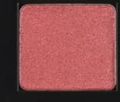

Use: This warm brick red can be used as an all-over lid shade for a bold editorial look, or to deepen the outer corner. Pairs with Copper for a warm metallic eye. All skin tones.

##### 色号 9：罂粟红 (Poppy) —— 暖调中调正红色，霜光质地。
用途：可作全眼铺色或叠在眼尾加深，打造大胆编辑风；与 `Copper` 搭配可做暖调金属眼妆。

## Shade 10: Jade — Neutral medium-dark teal with a frosted finish.
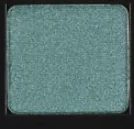

Use: This deep teal can be used in the outer corner and crease for depth, or as an all-over lid shade for a sophisticated jewel-toned look. Pairs with Lime for contrast. All skin tones.

##### 色号 10：翡翠绿 (Jade) —— 中性中深青绿色，霜光质地。
用途：可用于眼尾和眼窝加深，或作全眼铺色打造高级宝石妆；与 `Lime` 形成对比撞色。

## Shade 11: Orchid — Very cool medium-dark pink with a metallic finish.
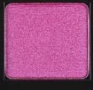

Use: This deep magenta can be used in the outer corner and lower lash line for drama, or as an all-over lid shade. Pairs with Fuchsia for a monochromatic pink look. All skin tones.

##### 色号 11：兰花紫 (Orchid) —— 冷调中深品红色，金属质地。
用途：可用于眼尾和下眼睑增添戏剧感，或全眼铺色；与 `Fuchsia` 搭配可做单色调粉紫妆。

## Shade 12: Royal — Moderately cool medium blue with a pearl finish.
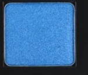

Use: This rich royal blue can be used as an all-over lid shade or concentrated in the outer corner for depth. Pairs with Ciel for a dimensional blue look. All skin tones.

##### 色号 12：宝蓝色 (Royal) —— 偏冷调中调宝蓝色，珠光质地。
用途：可作全眼铺色，或集中在眼尾加深；与 `Ciel` 搭配可做层次丰富的蓝调妆。
