# Viseart 12色 大号/小号 婚礼缎光盘 03 Satin Bridal
*发布：2016*

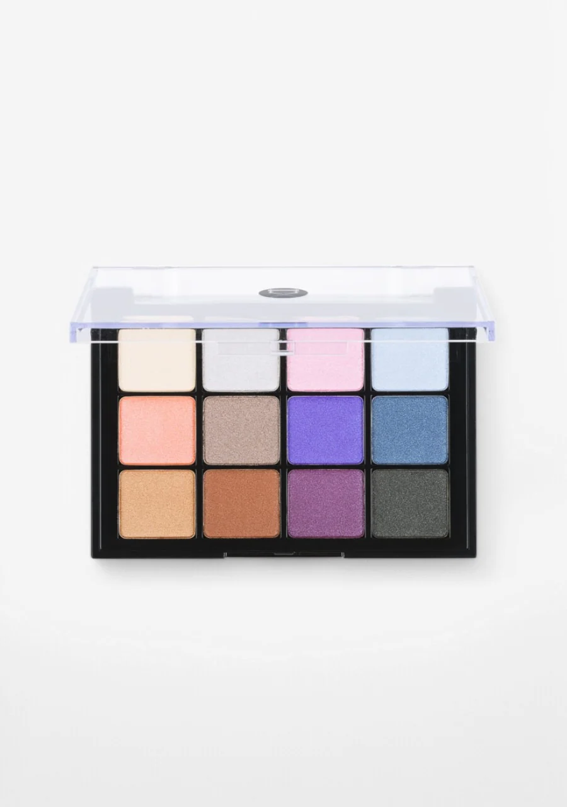

> 婚礼缎光盘以香槟金、银钻白、牡丹粉与蓝钻白等缎光珠光色调，为婚礼与正式场合打造如薄纱般轻盈的光感妆容。每一个色号都散发着洁白婚纱般的纯洁与光华。

> *Satin Bridal offers a curated collection of luminous champagne golds, sterling silvers, soft rose pinks, and ethereal blues in frosted satin finishes — purpose-built for bridal and formal occasion makeup that glows with effortless elegance.*

## Shade 1: Champagne — Lightly brightened light-medium buttery yellow gold with a frosted finish.
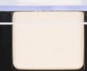

Use: This bright warm ivory can be used as an all-over lid shade or to highlight the inner corner, brow bone, and cupid's bow. Layer over other shades to add a luminous glow. All skin tones.

##### 色号 1：香槟金 (Champagne) —— 暖调浅米金色，细腻霜光质地。
用途：可作全眼铺色，或用于眼头、眉骨和唇峰提亮；叠在其他色号上增添发光感。

## Shade 2: Sterling — Bright silvery white with a metallic sheen.
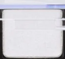

Use: This icy silver white is ideal for the inner corner highlight, brow bone, and center-lid pop. Can be used as an all-over lid shade for a clean ethereal look. All skin tones.

##### 色号 2：银钻白 (Sterling) —— 明亮银白色，金属光泽。
用途：适合眼头、眉骨提亮和眼皮中央点亮；也可全眼铺色，营造清透轻盈感。

## Shade 3: Peony — Brightened light-medium pink with subtle warm undertones and a very frosted slightly metallic finish.
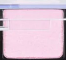

Use: This soft pink satin shade can be used as an all-over lid shade for a romantic look. Works beautifully as a highlight on the inner corner and brow bone on lighter complexions. All skin tones.

##### 色号 3：牡丹粉 (Peony) —— 明亮浅中粉色，微暖色调，霜光金属质地。
用途：可作全眼铺色，打造浪漫妆感；浅肤用于眼头和眉骨提亮效果尤佳。

## Shade 4: Blue Diamond — Brightened bluish-white with a hint of silver in its frosted sheen.
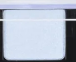

Use: This ethereal icy blue-white can be used as a highlight on the inner corner, center of the lid, or brow bone. Pairs beautifully with deeper blues and purples for a cool smokey look. All skin tones.

##### 色号 4：蓝钻白 (Blue Diamond) —— 冷调浅蓝白色，带银色霜光。
用途：适合眼头、眼皮中央或眉骨提亮；与深蓝、紫色搭配可做冷调烟熏妆。

## Shade 5: Orange Topaz — Brightened light-medium orange with warm undertones and a frosted lightly metallic sheen.
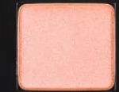

Use: This warm coral-peach can be used as an all-over lid shade on all complexions. Can also be used as a shimmery blush on lighter skin tones. Pairs well with copper and brown shades for a warm sunset look.

##### 色号 5：橙托帕石 (Orange Topaz) —— 明亮浅中橙珊瑚色，暖色调，霜光金属质地。
用途：可作全眼铺色；浅肤也可当作微光腮红。与铜棕色搭配可做暖调日落妆。

## Shade 6: Velvet — Medium taupe brown with subtle warm undertones and a metallic sheen.
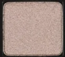

Use: This warm taupe can be used in the crease for natural depth, along the lower lash line, or as an all-over lid shade for an understated smokey eye. Excellent as a transition shade. All skin tones.

##### 色号 6：丝绒棕 (Velvet) —— 中调暖色摩卡棕，金属光泽。
用途：适合眼窝过渡、下眼睑晕染或全眼铺色，营造低调烟熏感；是出色的过渡色。

## Shade 7: Violet — Brightened medium purple with cool undertones and a frosted sheen.
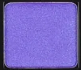

Use: This vibrant purple can be used as an all-over lid shade or concentrated in the outer corners and crease. Pairs beautifully with Sterling and Blue Diamond for a cool fantasy look.

##### 色号 7：紫罗兰 (Violet) —— 明亮中调冷紫色，霜光质地。
用途：可作全眼铺色，或集中在眼尾和眼窝加深；与 `Sterling`、`Blue Diamond` 搭配可做冷调幻彩妆。

## Shade 8: Sapphire — Dusty subdued medium-dark blue with a hint of gray and a pearly sheen.
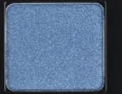

Use: This dusty steel blue can be used in the outer corners and lower lash line to add cool depth. Layer over Violet for a dimensional blue-purple smokey look. All skin tones.

##### 色号 8：蓝宝石 (Sapphire) —— 低调中深蓝色，带灰调和珠光质地。
用途：可用于眼尾和下眼睑加深，营造冷调立体感；叠在 `Violet` 上可做层次丰富的蓝紫烟熏妆。

## Shade 9: Cashmere — Slightly muted light-medium yellow gold with warm gold and brown undertones and a frosted sheen.
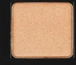

Use: This warm champagne gold is perfect as an all-over lid shade, inner corner highlight, or brow bone highlighter. Pairs well with copper and warm browns for a golden-hour look. All skin tones.

##### 色号 9：开司米金 (Cashmere) —— 柔和浅中黄金色，暖金棕色调，霜光质地。
用途：适合全眼铺色或做眼头、眉骨高光；与铜棕色搭配打造黄金时刻暖妆。

## Shade 10: Copper — Softened medium-dark brown with warm orange undertones and a frosted sheen.
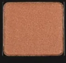

Use: This rich copper brown can be used as a deep all-over lid shade, in the crease for warmth, or along the lower lash line. Pairs beautifully with Cashmere and Orange Topaz for a warm metallic look.

##### 色号 10：铜棕色 (Copper) —— 柔化中深棕色，暖橙色调，霜光质地。
用途：可作全眼深色铺底、眼窝晕染或下眼睑加深；与 `Cashmere`、`Orange Topaz` 搭配可做暖调金属妆。

## Shade 11: Prune — Medium-dark plummy purple with warm pink undertones and a frosted finish.
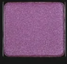

Use: This deep plum purple can be used in the outer corners and crease for dramatic depth, or as an all-over lid shade for a bold look. Pairs with Violet for a dimensional purple look.

##### 色号 11：李子紫 (Prune) —— 中深梅李紫色，带暖粉色调，霜光质地。
用途：可用于眼尾和眼窝加深，营造戏剧感；也可全眼铺色打造浓郁妆效。与 `Violet` 搭配可做层次丰富的紫调妆。

## Shade 12: Tuxedo — Medium-dark satiny black with subtle warm undertones.
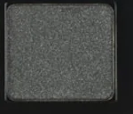

Use: This near-black shade can be used in the outer corners and lower lash line for definition, or as a liner shade. Layer over other shades in this palette to add depth and drama to any look.

##### 色号 12：礼服黑 (Tuxedo) —— 中深缎光黑色，带微暖色调。
用途：可用于眼尾和下眼睑加深定型，也可作眼线色使用；叠在其他色号之上可为任何妆容增添深邃感。
