# Viseart 12色 大号/小号 04 哑光深调盘 Mattes Dark
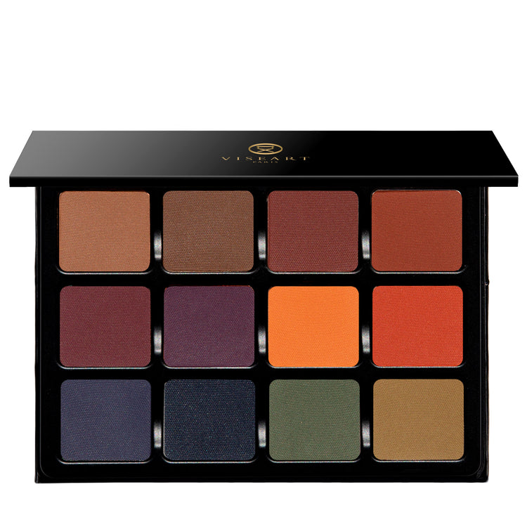

## Shade 1: Toffee — Warm light brown with a matte finish.
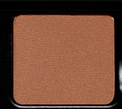

Use: All over base tone for all skin types, highlight for brow bone on medium to deep skin. Use as a mix-in with other brown tones and with greens to create different light variations of khaki.

##### 色号 1：太妃棕 (Toffee) —— 暖调浅棕色，哑光质地。
用途：适合所有肤色作大面积打底色；中等至深肤色也可用于眉骨提亮。还可与其他棕色或绿色混合，调出不同深浅变化的卡其色。

## Shade 2: Hazelnut — Deep taupe brown with a matte finish.
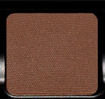

Use: All over base tone for all skin types. Use as a midtone to add definition.

##### 色号 2：榛果棕 (Hazelnut) —— 深灰棕色，哑光质地。
用途：适合所有肤色作大面积打底色，也可作为中间色调增加轮廓与层次。

## Shade 3: Sienna — Muted rosy brown with a matte finish.
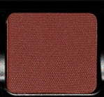

Use: All over tone for all skin types. Use it as a liner to create depth and dimension.

##### 色号 3：赭石棕 (Sienna) —— 柔和玫瑰棕色，哑光质地。
用途：适合所有肤色作大面积铺色，也可作为眼线色使用，增强深度与立体感。

## Shade 4: Sepia — Muted orange-brown with a matte finish.
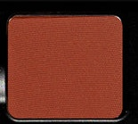

Use: All-over tone for all skin types. Use it as a liner to create depth and dimension.

##### 色号 4：棕褐 (Sepia) —— 柔和橘棕色，哑光质地。
用途：适合所有肤色作大面积铺色，也可作为眼线色使用，增强深度与立体感。

## Shade 5: Pinot — Deep rosy plum with a matte finish.
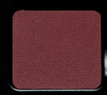

Use: All-over tone for all skin types. Use it as a liner to create depth and dimension.

##### 色号 5：黑皮诺紫棕 (Pinot) —— 深玫瑰李子色，哑光质地。
用途：适合所有肤色作大面积铺色，也可作为眼线色使用，增强深度与立体感。

## Shade 6: Beaujolais — Eggplant purple with a matte finish.
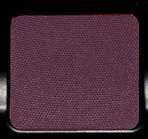

Use: All-over tone for all skin types. Use it as a liner to create depth and dimension.

##### 色号 6：博若莱紫 (Beaujolais) —— 茄紫色，哑光质地。
用途：适合所有肤色作大面积铺色，也可作为眼线色使用，增强深度与立体感。

## Shade 7: Curcumin — Muted yellow-orange with a matte finish.
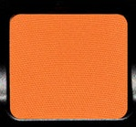

Use: All-over tone for all skin types. Use it as a liner to create depth and dimension.

##### 色号 7：姜黄橘 (Curcumin) —— 柔和黄橘色，哑光质地。
用途：适合所有肤色作大面积铺色，也可作为眼线色使用，增强深度与立体感。

## Shade 8: Persimmon — Deep orange with a matte finish.
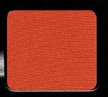

Use: All-over tone for all skin types. Use it as a liner to create depth and dimension.

##### 色号 8：柿橘 (Persimmon) —— 深橘色，哑光质地。
用途：适合所有肤色作大面积铺色，也可作为眼线色使用，增强深度与立体感。

## Shade 9: Myrtille — Blue purple with a matte finish.
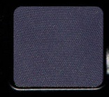

Use: All-over tone for all skin types. Use it as a liner to create depth and dimension.

##### 色号 9：蓝莓紫 (Myrtille) —— 蓝紫色，哑光质地。
用途：适合所有肤色作大面积铺色，也可作为眼线色使用，增强深度与立体感。

## Shade 10: Minuit — Deep navy blue with a matte finish.
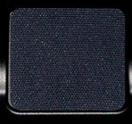

Use: All-over tone for all skin types. Use it as a liner to create depth and dimension.

##### 色号 10：午夜蓝 (Minuit) —— 深海军蓝色，哑光质地。
用途：适合所有肤色作大面积铺色，也可作为眼线色使用，增强深度与立体感。

## Shade 11: Fôret — Forest green with a matte finish.
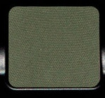

Use: All-over tone for all skin types. Use it as a liner to create depth and dimension.

##### 色号 11：森林绿 (Fôret) —— 森林绿色，哑光质地。
用途：适合所有肤色作大面积铺色，也可作为眼线色使用，增强深度与立体感。

## Shade 12: Olive — Olive green with a matte finish.
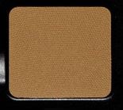

Use: All-over tone for all skin types. Use it as a liner to create depth and dimension.

##### 色号 12：橄榄绿 (Olive) —— 橄榄绿色，哑光质地。
用途：适合所有肤色作大面积铺色，也可作为眼线色使用，增强深度与立体感。
