# Viseart 12色 大号/小号 魅惑微光盘 05 Shimmers Sultry Muse
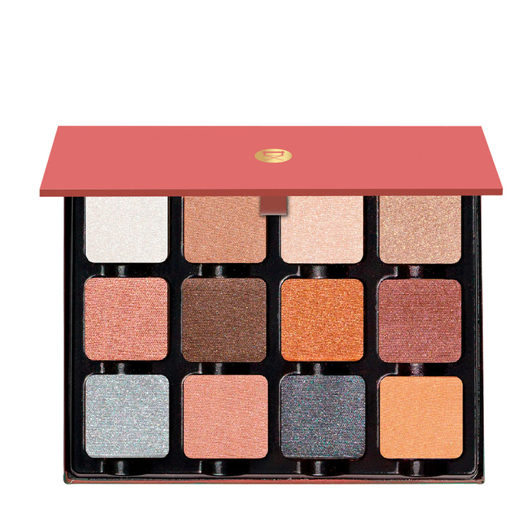

## Shade 1: Yves — Warm white satin with a metallic crystalline shimmer finish.
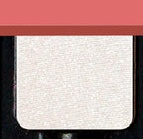

Use: This tone can be used to lighten and add shimmering glow to all other shades in Sultry Muse. This tone is also used for the inner corner, brow bone, and cupid's bow and can be added to blush to create a light shimmering glow on cheeks.

##### 色号 1：伊夫白金 (Yves) —— 暖白缎光，带金属晶闪质地。
用途：可用于提亮盘中其他色号，也适合眼头、眉骨和上唇峰提亮，并可混入腮红，带出轻盈光泽。

## Shade 2: Camille — Soft light rose-brown nude with a metallic finish.
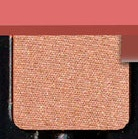

Use: This warm hue can be used as an all over lid shade on all complexions, can also be used as a shimmering bronzer on lighter skin tones.

##### 色号 2：卡米尔裸玫 (Camille) —— 柔和浅玫棕裸色，金属质地。
用途：适合作为所有肤色的全眼铺色；浅肤也可当作带微光的修容色。

## Shade 3: Kifu — Warm light champagne beige with a satin shimmer finish.
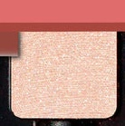

Use: This satin shade can be used as an all over lid tone or to brighten the inner corners of the eyes. This satin shade can also be used on the brow bone, and on top of any cream eyeliner, or conversely, use a wet brush or mixing medium to intensify the tone for a high definition finish. All skin tones.

##### 色号 3：香槟金 (Kifu) —— 暖调浅香槟米色，缎光微闪质地。
用途：可作全眼铺色或眼头提亮，也能用于眉骨，或叠在膏状眼线之上；湿刷或调和液可进一步增强显色与立体感。

## Shade 4: Melissa — Light golden brown nude with a foiled metallic finish.
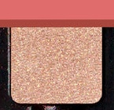

Use: This satin shade can be used as an all-over lid tone, as a highlighter in the inner corner of the eyes, on the brow bone, and on top of any cream eyeliner. Conversely, use a wet brush, or mixing medium to intensify the tone for high definition shine. All skin tones.

##### 色号 4：梅丽莎金棕 (Melissa) —— 浅金棕裸色，箔光金属质地。
用途：可作全眼铺色，也适合眼头、眉骨和膏状眼线之上的提亮；湿刷或调和液可强化高光感。

## Shade 5: Tym — Rose pink with a foiled metallic finish.
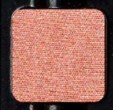

Use: This shade can be used as an all over lid hue, paired with shade 'Mattias' for a sexy burgundy eye look, or layered over any of your favorite matte shadows. Can be mixed into other shades to create a shimmery blush.

##### 色号 5：提姆玫粉 (Tym) —— 玫粉色，箔光金属质地。
用途：可作全眼铺色；与 `Mattias` 搭配可做酒红眼妆，也可叠加在哑光色上，或混入其他色号做闪亮腮红。

## Shade 6: Jori — Rich dark chocolate brown with a foiled metallic finish.
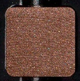

Use: This satin shade can be used as an all-over lid tone to create a deep chocolate smokey eye, can be used in the crease or outer corners or conversely use a wet brush, or mixing medium to intensify the tone for high definition shine. Can also be used as an eyeliner. All skin tones.

##### 色号 6：乔里浓巧 (Jori) —— 浓郁深巧克力棕，箔光金属质地。
用途：可作全眼铺色，做出深巧烟熏感；也适合眼窝、眼尾和眼线使用，湿刷或调和液可进一步加深高光泽度。

## Shade 7: Cindi — Deep copper with a foiled metallic finish.
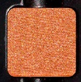

Use: This bright copper orange satin shade can be used as an all over lid shade for all complexions. Combine with a rich chocolate hue for a warm smokey eye look. Looks beautiful on redheads, and can be used on all skin tones.

##### 色号 7：辛迪铜橘 (Cindi) —— 深铜色，箔光金属质地。
用途：可作全眼铺色；与深巧克力色搭配可做暖调烟熏妆，也很适合红发人群。

## Shade 8: Mattias — Deep rosy burgundy with a metallic foil finish.
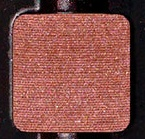

Use: This deep rosy shade can be used to build up the outer corners of the eye or to add definition to the lower lashline. It can be blended into any of the lighter hues for more tones, it also can be used to highlight deeper skin tones. Pairs beautifully with shade 'Tym' to create a sunset of warmth.

##### 色号 8：马蒂亚斯酒红 (Mattias) —— 深玫瑰酒红，金属箔光质地。
用途：可叠加在眼尾或下睫毛根部，也可与浅色晕染出更多层次；深肤也能得到更明显的提亮感。和 `Tym` 搭配尤其好看。

## Shade 9: Chloe — Silver metallic with a crystalline shimmer finish.
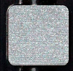

Use: This icy silver can be used to concentrate the hue with brush in the center of the lid for a reflective pop of color, it can also be used as an all-over lid tone, as a highlight in the inner corner of the eyes, on the brow bone, and on top of any cream eyeliner. Conversely, use a wet brush, or mixing medium to intensify the tone for high definition shine. All skin tones.

##### 色号 9：克洛伊银闪 (Chloe) —— 银色金属，晶闪质地。
用途：可点在眼皮中央做反光亮点，也可作全眼铺色，或用于眼头、眉骨和膏状眼线之上的提亮；湿刷或调和液可增强高光感。

## Shade 10: Melonie — Rose with a foiled metallic finish.
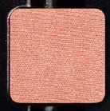

Use: This soft pink satin shade can be used as an all over lid tone for all complexions. Can be used as a shimmery blush for lighter complexions. Mix into other hues to create new shades.

##### 色号 10：梅洛妮玫粉 (Melonie) —— 玫粉色，箔光金属质地。
用途：可作全眼铺色；浅肤也可当作闪亮腮红，还能混入其他色号调出新色。

## Shade 11: Xander — Charcoal grey with a metallic shimmer finish.
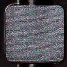

Use: This cool-toned gray satin shade can be blended into the crease and outer corners of the eyes for a smokey finish. Can also be used as a liner, or conversely use a wet brush, or mixing medium to intensify the tone for high definition shine. All skin tones.

##### 色号 11：赞德炭灰 (Xander) —— 炭灰色，金属微闪质地。
用途：可晕染于眼窝和眼尾，做烟熏收边，也可作为眼线使用；湿刷或调和液可进一步提升光泽度。

## Shade 12: Francheska — Soft yellow gold nude with a satin shimmer finish.
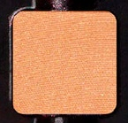

Use: This pale warm yellow gold is perfect for a sexy subtle glow all over the eyes, can also be used for the inner corner and brow bone. It can be added to other tones to create transitional gradient hues, or conversely use a wet brush, or mixing medium to intensify the tone for high definition shine. All skin tones.

##### 色号 12：弗兰切斯卡金裸 (Francheska) —— 柔和黄金裸色，缎光微闪质地。
用途：可作全眼铺色，营造柔和微光；也适合眼头和眉骨提亮，还能混入其他色号做过渡渐变。
