# Viseart 12色 大号/小号 06 巴黎裸光盘 Shimmers Paris Nudes
*发布：2015*

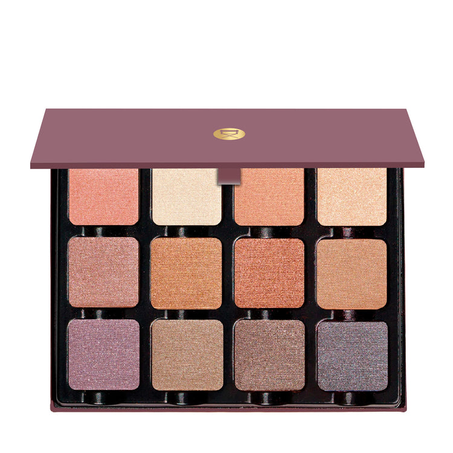

> 巴黎裸光盘专为巴黎时装周打造，以艺术桥桃粉、香榭丽舍金、铜棕与烟熏梅紫等缎光金属色调，诠释巴黎女人浪漫而精致的妆容哲学。每一个色号都是一幅流动的光影诗篇。

> *Originally created for Paris Fashion Week, Paris Nudes channels the city's romantic elegance through nude peaches, rose golds, warm coppers, and smoked plums in sumptuous satin and metallic finishes. Luminous, incandescent, and quintessentially Parisian.*

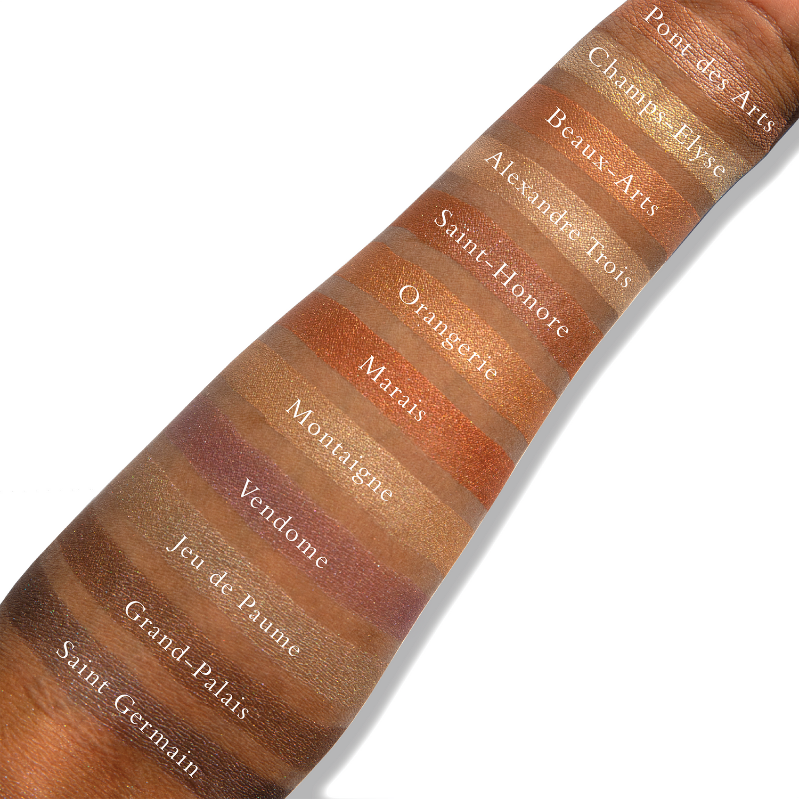

## Shade 1: Pont des Arts — Soft peachy pink with a soft metallic satin shimmer finish.
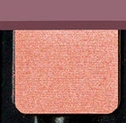

Use: This tone can be used as an all over wash on the lid or can be blended into other hues to create soft romantic looks. Mix this tone with other light or deeper shades to create more hues. The pearls in this tone make the shadows have a more glittery dimension. Use a wet brush or a mixing medium to brightly foil the hue and to set it.

##### 色号 1：艺术桥桃粉 (Pont des Arts) —— 柔和桃粉色，柔缎金属光泽。
用途：可扫满眼皮作提亮底色，也可用于眼窝过渡，或叠加在其他浅深色之下增强层次。湿刷或调和液可强化反光。

## Shade 2: Champs-Elysées — Pale white gold with a metallic shimmer finish.
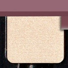

Use: This tone can be used as a highlight for the inner corner, concentrating the hue with a brush in the center of the eyelid for a reflective pop of colour (add mixing medium for pop and longevity), and as an all over lid colour. Mix this tone with other shades to create a lighter version of any Paris Nudes tone, the special pearls in this tone make the shadows have a more glittery dimension. Use a wet brush or a mixing medium to brightly foil the hue and to set it.

##### 色号 2：香榭白金 (Champs-Elysées) —— 浅白金色，金属闪泽。
用途：适合点亮眼头、眼皮中央或全眼提亮，也可与其他巴黎裸色调和成更浅一阶。湿刷或调和液可带来更强的箔光感。

## Shade 3: Beaux-Arts — Light pale peach with a metallic shimmer finish.
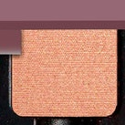

Use: This light, warm light peachy tone can be used all over the eyes to create freshness, depth and reflectivity. Mix in with other hues to create a multitude of shades. Can be used as a highlight on multiple skin tones, use a wet brush or mixing medium for high shine reflectivity.

##### 色号 3：艺坊浅桃 (Beaux-Arts) —— 浅粉杏色，金属闪泽。
用途：可大面积铺色，也可用于眼头、眼皮中央或作为其他颜色的提亮混色。湿刷或调和液可强化高光感。

## Shade 4: Alexandre Trois — Light golden nude beige with a metallic shimmer finish.
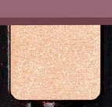

Use: This tone can be used as an all over wash of nude metallic shimmer, or as a mix in to amplify or lighten other hues. Concentrate the hue with brush in the center of the lid for a reflective pop of colour (add mixing medium for pop and longevity), as a highlight in the inner corner of the eyes, on the brow bone, and on top of any cream eyeliner. Conversely, use a wet brush, or mixing medium to intensify the tone for high definition shine. All skin tones.

##### 色号 4：亚历山大米金 (Alexandre Trois) —— 浅金米裸色，金属闪泽。
用途：可作全眼底色，或与其他色混合提亮、增亮；也适合放在眼头、眉骨和眼皮中央。湿刷或调和液能放大光泽。

## Shade 5: Saint-Honoré — Light rosy nude brown with a metallic shimmer finish.
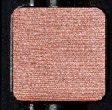

Use: This cool-toned nude shadow can be used all over the lid or subtlety build depth in the outer corner on light to medium complexions. Conversely use a wet brush, or mixing medium to intensify the tone for high definition shine.

##### 色号 5：圣奥诺雷玫棕 (Saint-Honoré) —— 浅玫瑰裸棕色，金属闪泽。
用途：适合作全眼薄铺或在眼尾轻轻加深，也可作为日常裸感提亮色。湿刷或调和液可让光泽更明显。

## Shade 6: Orangerie — Warm pale light orange peach with a metallic shimmer finish.
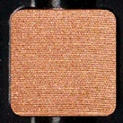

Use: This mid tone gold can be used all over lids or as a highlighter on deep complexions, or conversely use a wet brush, or mixing medium to intensify the tone for high definition shine.

##### 色号 6：橘园杏桃 (Orangerie) —— 温柔浅橘桃色，金属闪泽。
用途：可铺满眼皮作暖调打底，也可放在眼皮中央提亮立体感，或混入其他色中增加暖意。湿刷或调和液可提升反射度。

## Shade 7: Marais — Medium copper peach nude with a satin metallic finish.
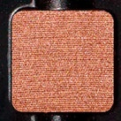

Use: This warm copper brown can be used all over the lids and lower lash line, mix in with other hues to create a multitude of shades, or conversely use a wet brush, or mixing medium to intensify the tone for high definition shine.

##### 色号 7：玛莱铜桃 (Marais) —— 中调铜桃裸色，缎感金属光泽。
用途：可全眼铺色，也适合眼尾和下眼睑加深，或与其他色混合打造更多层次。湿刷或调和液可强化高光泽。

## Shade 8: Montaigne — Pale neutral gold with a shimmer metallic finish.
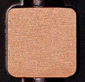

Use: Wear this muted, cool-toned nude all over the lids, or mix it in with other hues to create a multitude of shades. Concentrate the hue with brush in the center of the lid for a reflective pop of colour (add mixing medium for pop and longevity), use as a highlight in the inner corner of the eyes, on the brow bone, on cupid’s bow and on top of any cream eyeliner. Conversely, use a wet brush, or mixing medium to intensify the tone for high definition shine.

##### 色号 8：蒙田浅金 (Montaigne) —— 柔和浅金裸色，金属闪泽。
用途：适合全眼铺色，也可与其他冷调眼影混色，或点在眼皮中央、眼头、眉骨和唇峰提亮。湿刷或调和液可提升反光效果。

## Shade 9: Vendôme — Lilac purple with a shimmer metallic finish.
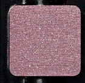

Use: This tone can be used as an all over wash or subtlety build depth in the outer corner on light to medium complexions. Concentrate the hue with brush in the center of the lid for a reflective pop of colour (add mixing medium for pop and longevity), use as a highlight in the inner corner of the eyes, on the brow bone, on cupid’s bow and on top of any cream eyeliner, or conversely use a wet brush, or mixing medium to intensify the tone for high definition shine.

##### 色号 9：旺多姆薰紫 (Vendôme) —— 淡薰衣草紫，金属闪泽。
用途：可轻扫满眼或在眼尾轻柔加深，也可搭配其他色调成更浅或更浪漫的紫调层次。湿刷或调和液能加强高光感。

## Shade 10: Jeu de Paume — pale khaki gold with a shimmer metallic finish.
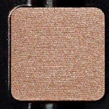

Use: This muted, cool-toned nude can be used all over lids or mixed in with other cool tones to create new shades. Concentrate the hue with brush in the center of the lid for a reflective pop of colour (add mixing medium for pop and longevity), use as a highlight in the inner corner of the eyes, on the brow bone, on cupid’s bow and on top of any cream eyeliner, or conversely use a wet brush, or mixing medium to intensify the tone for high definition shine.

##### 色号 10：波姆卡其金 (Jeu de Paume) —— 柔和浅卡其金，细闪金属光泽。
用途：可全眼铺色或与冷调眼影混色，也适合点在眼皮中央、眼头、眉骨和唇峰提亮。湿刷或调和液可提升高定感光泽。

## Shade 11: Grand-Palais — Smoky medium taupe with a metallic shimmer finish.
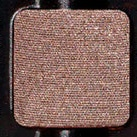

Use: This muted, cool-toned nude can be used all over lids and lower lash line and with other cool hues - it can also be paired with warmer hues to create dimension and depth, use as a highlight in the inner corner of the eyes and on top of any cream eyeliner, or conversely use a wet brush, or mixing medium to intensify the tone for high definition shine.

##### 色号 11：大皇宫烟褐 (Grand-Palais) —— 烟熏中调灰褐色，金属闪泽。
用途：可用于全眼和下眼睑，也能和冷暖色一起打造层次；点在眼头或叠在乳霜眼线之上也很合适。湿刷或调和液可加强反光。

## Shade 12: Saint Germain — Smoky grey purple with a shimmer metallic finish.
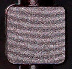

Use: This tone can be used all over the lid or to subtly build depth in the outer corner on light to medium complexions, can be used on top of any cream eyeliner, or conversely use a wet brush, or mixing medium to intensify the tone for high definition shine.

##### 色号 12：圣日耳曼灰紫 (Saint Germain) —— 烟熏灰紫色，金属闪泽。
用途：可铺满眼皮，或在眼尾轻轻加深，适合浅中肤色营造柔和深度；也可叠在乳霜眼线之上提升光感。
