# Viseart 12色 大号/小号 08 哑光亮彩盘 Editorial Brights
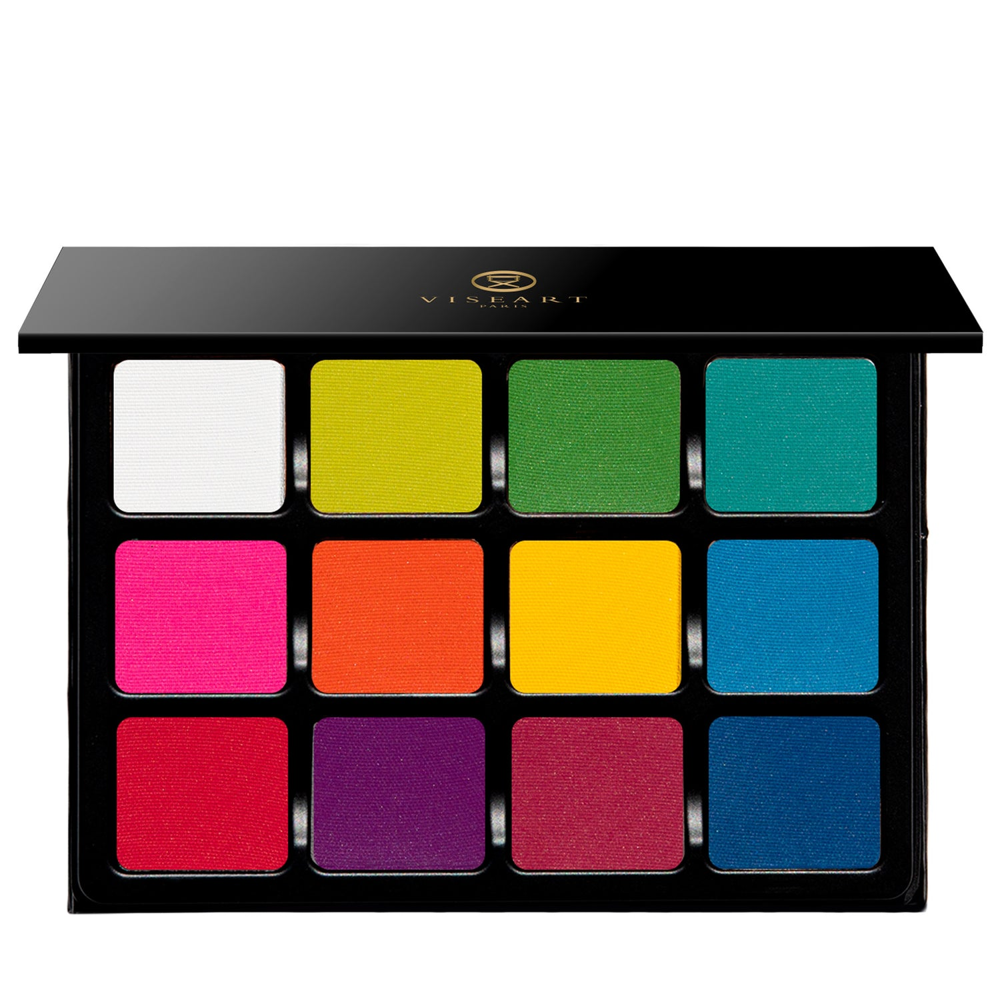

## Shade 1: White — Bright white with a matte finish.
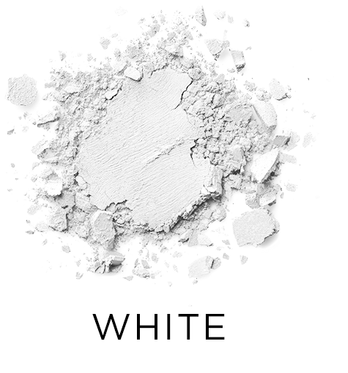

Use: The most versatile! This can be mixed with any of the other colors to make pastels, or blended in as a matte opaque color.

##### 色号 1：纯白 (White) —— 明亮纯白色，哑光质地。
用途：这是一支用途最广的颜色。可与盘中任何颜色混合，调出粉彩效果，也可单独作为高遮盖哑光色使用。

## Shade 2: Lime — Neon yellow green with a matte finish.
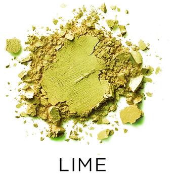

Use: This is a tertiary color, as it’s a yellow-green, Mix with white to make pale lime, or with Clover to intensify the depth of the green. This color is also analogous to both blues and yellows.

##### 色号 2：青柠绿 (Lime) —— 霓虹黄绿色，哑光质地。
用途：这是一支三次色，属于黄绿色。与白色混合可调出浅青柠色；与更深的绿色混合则可增强绿色深度。它也很适合与蓝色和黄色系搭配使用。

## Shade 3: Kelly — Bright green with a matte finish.
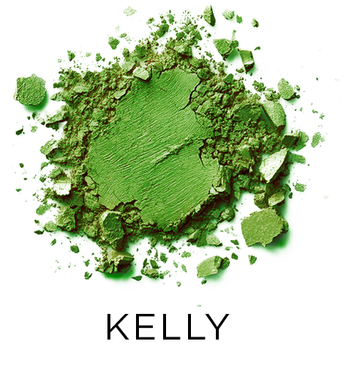

Use: This is a secondary color, mix with white to make pale green, with yellow to make a lighter green, or with blue to make Teal.

##### 色号 3：凯利绿 (Kelly) —— 明亮绿色，哑光质地。
用途：这是一支二次色。与白色混合可调出浅绿色；与黄色混合可做出更轻亮的绿色；与蓝色混合则可得到蓝绿色。

## Shade 4: Aqua — Bright aqua with a matte finish.
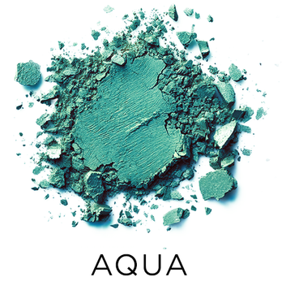

Use: This is a tertiary color, it’s a blue-green. Mix with white to make anything from pastel teal to turquoise.

##### 色号 4：水蓝绿 (Aqua) —— 明亮水蓝绿色，哑光质地。
用途：这是一支三次色，属于蓝绿色。与白色混合后，可从粉彩蓝绿一路调到绿松石色。

## Shade 5: Pink — Bright fuchsia pink with a matte finish.
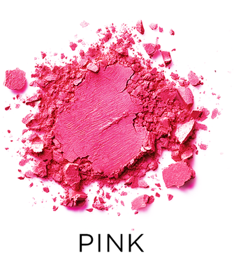

Use: A tertiary color, mix with white to make anything from pastel to bubble gum pink, or use to brighten up blue and green eyes. This can also be used on cheeks, or mix with a blush that’s too light to intensify it. *WARNING* - In the US, this shade contains pigments that the FDA has not approved for use in the eye area.

##### 色号 5：亮玫粉 (Pink) —— 明亮洋红粉色，哑光质地。
用途：这是一支三次色。与白色混合可从粉彩粉一路调到泡泡糖粉；也适合用于提亮蓝色和绿色眼眸。还可作腮红使用，或与过浅的腮红混合增强颜色。 *WARNING* - In the US, this shade contains pigments that the FDA has not approved for use in the eye area.

## Shade 6: Orange — Primary orange with a matte finish.
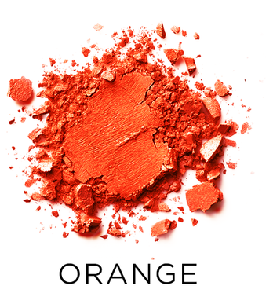

Use: A secondary color, mix with white to make anything from a pale orange to pastel. Orange is amazing against blue eyes, or use analogous colors with it, like Red and Yellow. *WARNING* - In the US, this shade contains pigments that the FDA has not approved for use in the eye area.

##### 色号 6：亮橙 (Orange) —— 原色橙，哑光质地。
用途：这是一支二次色。与白色混合可从浅橙调到粉彩橙。橙色尤其能衬托蓝色眼眸，也适合与红色、黄色等邻近色搭配。 *WARNING* - In the US, this shade contains pigments that the FDA has not approved for use in the eye area.

## Shade 7: Yellow — Primary yellow with a matte finish.
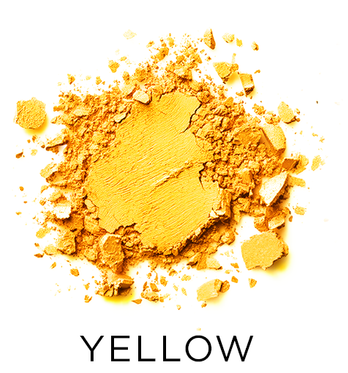

Use: Yellow is a primary color, which makes it ultra versatile. Mix with white to make anything from pastel to buttercup! You can also blend with orange to intensify the yellow, or blend with red to change the depth of the orange.

##### 色号 7：亮黄 (Yellow) —— 原色黄，哑光质地。
用途：黄色是原色，因此非常百搭。与白色混合可从粉彩黄调到奶油黄；也可与橙色混合增强黄色感，或与红色混合改变橙色的深浅层次。

## Shade 8: Periwinkle — Cyan blue with a matte finish.
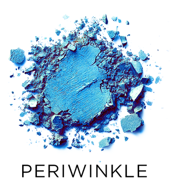

Use: A tertiary color, Mix with white to range from pastel to sky blue, or use with analogous colors like purples or greens.

##### 色号 8：长春花蓝 (Periwinkle) —— 青蓝色，哑光质地。
用途：这是一支三次色。与白色混合可从粉彩蓝调到天蓝色；也很适合与紫色或绿色等邻近色搭配使用。

## Shade 9: Red — Neon red with a matte finish.
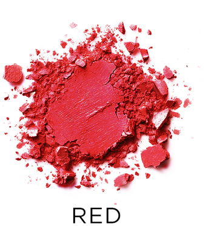

Use: A primary color, Mix with white to make multiple shades of pink, or blend out to create purples, browns, oranges and more. *WARNING* - In the US, this shade contains pigments that the FDA has not approved for use in the eye area.

##### 色号 9：霓虹红 (Red) —— 霓虹红色，哑光质地。
用途：这是一支原色。与白色混合可调出多种粉色；也可继续混色延展出紫色、棕色、橙色等更多变化。 *WARNING* - In the US, this shade contains pigments that the FDA has not approved for use in the eye area.

## Shade 10: Raspberry — Bright raspberry with a matte finish.
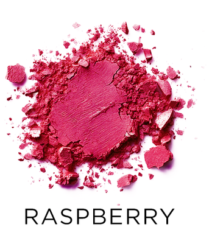

Use: This is a tertiary color, it is a red-violet. It’s fantastic against brown or hazel eyes to brighten, but is a super versatile color with almost every eye shade. *WARNING* - In the US, this shade contains pigments that the FDA has not approved for use in the eye area.

##### 色号 10：树莓粉 (Raspberry) —— 明亮树莓色，哑光质地。
用途：这是一支三次色，属于红紫调。特别适合提亮棕色或榛色眼眸，同时对几乎所有眼色都很百搭。 *WARNING* - In the US, this shade contains pigments that the FDA has not approved for use in the eye area.

## Shade 11: Grape — Bright magenta purple with a matte finish.
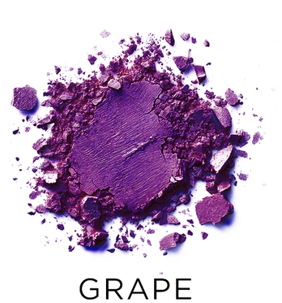

Use: This secondary color can be made into pastel simply by mixing with white. This is also super versatile for every eye color to intensify. *WARNING* - In the US, this shade contains pigments that the FDA has not approved for use in the eye area.

##### 色号 11：葡萄紫 (Grape) —— 明亮洋红紫色，哑光质地。
用途：这是一支二次色，与白色混合即可轻松调成粉彩效果。它也适合用于增强各种眼色的表现力。 *WARNING* - In the US, this shade contains pigments that the FDA has not approved for use in the eye area.

## Shade 12: Azure — Cerulean blue with a matte finish.
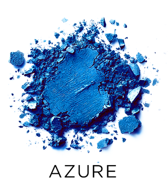

Use: This is a primary Blue, Mix with white to make a pastel blue, or use dramatically for anything you can think of. This can be used for liner, lid, crease - the sky's the limit. Blue is also a wonderful color to brighten Brown and Hazel eyes.

##### 色号 12：天青蓝 (Azure) —— 天青蓝色，哑光质地。
用途：这是一支原色蓝。与白色混合可调出粉彩蓝，也可直接高强度使用，发挥各种创意。可用于眼线、眼皮主色或眼窝加深，几乎没有使用边界。蓝色也很适合提亮棕色和榛色眼眸。
