# Viseart 12色 大号/小号 09 珠宝皇室盘 Shimmers Bijoux Royal
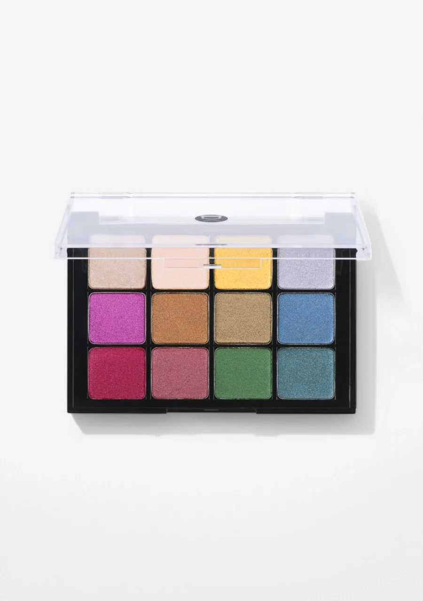

## Shade 1: Champagne — Light warm pewter with a frosted finish.
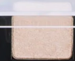

Use: This light champagne shimmer can be used as an all-over lid shade, inner corner highlight, or brow bone highlighter. A versatile base for all looks. All skin tones.

##### 色号 1：香槟金 (Champagne) —— 浅暖调银铜色，霜光质地。
用途：可作全眼铺色、眼头提亮或眉骨高光，是百搭的打底提亮色。

## Shade 2: Nude — Light warm peachy beige with a frosted finish.
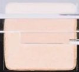

Use: This soft peachy nude can be used as an all-over lid shade for a subtle everyday look, or as a base to help other shades adhere. Brightens the inner corner on all skin tones.

##### 色号 2：裸桃色 (Nude) —— 浅暖调桃米裸色，霜光质地。
用途：可作全眼铺色做日常低调妆底，也可用于眼头提亮；是其他色号的极佳打底色。

## Shade 3: Doré — Medium-dark warm tarnished gold with a metallic finish.
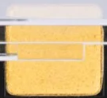

Use: This rich antique gold can be used as an all-over lid shade for a luxurious look. Pairs with Champagne for a tonal golden look, or with deep greens and blues for jewel-toned depth. All skin tones.

##### 色号 3：镀金色 (Doré) —— 中深暖调旧金色，金属质地。
用途：可作全眼铺色打造奢华感；与 `Champagne` 叠加可做同色调金色妆，与深绿深蓝搭配可做宝石色妆。

## Shade 4: Lilas — Light-medium cool muted lavender with a frosted finish.
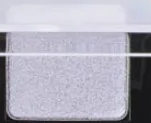

Use: This soft lavender can be used as an all-over lid shade for a dreamy pastel look, or in the inner corner as a cool highlight. Pairs with deeper purples for a tonal eye. All skin tones.

##### 色号 4：薰衣草 (Lilas) —— 浅中偏冷调柔和薰衣草紫，霜光质地。
用途：可作全眼铺色，打造梦幻粉彩妆感；也适合眼头冷调提亮，与深紫搭配做同色调眼妆。

## Shade 5: Améthyste — Medium-dark warm purple with a frosted finish.
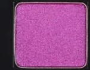

Use: This vivid magenta-purple can be used as an all-over lid shade or concentrated in the outer corner. Pairs with Lilas for a monochromatic purple look, or with gold for contrast. All skin tones.

##### 色号 5：紫水晶 (Améthyste) —— 中深暖调品红紫色，霜光质地。
用途：可作全眼铺色或集中在眼尾加深；与 `Lilas` 搭配做同色调紫妆，或与金色形成撞色对比。

## Shade 6: Bronze — Deep warm bronze with a pearly finish.
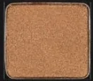

Use: This rich copper bronze can be used as an all-over lid shade, in the crease for depth, or along the lower lash line. Pairs with gold and warm neutrals for a classic warm metallic look. All skin tones.

##### 色号 6：青铜色 (Bronze) —— 深暖调铜棕色，珠光质地。
用途：可作全眼铺色、眼窝加深或下眼睑晕染；与金色和暖中性色搭配可做经典暖调金属妆。

## Shade 7: Kaki — Muted warm medium olive green with a frosted finish.
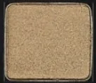

Use: This earthy olive green can be used in the crease for a sophisticated look, or as an all-over lid shade for an editorial earth-tone eye. Pairs with bronze and gold for a jewel-toned warm look.

##### 色号 7：橄榄绿 (Kaki) —— 柔和暖调中调橄榄绿，霜光质地。
用途：可用于眼窝过渡做高级感妆容，或全眼铺色打造编辑风大地色眼妆；与铜棕色、金色搭配可做宝石暖调妆。

## Shade 8: Marine — Deep cool navy blue with a pearly finish.
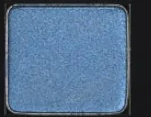

Use: This deep navy can be used in the outer corner and along the lower lash line for depth, or as an all-over lid shade for a bold jewel-toned look. Pairs with teal for a cool blue-green smokey eye.

##### 色号 8：海军蓝 (Marine) —— 深冷调藏青蓝色，珠光质地。
用途：可用于眼尾和下眼睑加深，或全眼铺色打造浓郁宝石色妆；与青绿搭配可做冷调蓝绿烟熏妆。

## Shade 9: Baies — Medium-dark cool berry with a satin finish.
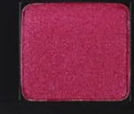

Use: This vivid berry can be used as an all-over lid shade or concentrated in the outer corner for drama. Pairs with Améthyste for a bold pink-purple look. All skin tones.

##### 色号 9：莓果色 (Baies) —— 中深冷调浆果玫红色，缎光质地。
用途：可作全眼铺色或集中在眼尾增强戏剧感；与 `Améthyste` 搭配可做浓郁粉紫妆。

## Shade 10: Prune — Medium-dark warm plum with a pearly finish.
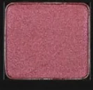

Use: This warm plum can be used in the outer corner and crease for depth, or as an all-over lid shade for a moody look. Pairs with berry tones for a dimensional warm-cool purple look.

##### 色号 10：梅李紫 (Prune) —— 中深暖调梅紫色，珠光质地。
用途：可用于眼尾和眼窝加深做慵懒妆感，或全眼铺色；与浆果色搭配可做冷暖对比的紫调眼妆。

## Shade 11: Émeraude — Medium-dark warm emerald green with a pearly finish.
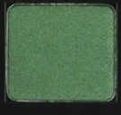

Use: This rich emerald green can be used as an all-over lid shade for a jewel-toned statement eye, or in the outer corner for depth. Pairs with teal for a tonal green eye. All skin tones.

##### 色号 11：祖母绿 (Émeraude) —— 中深暖调祖母绿，珠光质地。
用途：可作全眼铺色打造宝石感招牌眼妆，或用于眼尾加深；与青绿搭配可做同色调绿调妆。

## Shade 12: Abyssal — Deep cool bluish-teal with a frosted finish.
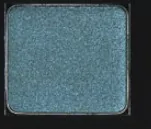

Use: This deep teal blue can be used in the outer corner and lower lash line for a cool, smokey finish, or as an all-over lid shade. Pairs with Marine for a deep blue-teal look. All skin tones.

##### 色号 12：深渊蓝 (Abyssal) —— 深冷调蓝绿色，霜光质地。
用途：可用于眼尾和下眼睑做冷调烟熏收边，或作全眼铺色；与 `Marine` 搭配可做深邃蓝绿妆。
