# Viseart 12色 大号/小号 10 哑光暖调盘 Mattes Warm
*发布：2017*

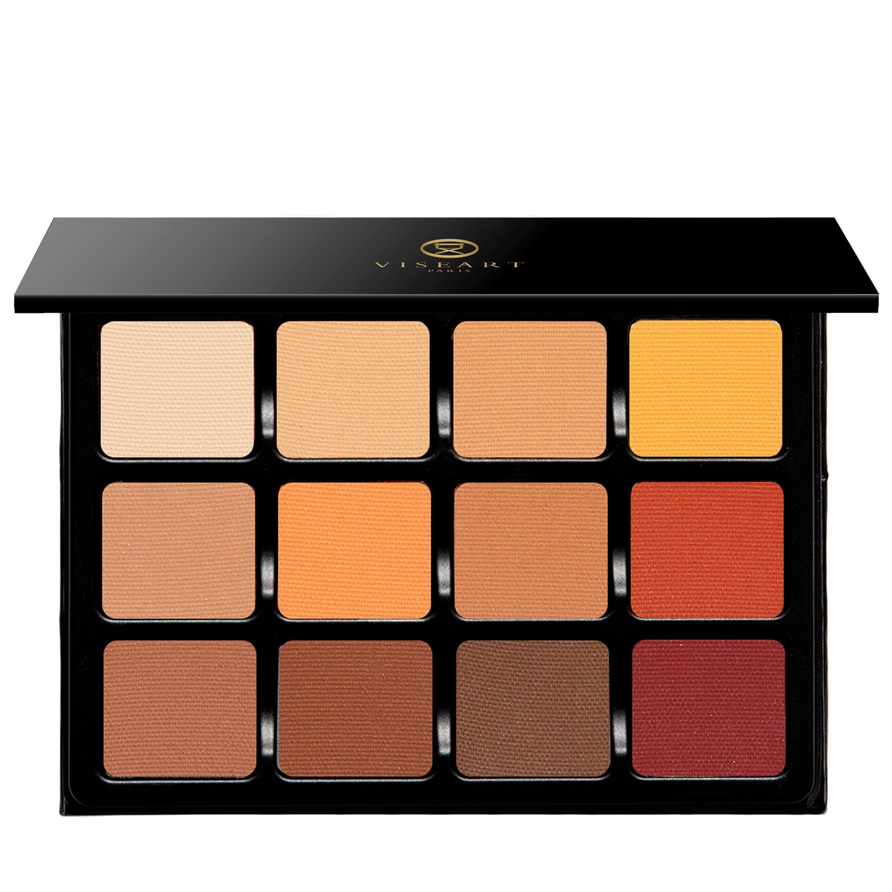

> 哑光暖调盘以奶油黄、番红花橙、肉桂、焦糖棕与深赤陶等秋日暖阳色调，构建完整的暖色哑光调色系统。是表达温暖大地与日落感妆容的核心专业工具。

> *Warm Mattes celebrates the full spectrum of autumn warmth — from soft butter yellow through saffron orange, cinnamon, caramel, and deep terracotta — in Viseart's signature velvety matte formula. The essential warm-toned palette for sculpting sun-kissed, golden looks.*

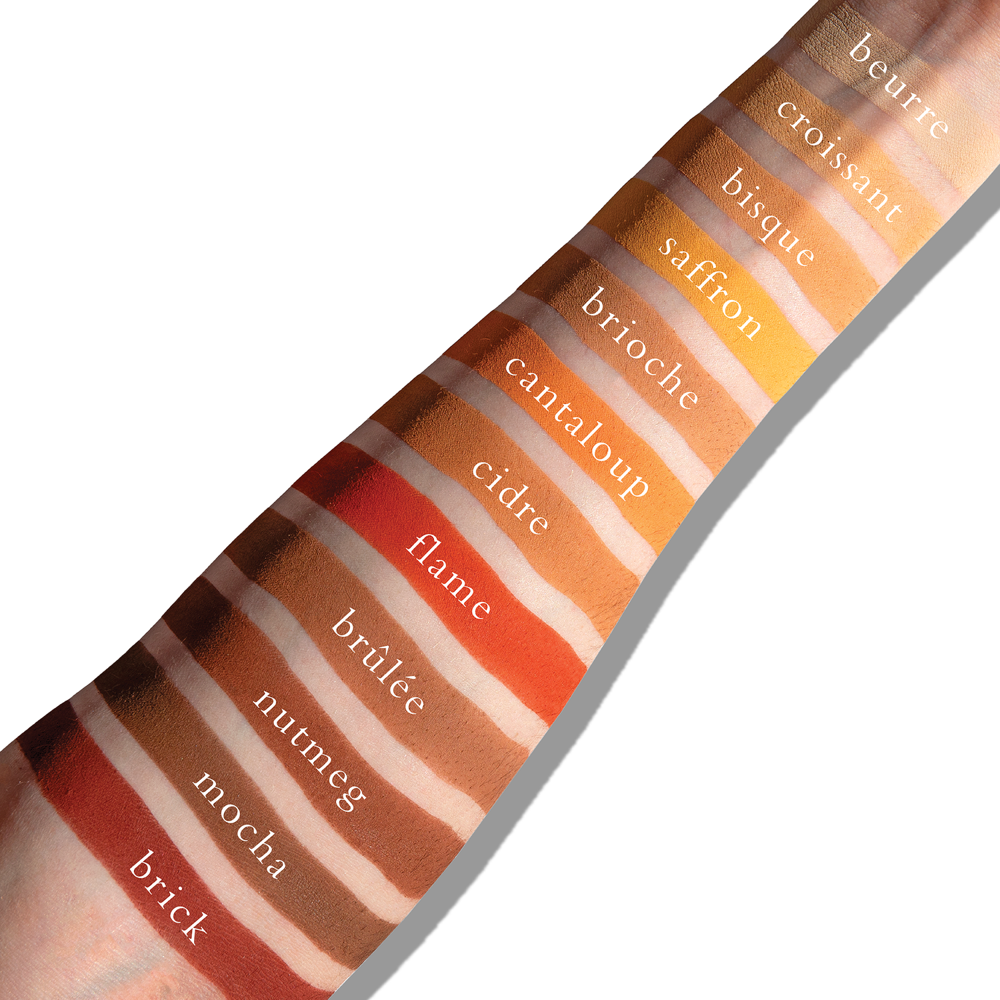
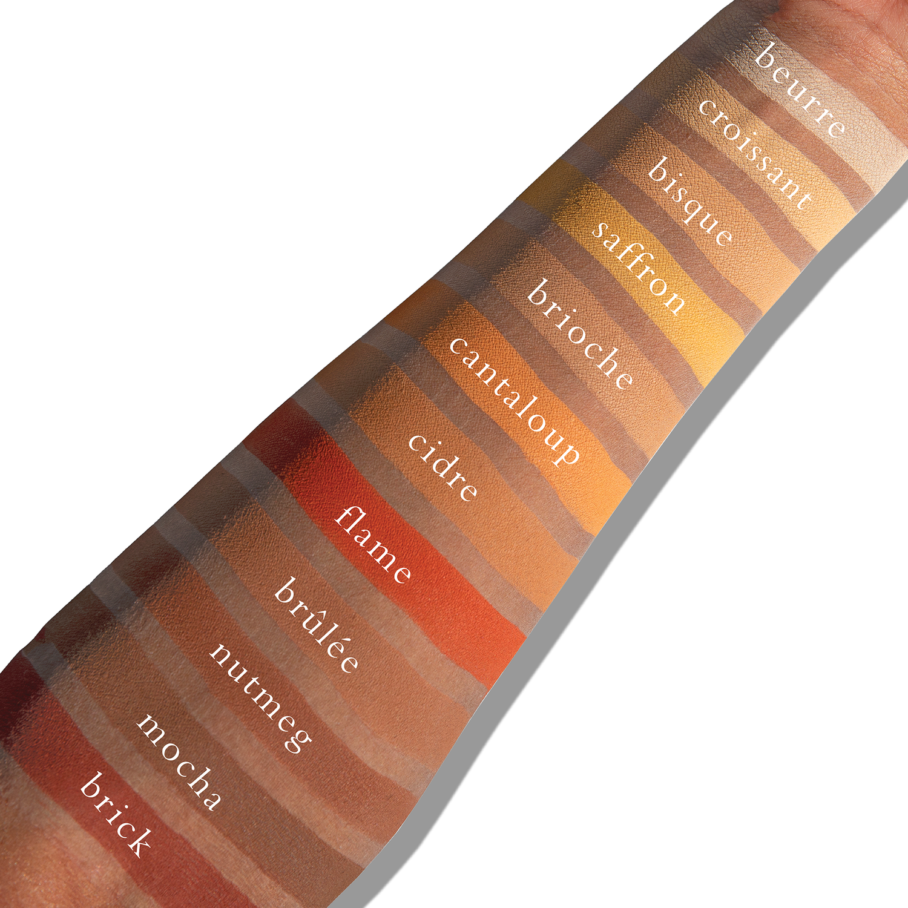

## Shade 1: Beurre — Buttery yellow with warm undertones and a matte finish.
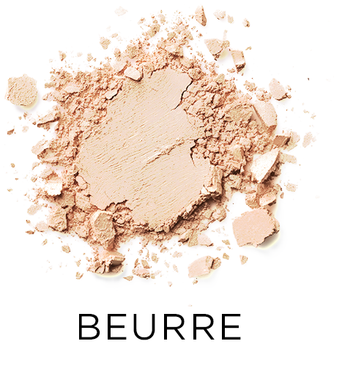

Use: All over-lid shade for light to medium skin tones, or a pale yellow for darker ones. Can be used to brighten the inner corner of the eye, or under the brow.

##### 色号 1：奶油黄 (Beurre) —— 奶油黄，带暖调底色，哑光质地。
用途：适合浅至中等肤色作全眼铺色；对深肤色则可作为浅黄色提亮色，也可用于眼头或眉骨提亮。

## Shade 2: Croissant — Medium yellow with warm undertones and a matte finish.
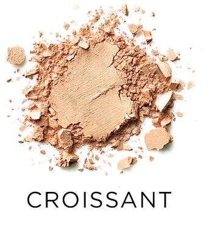

Use: All over lid shade for medium skin tones, can also be used for inner corner or under brow highlighting.

##### 色号 2：可颂暖黄 (Croissant) —— 中调暖黄，哑光质地。
用途：适合中等肤色作全眼铺色，也可用于眼头或眉骨提亮。

## Shade 3: Bisque — Soft brown with warm, yellow-orange undertones and a matte finish.
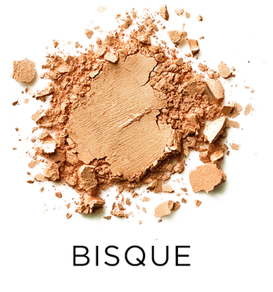

Use: Use as a base color all over the lid for medium skin tones. Can be used in crease for fair to light medium skin.

##### 色号 3：杏饼棕 (Bisque) —— 柔和棕色，带暖调黄橘底色，哑光质地。
用途：适合中等肤色作全眼打底色；浅肤到浅中等肤色也可用于眼窝加深与过渡。

## Shade 4: Saffron — Bright yellow with a satin finish.
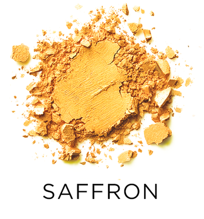

Use: Can be used as lid or crease for fair skin, or lid for medium to dark.

##### 色号 4：番红花黄 (Saffron) —— 明亮黄色，缎光质地。
用途：浅肤色可用于眼皮或眼窝位置；中等至深肤色可作眼皮主色。

## Shade 5: Brioche — Soft brown with warm, yellowish undertones and a matte finish.
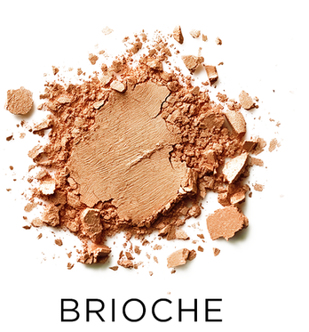

Use: A great everyday lid/crease color for light/mid-toned skins, or this can actually be used as a grey/brown on darker skins.

##### 色号 5：奶油面包棕 (Brioche) —— 柔和棕色，带偏黄暖调底色，哑光质地。
用途：适合浅肤和中等肤色作为日常眼皮主色或眼窝过渡色；在深肤色上也可呈现柔和灰棕效果。

## Shade 6: Cantaloup — Tangerine orange with warm, yellow undertones and a matte finish.
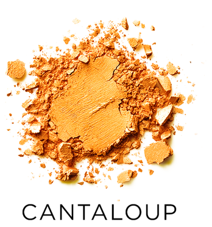

Use: A great inner eye highlight for dark skins, or warm all over lid or crease for light to medium. This is also a secret weapon for darkness on the lids - since orange neutralizes blue, try this to brighten up darkness on the lid.

##### 色号 6：蜜瓜橘 (Cantaloup) —— 橘橙色，带暖调黄色底色，哑光质地。
用途：深肤色可用于眼头提亮；浅至中等肤色可作暖调全眼铺色或眼窝过渡色。它也适合修饰眼皮暗沉，因为橘色能中和蓝调，可用于提亮发暗部位。

## Shade 7: Cidre — Medium brown with warm, yellow undertones and a matte finish.
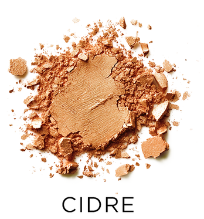

Use: A super versatile color! This is an AMAZING brow color for redheads, but also as a lid color for medium tones, or a crease color to build depth and dimension for fair to medium skin.

##### 色号 7：苹果酒棕 (Cidre) —— 中调棕色，带暖调黄色底色，哑光质地。
用途：非常百搭的颜色。既适合红发人群作眉色，也适合中等肤色作眼皮主色，或用于浅至中等肤色的眼窝加深，增强立体层次。

## Shade 8: Flame — Burnt orange with warm, red undertones and a matte finish.
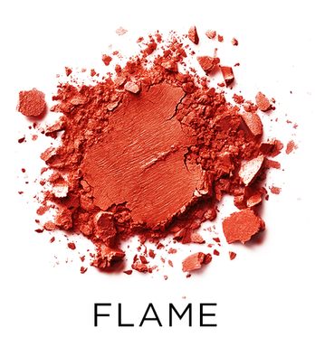

Use: This can be used for lid or crease. Build depth and dimension, or brighten darker skin tones.

##### 色号 8：焰橘红 (Flame) —— 焦橘色，带暖调红色底色，哑光质地。
用途：可用于眼皮或眼窝位置，帮助建立深度与立体感，也能更好衬托较深肤色上的暖调表现。

## Shade 9: Brûlée — Medium-dark taupe-brown with warm undertones and a matte finish.
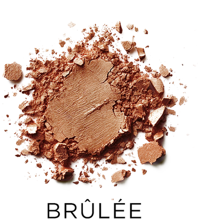

Use: Use all over the lid and crease on all complexions or as a base tone for deeper complexions.

##### 色号 9：焦糖炙棕 (Brûlée) —— 中深调灰棕色，带暖调底色，哑光质地。
用途：适合所有肤色用于眼皮与眼窝的大面积铺陈；对深肤色也可作为打底色使用。

## Shade 10: Nutmeg — Medium-dark brown with subtle, reddish undertones and a matte finish.
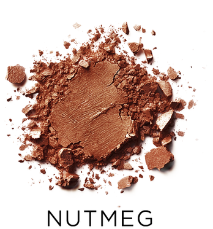

Use: All over solid tone for all skin types. Base tone, as well as midtone for eyeshadow depth and dimension. Also can be used in brows, and as a contour.

##### 色号 10：肉豆蔻棕 (Nutmeg) —— 中深调棕色，带细微红调底色，哑光质地。
用途：适合所有肤色大面积铺色；既可作打底色，也可作为增强眼影深度与立体感的中间色调；同时也可用于眉部与修容。

## Shade 11: Mocha — Dark brown with subtle, warm undertones and a matte finish.
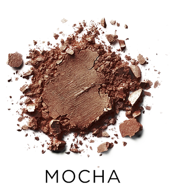

Use: This ultra versatile tone is perfect for a smokey eye on almost all skin tones, and can be used for liner, or for brows for brunettes and black hair.

##### 色号 11：摩卡深棕 (Mocha) —— 深棕色，带细微暖调底色，哑光质地。
用途：这是一支适用于大多数肤色的高适配深色，可用于打造烟熏眼妆，也可作为眼线色；深棕发或黑发人群也可用于眉部。

## Shade 12: Brick — Deep muted red with warm undertones and a matte finish.
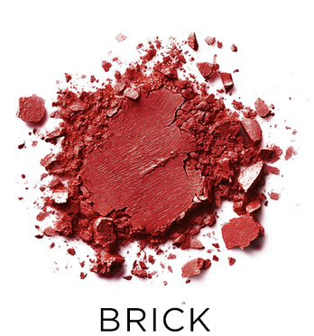

Use: Use in the crease and outer corner for a dimensional wash of warm burgundy.

##### 色号 12：砖红棕 (Brick) —— 深柔雾红色，带暖调底色，哑光质地。
用途：适合用于眼窝与眼尾，铺出带暖酒红调的层次感与晕染效果。
