# Viseart 12色 大号/小号 11 哑光冷调盘 Mattes Cool 2
*发布：2018*

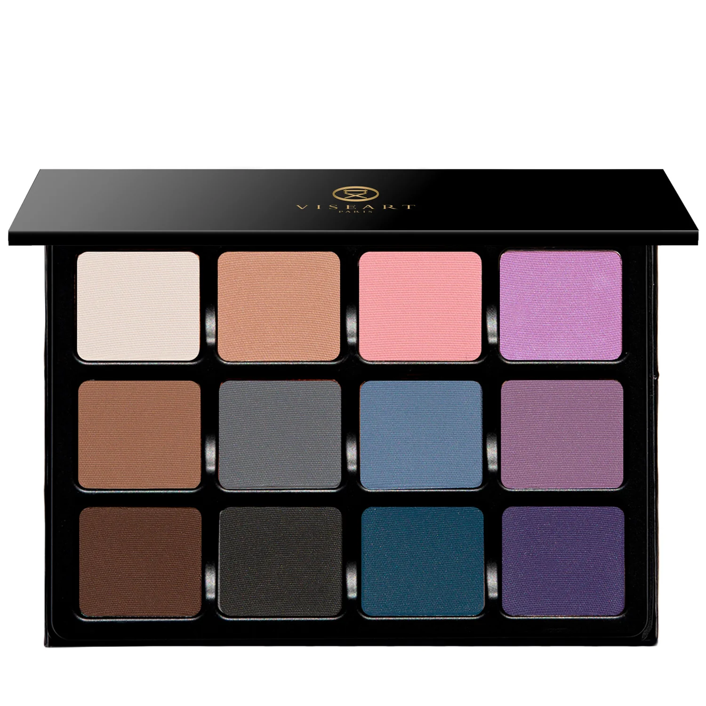

> 哑光冷调盘2号以薰衣草粉、矢车菊蓝、鸢尾紫与烟灰等轻柔冷调，诠释如诗如画的冷艳精致。是哑光冷调原版的浪漫延伸，主打更多紫调与蓝调的色彩表达。

> *Cool Mattes 2 expands the cool matte family with twelve enchanting chapters — from softest sky blue and languid lilacs to dusky roses, tendrils of smoke, and deep sea hues. Designed by alchemists, crafted by artisans, and adored by professional artists worldwide.*

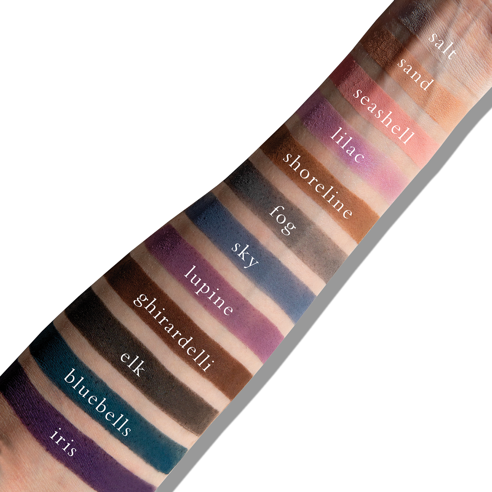
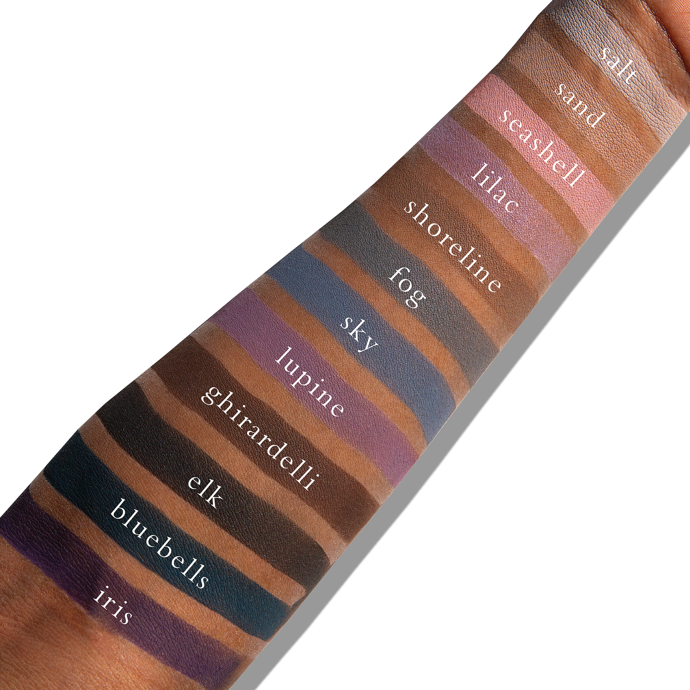

## Shade 1: Salt — Pale bone matte finish.
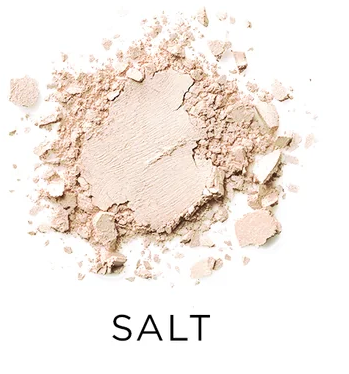

Use: Use to highlight and blend into all other tones to soften shades, use on brow bone to highlight.

##### 色号 1：盐白 (Salt) —— 淡骨色，哑光质地。
用途：可用作高光，并与其他色号混合以柔和整体色调，也可用于眉骨提亮。

## Shade 2: Sand — Cool light beige matte finish.
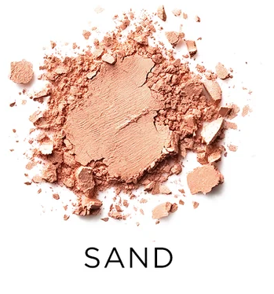

Use: Base tone for light to medium skin tones.

##### 色号 2：沙色 (Sand) —— 冷调浅米色，哑光质地。
用途：适合浅至中等肤色的底色。

## Shade 3: Seashell — Light pink matte finish.
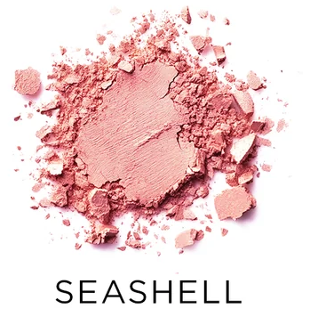

Use: Base tone for light to medium skin tones. Use as a highlight on brow bone for deeper tones. Mix-in with lighter tones and deeper tones to create variegated base tones in an array of depth.

##### 色号 3：贝壳粉 (Seashell) —— 浅粉色，哑光质地。
用途：适合浅至中等肤色的底色；深肤色可作为眉骨提亮；可与更浅或更深的颜色混合，调出不同深浅层次的底色。

## Shade 4: Lilac — Light purple matte finish.
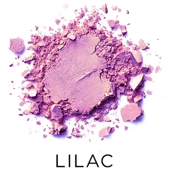

Use: Base tone for all skin tones.

##### 色号 4：淡紫 (Lilac) —— 浅紫色，哑光质地。
用途：适合所有肤色的底色。

## Shade 5: Shoreline — Medium cool brown matte finish.
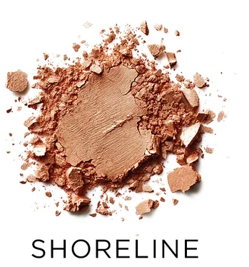

Use: All over solid tone for all skin types. Base tone, as well as midtone for eyeshadow depth and dimension. Also can be used in brows, and as contour.

##### 色号 5：海岸线棕 (Shoreline) —— 中等冷调棕色，哑光质地。
用途：适合所有肤色的大面积实色铺陈；可作底色或中间色调，增强眼影深度与立体感；也可用于眉部与修容。

## Shade 6: Fog — Light cool grey matte finish.
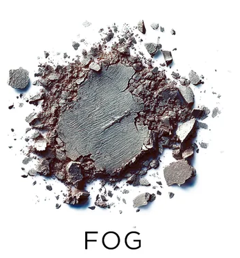

Use: All over tone for all skin types, use as a soft eyeliner for light to medium tones.

##### 色号 6：雾灰 (Fog) —— 浅冷调灰色，哑光质地。
用途：适合所有肤色的大面积铺色；可作为浅至中等肤色的柔和眼线。

## Shade 7: Sky — Light blue matte finish.
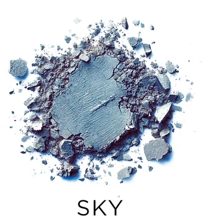

Use: All over tone for all skin types, use as a soft eyeliner for light to medium tones.

##### 色号 7：天蓝 (Sky) —— 浅蓝色，哑光质地。
用途：适合所有肤色的大面积铺色；可作为浅至中等肤色的柔和眼线。

## Shade 8: Lupine — Dusty medium purple.
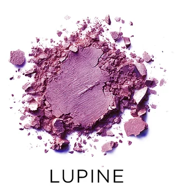

Use: All over tone for all skin types, use as a soft eyeliner for light to medium tones.

##### 色号 8：羽扇豆紫 (Lupine) —— 柔和中紫色。
用途：适合所有肤色的大面积铺色；可作为浅至中等肤色的柔和眼线。

## Shade 9: Ghirardelli — Chocolate cool matte finish.
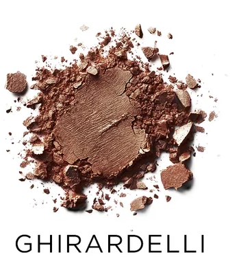

Use: All over solid tone for all skin types. Base tone, as well as midtone for eyeshadow depth and dimension. Also can be used in brows, and as contour.

##### 色号 9：吉拉德利棕 (Ghirardelli) —— 冷调巧克力棕，哑光质地。
用途：适合所有肤色的大面积实色铺陈；可作底色或中间色调，增强眼影深度与立体感；也可用于眉部与修容。

## Shade 10: Elk — Bitter brown matte finish.
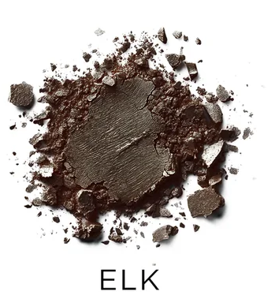

Use: All over solid tone for all skin types. Base tone, as well as midtone for eyeshadow depth and dimension. Also can be used in brows, and as contour.

##### 色号 10：麋鹿棕 (Elk) —— 深苦棕，哑光质地。
用途：适合所有肤色的大面积实色铺陈；可作底色或中间色调，增强眼影深度与立体感；也可用于眉部与修容。

## Shade 11: Bluebells — Deep fresh blue matte finish.
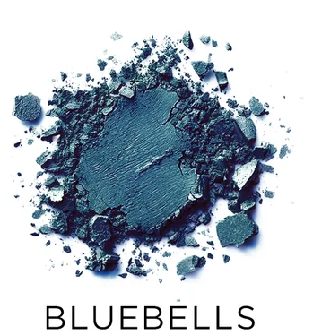

Use: All over tone for all skin types, use as a soft eyeliner for light to medium tones.

##### 色号 11：风铃草蓝 (Bluebells) —— 深清爽蓝，哑光质地。
用途：适合所有肤色的大面积铺色；可作为浅至中等肤色的柔和眼线。

## Shade 12: Iris — Deep purple-blue matte finish.
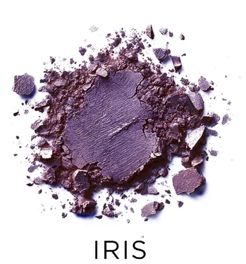

Use: All over tone for all skin types, use as a soft eyeliner for light to medium tones.

##### 色号 12：鸢尾紫蓝 (Iris) —— 深紫蓝色，哑光质地。
用途：适合所有肤色的大面积铺色；可作为浅至中等肤色的柔和眼线。
