# Viseart 12色 大号/小号 哑光冷调盘 Mattes Cool Original
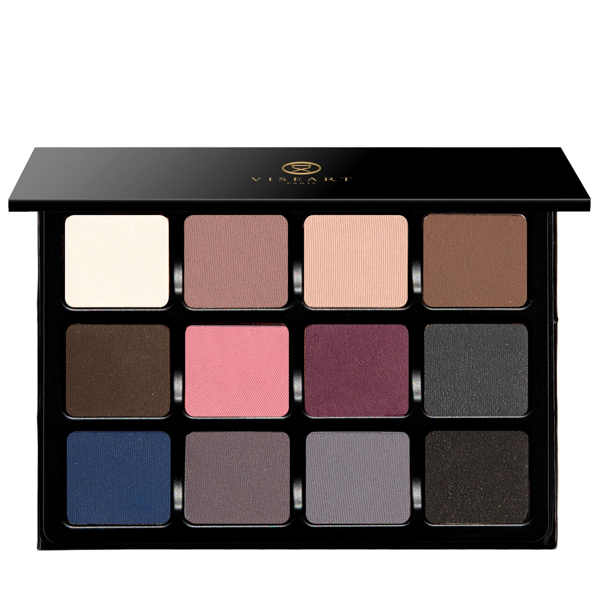

## Shade 1: Saltstone — Pale vanilla nude with a matte finish.
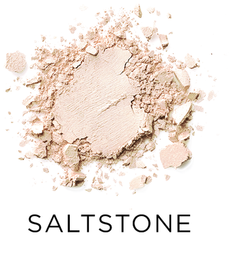

Use: This pale vanilla shade can be used as an all over lid colour or as a base tone beneath complementary shades. It can also be used to highlight the brow bone and inner corners of the eyes on light to medium complexions. Additionally, mix it with any of the other tones to brighten, lighten, and create over 12 new hues. Pair with shades ‘Slate’ and ‘Sandstone’ for a quick and easy cool-toned tantalizing taupe eye look. Apply with a brush for your desired level of intensity.

##### 色号 1：Saltstone (Saltstone) —— 香草米白裸色，哑光质地。
用途：可作全眼铺色，或作为互补色下方的打底色。浅至中等肤色可用于眉骨和眼头提亮。也可与盘中其他色调混合，提亮、调浅并延展出 12 种以上新色。与 `Slate`、`Sandstone` 搭配，可快速完成冷调迷人的灰棕眼妆。可用刷具按需叠加显色度。

## Shade 2: Mauvewood — Nude rose-brown with a matte finish.
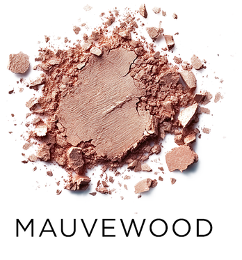

Use: This nude rose-brown shade can be used to add subtle definition to contours of the face. It can also be used as a nude blush on light to medium complexions. Apply with a brush for your desired level of intensity. *WARNING* - In the US, this shade contains pigments that the FDA has not approved for use in the eye area.

##### 色号 2：Mauvewood (Mauvewood) —— 裸玫瑰棕色，哑光质地。
用途：This nude rose-brown shade can be used to add subtle definition to 修容s of the face. It can also be used as a nude 腮红 on light to medium complexions. Apply with a brush for your desired level of intensity. *WARNING* - In the US, this shade contains pigments that the FDA has not approved for use in the eye area.

## Shade 3: Dunaire — Sandy taupe with a matte finish.
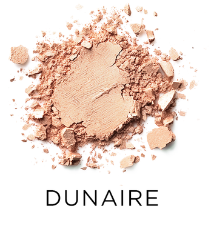

Use: This sandy taupe shade can be used to highlight and bring forth the contours of the face. Apply it under the brow bone or in the inner corners of the eyes on all complexions, or down the bridge of the nose and on the cheekbones on medium to deep complexions to add brightness to the face. *WARNING* - In the US, this shade contains pigments that the FDA has not approved for use in the eye area.

##### 色号 3：Dunaire (Dunaire) —— 沙感灰棕色，哑光质地。
用途：This sandy taupe shade can be used to 提亮 and bring forth the 修容s of the face. Apply it under the 眉骨 or in the 眼头s of the eyes on all complexions, or down the bridge of the nose and on the cheekbones on medium to deep complexions to add brightness to the face. *WARNING* - In the US, this shade contains pigments that the FDA has not approved for use in the eye area.

## Shade 4: Sandstone — Medium-deep cool taupe brown with a matte finish.
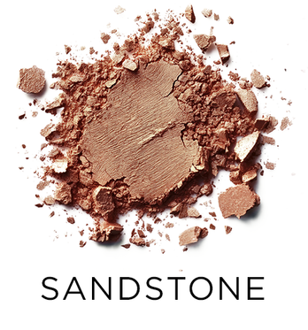

Use: This taupe brown shade can be used as an all-over lid colour for all complexions, focused in the socket and outer corners of the eyes for buildable intensity, or applied along the lash lines to add definition. Pair with shades ‘Drift’ and ‘Pewter’ for a cool-toned, neutral look. Apply with a brush for your desired level of intensity.

##### 色号 4：Sandstone (Sandstone) —— 中深调冷灰棕色，哑光质地。
用途：适合所有肤色作全眼铺色，也可集中于眼窝和眼尾逐步加深，或沿睫毛根部勾勒轮廓。与 `Drift`、`Pewter` 搭配，可完成冷调中性色眼妆。可用刷具按需叠加显色度。

## Shade 5: Drift — Deep, cool-toned shale brown with a matte finish
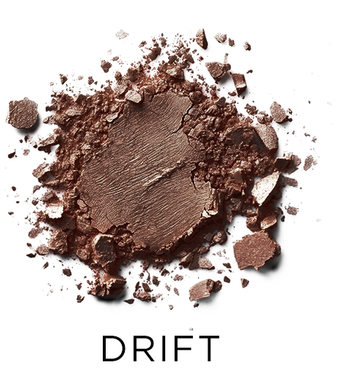

Use: This deep, cool-toned shale brown shade can be used as an all over lid colour for all complexions, focused in the socket and outer corners of the eyes for buildable intensity, or applied along the lash lines to add definition. Wear with shades ‘Mauvewood’ and ‘Sediment’ for the perfect, richly pigmented, sooty smokey eye. Apply with a brush for your desired level of intensity.

##### 色号 5：Drift (Drift) —— 深冷调页岩棕色，哑光质地。
用途：适合所有肤色作全眼铺色，也可集中于眼窝和眼尾逐步加深，或沿睫毛根部勾勒轮廓。与 `Mauvewood`、`Sediment` 搭配，可打造浓郁烟灰感的完美烟熏眼妆。可用刷具按需叠加显色度。

## Shade 6: Shell — Bright bubblegum pink with a matte finish.
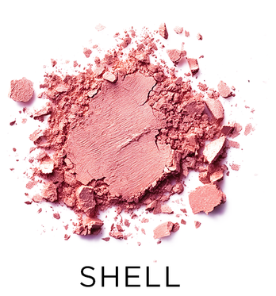

Use: This bubblegum pink shade can be used as an all over lid colour, as a base tone beneath complementary shades, or anywhere you want to add brightness and vibrancy. Can also be worn as a blush shade on light complexions. Wear with shades ‘Saltsone’ and ‘Sandstone’’ for soft nude look with a regal rose twist! Apply with a brush for your desired level of intensity.

##### 色号 6：Shell (Shell) —— 明亮泡泡糖粉色，哑光质地。
用途：可作全眼铺色、互补色下方的打底色，或用于任何需要提亮和增添活力的位置。浅肤色也可当腮红使用。与 `Saltsone`、`Sandstone` 搭配，可完成带高贵玫瑰感的柔和裸妆。可用刷具按需叠加显色度。

## Shade 7: Violacé — Midtone, magenta-aubergine with a matte finish.
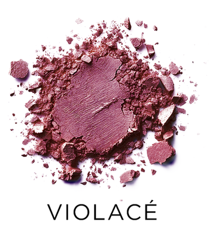

Use: This midtone magenta-aubergine shade can be used to add a pop of vibrancy or as a blush shade on all complexions. Blend with the shade ‘Shell’ for a beautiful, gradated look. Apply with a brush for your desired level of intensity. *WARNING* - In the US, this shade contains pigments that the FDA has not approved for use in the eye area.

##### 色号 7：Violacé (Violacé) —— 中调洋红茄紫色，哑光质地。
用途：This midtone magenta-aubergine shade can be used to add a pop of vibrancy or as a 腮红 shade on all complexions. Blend with the shade ‘Shell’ for a beautiful, gradated look. Apply with a brush for your desired level of intensity. *WARNING* - In the US, this shade contains pigments that the FDA has not approved for use in the eye area.

## Shade 8: Pewter — Deep, charcoal blue-grey with a matte finish.
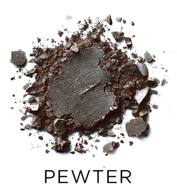

Use: This deep, charcoal blue-grey shadow can be used as an all-over lid colour for drama and intensity, or focused in the crease and outer corners of the eyes for a sensual smokey look. Can also be used along the upper and lower lashline as eyeliner or in the brows on dark brows shades. Pair with shades ‘Sediment’ and ‘Sandstone’ for a cool-toned, charcoal effect! Apply with a brush for your desired level of intensity.

##### 色号 8：Pewter (Pewter) —— 深炭蓝灰色，哑光质地。
用途：可作全眼铺色，打造戏剧感和高强度妆效；也可集中于眼窝和眼尾，塑造性感烟熏感。还可沿上下睫毛根部当眼线，或用于深色眉毛的眉部修饰。与 `Sediment`、`Sandstone` 搭配，可完成冷调炭灰效果。可用刷具按需叠加显色度。

## Shade 9: Mariner — Zenith blue with a matte finish.
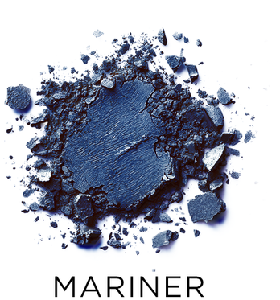

Use: This zenith blue shade can be used to add a pop of cool-toned saturation to the face. Apply with a brush for your desired level of intensity. *WARNING* - In the US, this shade contains pigments that the FDA has not approved for use in the eye area.

##### 色号 9：Mariner (Mariner) —— 天穹蓝色，哑光质地。
用途：This zenith blue shade can be used to add a pop of cool-toned saturation to the face. Apply with a brush for your desired level of intensity. *WARNING* - In the US, this shade contains pigments that the FDA has not approved for use in the eye area.

## Shade 10: Grisaille — Dusty midtone plum-grey with a matte finish.
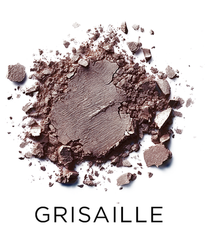

Use: This dusty, midtone plum-grey shade can be used to add subtle definition to contours of the face. Apply with a brush for your desired level of intensity. *WARNING* - In the US, this shade contains pigments that the FDA has not approved for use in the eye area.

##### 色号 10：Grisaille (Grisaille) —— 雾感中调李子灰色，哑光质地。
用途：This dusty, midtone plum-grey shade can be used to add subtle definition to 修容s of the face. Apply with a brush for your desired level of intensity. *WARNING* - In the US, this shade contains pigments that the FDA has not approved for use in the eye area.

## Shade 11: Slate — Midtoned, cool-toned dove grey with a matte finish.
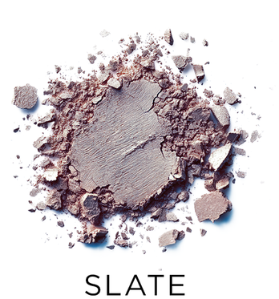

Use: This midtone dove grey shade can be used as an all-over lid colour, in the crease and socket for buildable dimension, or beneath of any of the complementary shades in the palette for increased depth and saturation. Pair with shades ‘Saltstone’’ and ‘Sediment’ for the perfect sleek slate shadow look! Apply with a brush your desired level of intensity.

##### 色号 11：Slate (Slate) —— 中调冷鸽灰色，哑光质地。
用途：可作全眼铺色，也可在眼窝和轮廓处逐步加深，或作为盘中互补色下方的打底色，增强深度与饱和度。与 `Saltstone`、`Sediment` 搭配，可完成利落的灰石调眼妆。可用刷具按需叠加显色度。

## Shade 12: Sediment — Dark charcoal grey-black with a matte finish.
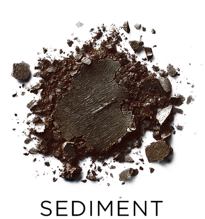

Use: This dark, charcoal grey-black shadow can be used as an all-over lid colour for drama and intensity, or focused in the crease and outer corners of the eyes for a sensual smokey look. Can also be used along the upper and lower lash line as eyeliner or in the brows on dark brows shades. Pair with shades ‘Drift’ and ‘Sandstone’ for a dramatic, smoldering effect! Apply with a brush for your desired level of intensity.

##### 色号 12：Sediment (Sediment) —— 深炭灰黑色，哑光质地。
用途：可作全眼铺色，打造戏剧感与高强度妆效；也可集中于眼窝和眼尾，塑造性感烟熏感。还可沿上下睫毛根部当眼线，或用于深色眉毛的眉部修饰。与 `Drift`、`Sandstone` 搭配，可完成张力十足的深邃妆效。可用刷具按需叠加显色度。
