# Viseart 12色 大号 哑光中性盘 Neutral Mattes: Milieu Slimpro
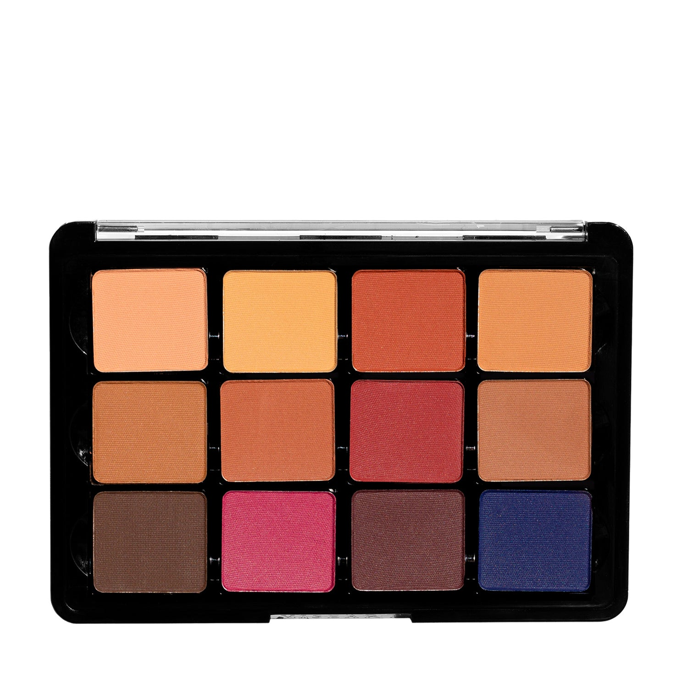

## Shade 1: Chiffon — Muted cantaloupe with a matte finish.
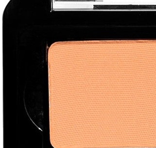

Use: Use as all over lid color or as a crease color - pop a champagne shimmer over this for an easy daytime look.

##### 色号 1：雪纺蜜桃 (Chiffon) —— 柔和哈密瓜橘色，哑光质地。
用途：可作全眼铺色或眼窝过渡色；在其上轻叠一层香槟珠光，就能快速完成日间妆容。

## Shade 2: Crème Brûlée — soft buttercream with a matte finish.
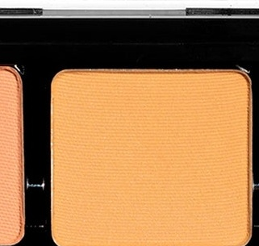

Use: Use as all over lid color, or to brighten the inner corner on medium skin tones.

##### 色号 2：焦糖布蕾 (Crème Brûlée) —— 柔和奶油霜色，哑光质地。
用途：可作全眼铺色；中等肤色也可用它提亮眼头。

## Shade 3: Roussillon — Terracotta with a matte finish.
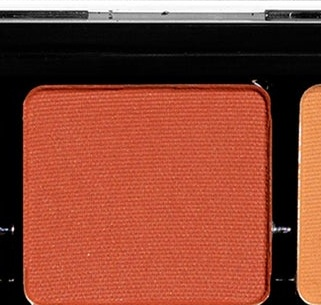

Use: All over lid tone for a smokey chocolate eye, use as a base tone for deeper skin, a crease color to warm up the look, and can be used in brows for redheads. This can also be blended with other tones as a blush.

##### 色号 3：鲁西永陶土 (Roussillon) —— 陶土色，哑光质地。
用途：可作巧克力烟熏妆的全眼铺色；深肤色可作打底，放在眼窝能提升整体暖感，也适合红发人群作眉色。还可与其他颜色混合作腮红使用。

## Shade 4: Platane — Caramel nude with a matte finish.
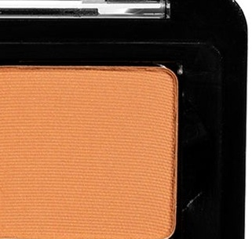

Use: All over lid shade for medium to dark skin tones, use as a crease colour, and in brows. Shade can be used as a bronzer for lighter skin tones.

##### 色号 4：梧桐裸棕 (Platane) —— 焦糖裸色，哑光质地。
用途：适合中深肤色作全眼铺色，也可用作眼窝色和眉色；浅肤色则可拿来作修容或古铜色使用。

## Shade 5: Latte — Tawny beige with a matte finish.
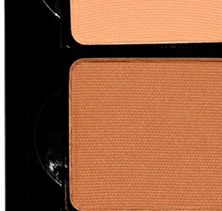

Use: All over lid shade for medium to dark skin tones, use as a crease colour, and in brows. Shade can be used as a bronzer for lighter skin tones.

##### 色号 5：拿铁米棕 (Latte) —— 黄褐米色，哑光质地。
用途：适合中深肤色作全眼铺色，也可用作眼窝色和眉色；浅肤色则可拿来作修容或古铜色使用。

## Shade 6: Sorrel — Warm cinnamon with a matte finish.
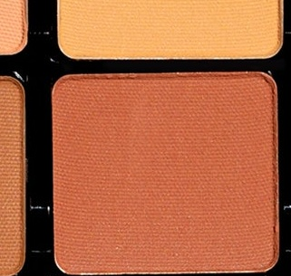

Use: All over lid shade for medium to dark skin tones, use as a crease colour, and in brows. Shade can be used as a bronzer for lighter skin tones.

##### 色号 6：暖肉桂 (Sorrel) —— 暖肉桂色，哑光质地。
用途：适合中深肤色作全眼铺色，也可用作眼窝色和眉色；浅肤色则可拿来作修容或古铜色使用。

## Shade 7: Groseille — Soft garnet with a matte finish.
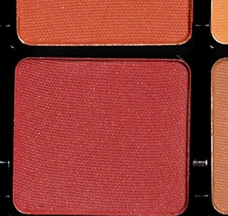

Use: On fair skin, this is a dramatic garnet, on deep skin, use it to warm up the lid or the crease. This can be mixed with a lighter shade for blush. Using this to create depth against green or blue eyes will intensify the color of the eye. *WARNING* - In the US, this shade contains pigments that the FDA has not approved for use in the eye area.

##### 色号 7：醋栗石榴 (Groseille) —— 柔和石榴红色，哑光质地。
用途：在浅肤色上，它会呈现鲜明的石榴红调；在深肤色上，则适合用来温暖眼皮或眼窝。也可与浅色混合当作腮红。若用它为绿色或蓝色眼眸增加深度，会让瞳色更突出。提示：在美国法规下，此色含有未获 FDA 批准用于眼周的色料。

## Shade 8: Nue — Taupe brown with a matte finish.
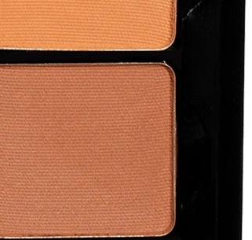

Use: Lids, creases, contour, brows - this color does it all on many skin tones.

##### 色号 8：裸灰棕 (Nue) —— 灰褐棕色，哑光质地。
用途：无论是眼皮铺色、眼窝加深、面部修容还是眉部塑形，这个颜色在多种肤色上都很实用。

## Shade 9: Cacao — Dark chocolate with a matte finish.
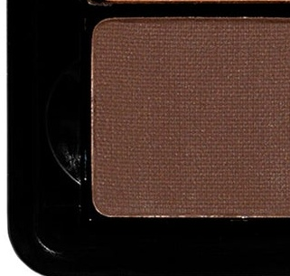

Use: Use this for liner, for a dramatic eye, for brows, for contour on deeper skin types. *WARNING* - In the US, this shade contains pigments that the FDA has not approved for use in the eye area.

##### 色号 9：可可深棕 (Cacao) —— 深巧克力色，哑光质地。
用途：可用于眼线、加深戏剧感眼妆、眉部塑形，也适合深肤色作修容。提示：在美国法规下，此色含有未获 FDA 批准用于眼周的色料。

## Shade 10: Dahlia — Magenta with a matte finish.
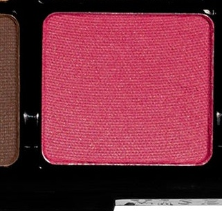

Use: Use on the lid or crease for drama, use on the lid and pop a metallic color over it, blend out as a blush, mix with white to make a super natural flush on the eyelids or cheeks. *WARNING* - In the US, this shade contains pigments that the FDA has not approved for use in the eye area.

##### 色号 10：大丽花洋红 (Dahlia) —— 洋红色，哑光质地。
用途：可用于眼皮或眼窝，营造更强烈的妆感；也可先铺在眼皮上，再叠加金属色增强层次。还能晕染作腮红，或与白色混合，调出眼皮和双颊都适合的自然红晕。提示：在美国法规下，此色含有未获 FDA 批准用于眼周的色料。

## Shade 11: Baie — Dusty plum with a matte finish.
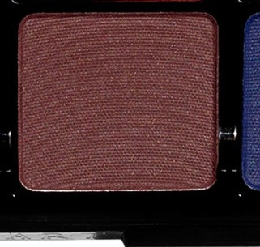

Use: This super versatile color works for almost everything - try it wet as a liner, dry for a smokey eye or in the crease for depth. This plum looks good against every eye color! *WARNING* - In the US, this shade contains pigments that the FDA has not approved for use in the eye area.

##### 色号 11：莓李灰紫 (Baie) —— 灰调李子色，哑光质地。
用途：这是一支几乎无所不能的多用途色。可湿用作眼线，干用打造烟熏妆，或放在眼窝增加深度。这支李子紫几乎能衬托所有眼色。提示：在美国法规下，此色含有未获 FDA 批准用于眼周的色料。

## Shade 12: Pénombre — Cobalt blue with a matte finish.
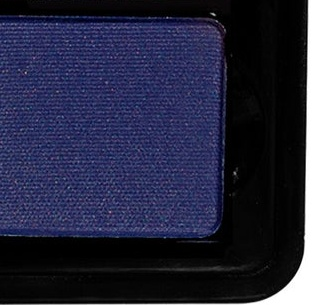

Use: Use this for a rich cobalt smokey eye, or a drop of water/mixing medium for a liner. This color also pops a brown or hazel eye.

##### 色号 12：暮影钴蓝 (Pénombre) —— 钴蓝色，哑光质地。
用途：可用来打造浓郁的钴蓝烟熏妆，也可加一滴清水或调和液作眼线使用。这一色调尤其能衬托棕色或榛色眼眸。
