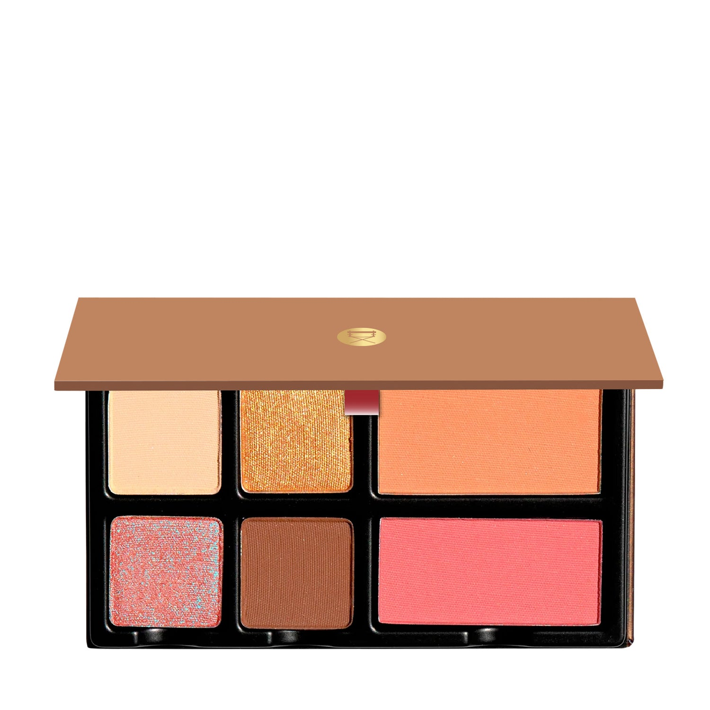
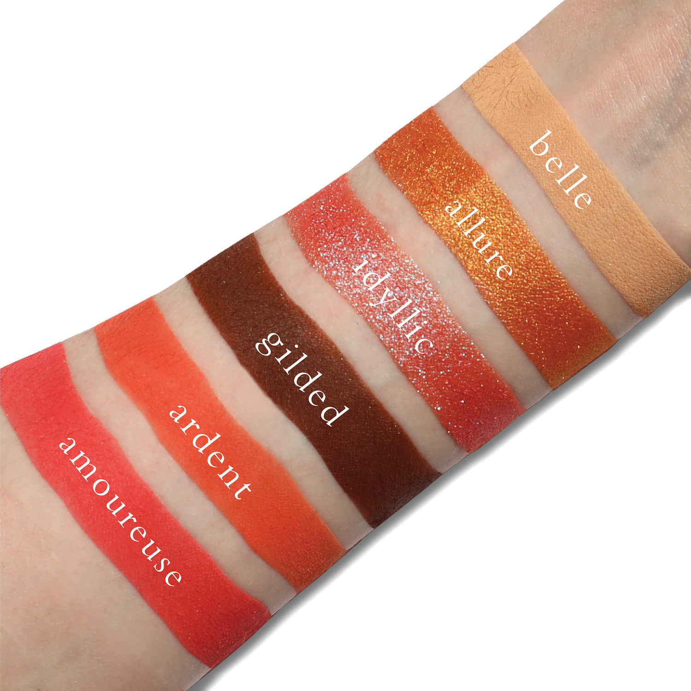
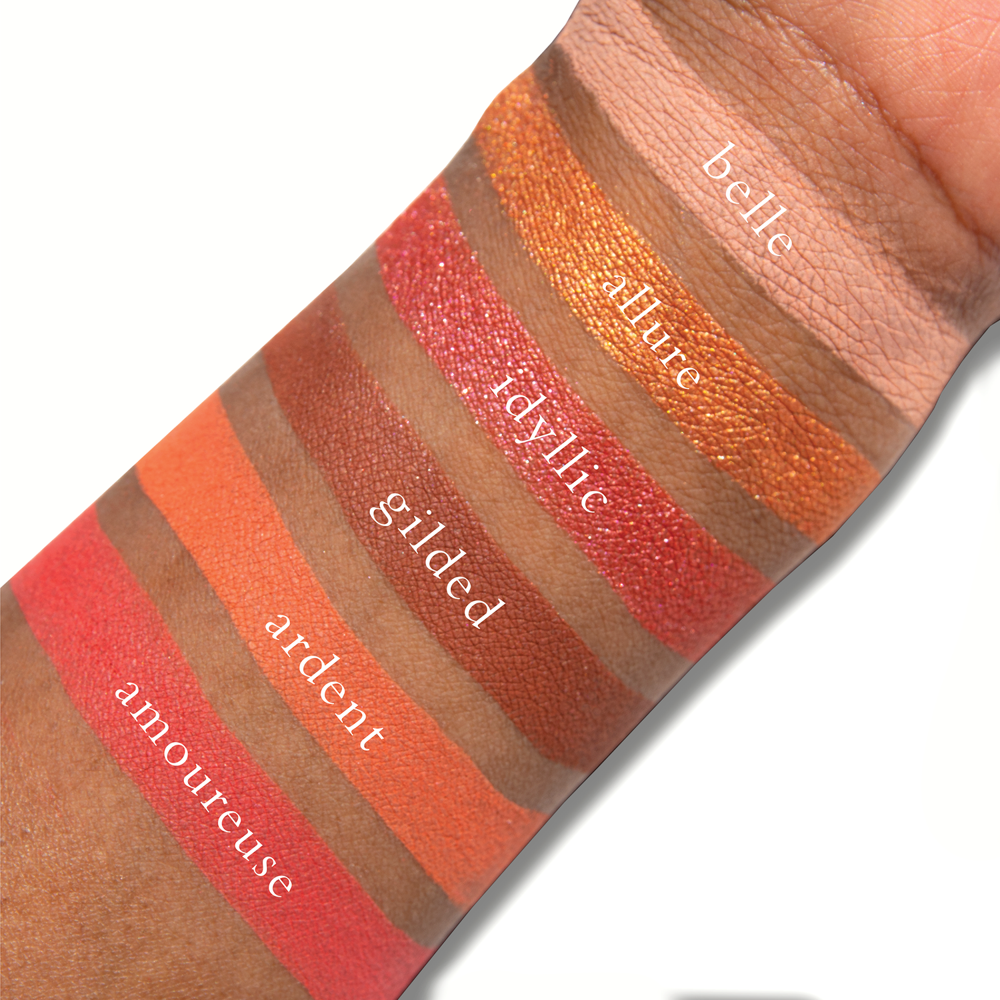
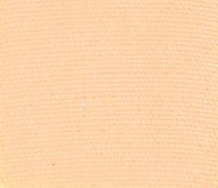
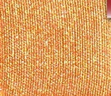
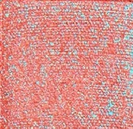
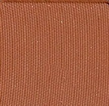
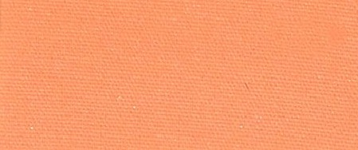
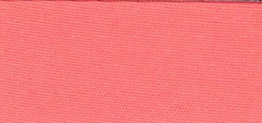

# Viseart 6色 大号 花束飞吻盘 Fleurette Bisous
*发布：2023*

> Fleurette Bisous 是一个令人心醉的亲吻——桃色的完美和谐、璀璨的光彩、鲜活多汁的生命力。杏桃阳光的金色光晕与珠母贝的流光交织，带你从宁静走向闪耀，从晨曦延续至黄昏。这款集眼影与腮红于一体的脸部盘，让桃调妆容自如游走于柔和定型与耀眼光彩之间。

> *Fleurette Bisous is an enchanting kiss of peach-perfect harmony, radiant luminosity, and fresh, juicy lushness. The golden aura of sun-kissed apricots and opalescent reflections carries you from serenity to sparkle, and from sunrise to sunset. This versatile face palette blends four eyeshadows with two blushes for a peach-toned look that blooms from soft definition to dazzling radiance.*

## Shade 1: Belle — Soft cream nude with a matte finish.

Use: Can be worn as an all over lid color or as a base beneath other complementary tones. Use to sculpt the eyes or add subtle definition.

##### 色号 1：贝尔 (Belle) —— 柔和奶油裸色，哑光质地。
用途：可作全眼底色或为其他色号打底铺垫，也可用于眼部塑形与细腻轮廓定型。

## Shade 2: Allure — Warm amber-copper with a shimmer finish.

Use: Can be used as an all over lid tone, built up in the outer corners of the eyes, or worn as a liner. Mix with water for a wash of color or combine with a mixing medium for a foiled effect.

##### 色号 2：魅力 (Allure) —— 暖琥珀铜色，缎光闪泽质地。
用途：可作全眼上色，晕染加深至眼尾，或用作眼线；加水可打造水彩晕染效果，搭配混合介质可呈现箔光效果。

## Shade 3: Idyllic — Red-orange with a red-blue duochromatic shimmer.

Use: Can be used as an all over lid color, applied to the inner corners of the eyes for a fresh burst of luminosity, as a reflective topper over any of the other shades, or as a colorful highlighter.

##### 色号 3：田园 (Idyllic) —— 红橙色调，红蓝变色幻彩质地。
用途：可作全眼铺色，点亮内眼角带来鲜活光泽，叠加于任意色号作反光提光层，或用作颧骨高光。

## Shade 4: Gilded — Warm terracotta brown with a matte finish.

Use: Can be worn as an all over lid color, as a transitional shade in the crease of the eyes, or along the lash line for soft definition. Can also be used as a base shade beneath shimmer hues.

##### 色号 4：镀金 (Gilded) —— 暖赭石棕色，哑光质地。
用途：可作全眼铺色，眼窝过渡晕染，或沿睫毛根部柔和定型，也可作为闪光色号的打底底色。

## Shade 5: Ardent — Bright peach-orange matte blush.

Use: Can be used to add a flush of radiant color to the cheeks. Apply a sweep for a natural wash of color or build in layers for more intensity.

##### 色号 5：炽热 (Ardent) —— 亮桃橙色，哑光腮红。
用途：扫于面颊，带来光彩红润气色。轻扫呈现自然光感，层叠涂抹可加深饱和度。

## Shade 6: Amoureuse — Bright coral-pink matte blush.

Use: Can be used to add a flush of radiant color to the cheeks. Apply a sweep for a natural wash of color or build in layers for a richly saturated look.

##### 色号 6：恋人 (Amoureuse) —— 亮珊瑚粉色，哑光腮红。
用途：扫于面颊，带来明艳红润光彩。轻扫为自然气色，层叠增涂可呈现饱和馥郁的妆效。
