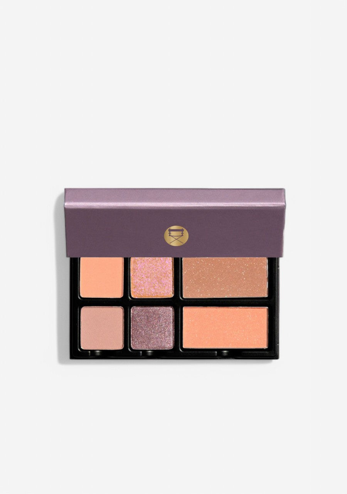
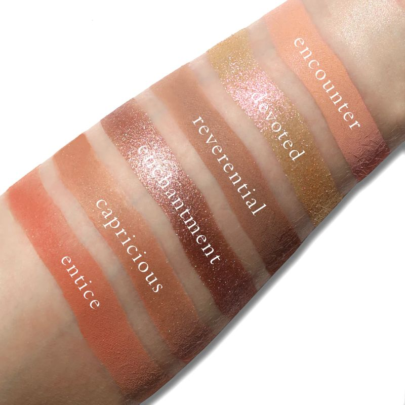
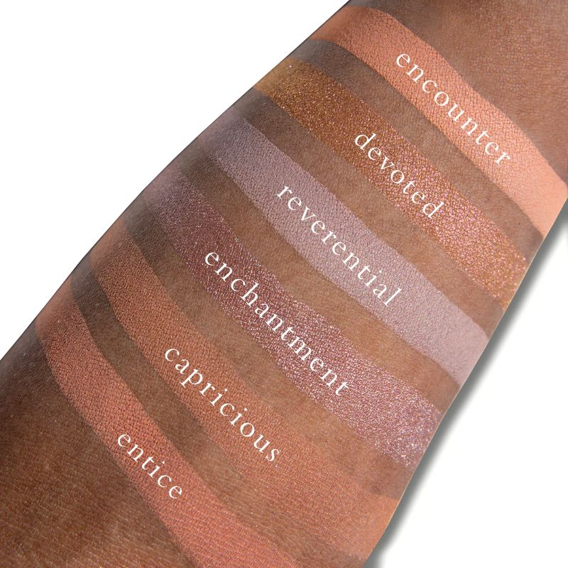
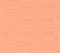
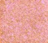
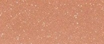
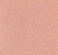
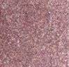
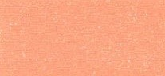

# Viseart 6色 大号 花束心动盘 Fleurette Coeur
*发布：~2023*

> Fleurette Cœur 是一款温柔、精致而浪漫的调色盘——柔和的冷调哑光与深情的珠光相得益彰，以其极致的饱和度与光泽直击彩妆爱好者的心扉。半透明的玫瑰紫与香槟色调如轻柔的爱抚，随着混合介质的加入，可从宁静的透明感蜕变为熔岩般的金属魔幻。

> *Fleurette Cœur is a soothing, refined and romantic palette of soft, cool mattes and passionately shimmering pearls that shoots straight into the hearts of makeup lovers with its sublime saturation and radiant luminosity. Whispering, gentle caresses of semi-transparent mauve and champagne tones can transform from calm translucency to molten metallic magic when love — or a mixing medium — is applied.*

## Shade 1: Encounter — Soft peachy-salmon with a matte finish.

Use: Can be worn as an all over lid base, brushed along the browbone as a highlight, or used to add gentle definition to the lash line.

##### 色号 1：邂逅 (Encounter) —— 柔和桃杏色，哑光质地。
用途：可作全眼底色铺色，扫于眉骨作提亮，或用于睫毛根部柔和定型。

## Shade 2: Enchantment — Pink iridescent glitter with a shimmer finish.

Use: Can be applied all over the lid for a luminous finish, concentrated on the inner corner for a brightening pop, or layered as a reflective topper over other shades.

##### 色号 2：迷魅 (Enchantment) —— 玫瑰粉幻彩亮片，闪光质地。
用途：可作全眼提亮铺色，集中点亮内眼角，或叠加于其他色号之上作反光提光层。

## Shade 3: Devoted — Warm golden-bronze with a shimmer finish.

Use: Can be used as an all over lid shade for a warm glow, concentrated on the center of the lid for dimension, or applied to the browbone. Use with a damp brush for maximum metallic intensity.

##### 色号 3：深情 (Devoted) —— 暖金铜色，闪光质地。
用途：可作全眼铺色带来暖光感，集中于眼中央增加层次，或扫于眉骨；搭配湿刷可最大化金属质感。

## Shade 4: Reverential — Pale pink-nude with a matte finish.

Use: Can be worn as a soft all over lid base, blended into the crease as a transitional shade, or used to highlight the browbone for a clean, refined finish.

##### 色号 4：虔诚 (Reverential) —— 淡粉裸色，哑光质地。
用途：可作全眼柔和底色，晕染至眼窝作自然过渡，或扫于眉骨打造干净精致的提亮效果。

## Shade 5: Capricious — Dusty rose-mauve with a shimmer finish.

Use: Can be applied all over the lid for a romantic shimmer look, blended into the crease for depth, or concentrated on the outer corner for definition. Intensifies beautifully with a damp brush.

##### 色号 5：任性 (Capricious) —— 烟玫瑰灰粉色，闪光质地。
用途：可作全眼铺色打造浪漫光泽感，晕染眼窝增加层次深度，或集中于眼尾加深定型；搭配湿刷效果更佳。

## Shade 6: Entice — Warm peach-coral with a matte finish.

Use: Can be worn as an all over lid color for a fresh, warm look, blended along the crease for soft depth, or used along the lower lash line for gentle definition. Can also double as a blush for a seamless, monochromatic effect.

##### 色号 6：诱惑 (Entice) —— 暖桃珊瑚色，哑光质地。
用途：可作全眼铺色打造清新暖调妆感，晕染眼窝作柔和层次，或沿下睫毛根部细致定型；也可用作腮红，打造单一色调的无缝妆容。
