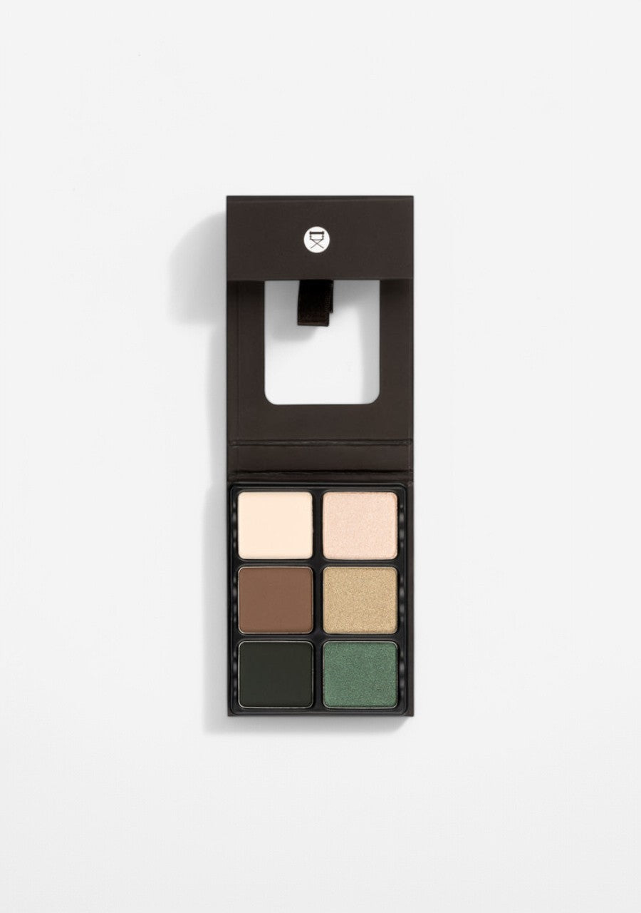
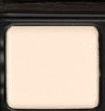
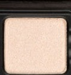
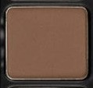
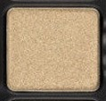
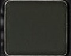
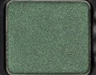

# Viseart 6色 大号 苦艾草本盘 Theory VI Absinthe
*发布：~2020*

> 苦艾草、茴香、柠檬香脂——这是一瓶蒸馏了整片林地的香水。Theory VI Absinthe 以植物学的克制与精准，将六种草木色彩提炼为眼妆语言：象牙白的哑光底、橄榄金的光泽、幽深森林绿的神秘，以及翡翠色的流光。

> *Wormwood, fennel, and lemon balm — the botanicals that define absinthe's mystique. Theory VI translates this alchemy into six precise tones: a matte ivory base, gleaming champagne gold, a warm brown mid-tone, cryptic forest green, and an emerald shimmer that glows like the Green Fairy herself.*

## Shade 1: Ivory — Pale cream with a matte finish.

Use: All over lid base from lash to brow, to prime and prepare for deeper shades, or to highlight the inner corner and brow bone.

##### 色号 1：象牙白 (Ivory) —— 浅奶油色，哑光质地。
用途：可从睫毛根部到眉骨作全眼打底铺色，为深色铺垫底色，或用于眼头与眉骨的提亮。

## Shade 2: Champagne — Warm gold with a shimmer finish.

Use: All over lid for a soft golden sheen, inner corner highlight, brow bone, or cheekbones. Layer over Ivory for a subtle gilded base.

##### 色号 2：金香槟 (Champagne) —— 暖金色，闪光质地。
用途：可作全眼柔光铺色，用于眼头、眉骨或颧骨高光；叠加于象牙白之上可呈现微妙镀金底色。

## Shade 3: Hazel — Medium warm brown with a matte finish.

Use: All over lid mid-tone, crease definition, or natural transition shade. Blend with Ivory for an everyday warm neutral look.

##### 色号 3：榛木棕 (Hazel) —— 中调暖棕色，哑光质地。
用途：可作全眼中间铺色，眼窝立体定型，或自然过渡色；与象牙白混合可打造日常暖中性妆效。

## Shade 4: Khaki — Olive gold with a metallic finish.

Use: All over lid for an earthy botanical metallic statement, or layered over Hazel for warm depth with shimmer dimension. Apply with a damp brush for maximum intensity.

##### 色号 4：卡其橄榄金 (Khaki) —— 橄榄金属色，金属质地。
用途：可作全眼打造大地植物金属感，或叠加于榛木棕之上增添光泽层次；搭配湿刷可最大化金属强度。

## Shade 5: Forest — Deep forest green with a matte finish.

Use: Crease depth, outer corner drama, liner, or all over lid for a bold botanical statement. Blend over Hazel or Khaki for a deep woodland smokey eye.

##### 色号 5：幽林深绿 (Forest) —— 深邃森林绿，哑光质地。
用途：可作眼窝深色定型，眼尾戏剧感，眼线，或全眼铺色打造大胆植物风宣言；与榛木棕或卡其橄榄金融合可打造幽深森林烟熏眼。

## Shade 6: Jade — Emerald green with a shimmer finish.

Use: All over lid for a jewel-toned statement, or concentrate on the center of the lid over Forest for a multidimensional emerald finish. Can be foiled for intense metallic color.

##### 色号 6：翡翠绿闪 (Jade) —— 翡翠绿色，闪光质地。
用途：可作全眼铺色打造宝石感，或集中叠加于幽林深绿之上打造多维翡翠妆效；可打箔光呈现高强度金属绿色。
