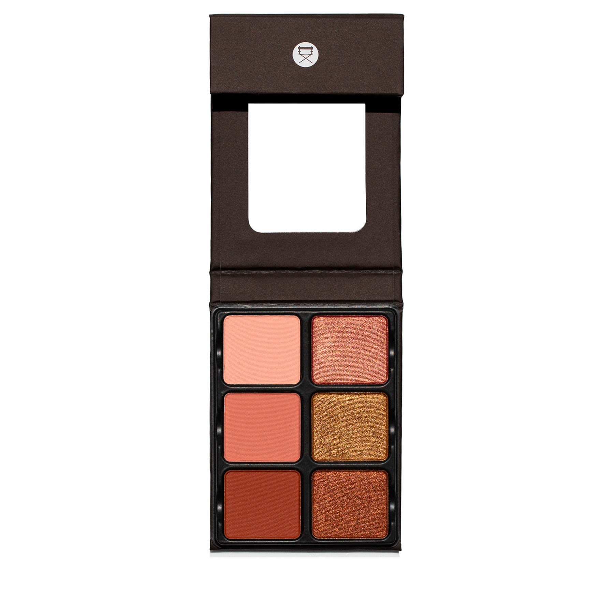
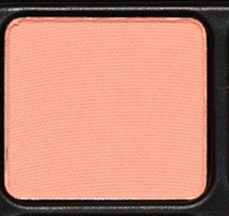
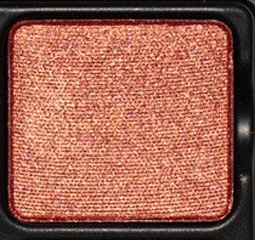
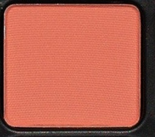
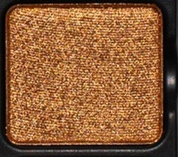
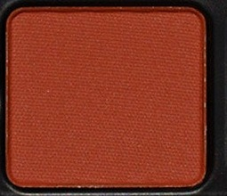
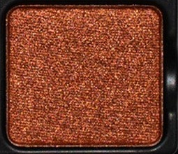

# Viseart 6色 大号 日落海妖盘 Theory VII Siren
*发布：2021*

> 落日燃尽天边，将天空染成一片炽热的橙红与玫铜。Theory VII Siren 以六个色调追摹黄昏的最后时刻——从如羽毛般轻柔的花瓣粉哑光，到灼灼然的磨光铜金属。每一抹都像余晖的残响，温柔而炽烈。

> *The sky burns from pale peach to smouldering copper as the sun meets the horizon. Theory VII Siren distils a fiery sunset into six curated tones — blendable peachy mattes and radiant metallics that move from the softest petal pink to a deep, burnished glow.*

## Shade 1: Petal Pink — Light peach with a matte finish.

Use: All over base tone from lash to brow, to brighten the inner corner of the eye, to subtly highlight and structure the face.

##### 色号 1：花瓣粉 (Petal Pink) —— 浅桃粉色，哑光质地。
用途：可从睫毛根部到眉骨作全眼打底铺色，提亮眼头，或作面部轻柔高光塑形。

## Shade 2: Rose Gold — Peachy gold with a metallic finish.

Use: Versatile tone that can be used as an all over lid colour, a highlight on eyes and cheeks! Mix this tone over the lighter shades for a simple, peachy-cream look, mix with the mid-tone mattes to create a sexy, liquid-satin glowing shade!

##### 色号 2：玫瑰金 (Rose Gold) —— 桃金色，金属质地。
用途：可作全眼铺色，用作眼部与面颊高光；叠于浅色上可呈现简单桃奶油色调；与中调哑光混合可打造性感的液态缎光发光妆效。

## Shade 3: Peony Pink — Medium peach with a matte finish.

Use: Versatile tone that can be used as an all over lid colour, also as a blusher on eyes and cheeks! Mix this tone over the lighter shades for a simple, rose-cream look, mix with deeper mattes and shimmer to create a bronzer or blush for cheeks!

##### 色号 3：牡丹粉 (Peony Pink) —— 中调桃粉，哑光质地。
用途：可作全眼铺色，或作眼颊腮红；叠于浅色上呈现玫奶油色调；与深色哑光及闪光混合可调出面颊修容或腮红。

## Shade 4: Burnt Gold — Warm yellow rose gold with a metallic finish.

Use: Use as an all over eyeshadow tone, add to the matte tones to create a beautiful peachy tones eye-look. Also can be used as a highlight for deeper skin tones.

##### 色号 4：焦糖金 (Burnt Gold) —— 暖黄玫瑰金，金属质地。
用途：可作全眼铺色；与哑光色叠加打造美丽的桃调眼妆；深肤色可用作高光提亮。

## Shade 5: Terracotta — Fiery peachy red with a matte finish.

Use: Versatile tone that can be used as an all over base tone. Used as a bronzer, blush, give the lash line dimension and depth. Mix with other matte tones to create versatile base tones.

##### 色号 5：陶土红 (Terracotta) —— 炽热桃红，哑光质地。
用途：可作全眼底色铺色；用作修容、腮红，或在睫毛根部增添立体感与深度；与其他哑光色混合可调出多变的底色。

## Shade 6: Burnished Copper — Fiery peachy red with a metallic finish.

Use: Use as an all over eyeshadow tone, add to the matte tones to create a copper smokey eye. Also can be used as a highlight for deeper skin tones.

##### 色号 6：磨光铜 (Burnished Copper) —— 炽热桃红金属色，金属质地。
用途：可作全眼铺色；与哑光色叠加打造铜调烟熏眼；深肤色可用作高光提亮。
